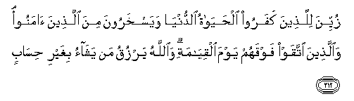

#زُيِّنَ لِلَّذِينَ كَفَرُوا الْحَيَاةُ الدُّنْيَا وَيَسْخَرُونَ مِنَ الَّذِينَ آمَنُوا ۘ وَالَّذِينَ اتَّقَوْا فَوْقَهُمْ يَوْمَ الْقِيَامَةِ ۗ وَاللَّهُ يَرْزُقُ مَنْ يَشَاءُ بِغَيْرِ حِسَابٍ 

##Zuyyina lillatheena kafaroo alhayatu alddunya wayaskharoona mina allatheena amanoo waallatheena ittaqaw fawqahum yawma alqiyamati waAllahu yarzuqu man yashao bighayri hisabin 

## 翻译(Translation)：

| Translator | 译文(Translation)                                            |
| :--------: | ------------------------------------------------------------ |
|    马坚    | 不信道的人，为今世的生活所迷惑，他们嘲笑信道者，复活日，敬畏者将在他们之上；真主将无量地供给他所意欲者。 |
|  YUSUFALI  | The life of this world is alluring to those who reject faith, and they scoff at those who believe. But the righteous will be above them on the Day of Resurrection; for Allah bestows His abundance without measure on whom He will. |
| PICKTHALL  | Beautified is the life of the world for those who disbelieve; they make a jest of the believers. But those who keep their duty to Allah will be above them on the Day of Resurrection. Allah giveth without stint to whom He will. |
|   SHAKIR   | The life of this world is made to seem fair to those who disbelieve, and they mock those who believe, and those who guard (against evil) shall be above them on the day of resurrection; and Allah gives means of subsistence to whom he pleases without measure. |

---

## 对位释义(Words Interpretation)：

| No   | العربية | 中文    | English | 曾用词 |
| ---- | ------: | ------- | ------- | ------ |
| 序号 |    阿文 | Chinese | 英文    | Used   |
| 2:212.1  | زُيِّنَ     | 诱惑的           | alluring        |           |
| 2:212.2  | لِلَّذِينَ   | 对那些人         | to those who    | 见2:79.2  |
| 2:212.3  | كَفَرُوا   | 不信             | disbelieve      | 见2:6.3   |
| 2:212.4  | الْحَيَاةُ  | 生活             | the life        |           |
| 2:212.5  | الدُّنْيَا  | 今世             | this world      | 见2:85.38 |
| 2:212.6  | وَيَسْخَرُونَ | 和他们嘲笑       | and they mock   |           |
| 2:212.7  | مِنَ      | 从               | from            | 见2:4.8   |
| 2:212.8  | الَّذِينَ   | 谁，那些         | those who       | 见2:6.2   |
| 2:212.9  | آمَنُوا   | 诚信             | believe         | 见2:9.4   |
| 2:212.10 | وَالَّذِينَ  | 和那些           | and those who   | 见2:21.8  |
| 2:212.11 | اتَّقَوْا   | 虔诚             | keep their duty |           |
| 2:212.12 | فَوْقَهُمْ   | 他们之上         | above them      |           |
| 2:212.13 | يَوْمَ     | 日，日子，时候的 | day             | 见1:4.2   |
| 2:212.14 | الْقِيَامَةِ | 复活的           | Resurrection    | 见2:85.40 |
| 2:212.15 | وَاللَّهُ   | 和安拉，真主     | and Allah       | 见2:19.17 |
| 2:212.16 | يَرْزُقُ    | 供应             | gives           |           |
| 2:212.17 | مَنْ      | 谁               | who             | 见2:97.2  |
| 2:212.18 | يَشَاءُ    | 他意欲           | He pleases      | 见2:90.18 |
| 2:212.19 | بِغَيْرِ    | 在没有          | without         | 见2:61.54 |
| 2:212.20 | حِسَابٍ    | 量度的           | measure         |           |

---
