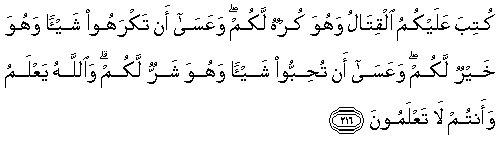

#كُتِبَ عَلَيْكُمُ الْقِتَالُ وَهُوَ كُرْهٌ لَكُمْ ۖ وَعَسَىٰ أَنْ تَكْرَهُوا شَيْئًا وَهُوَ خَيْرٌ لَكُمْ ۖ وَعَسَىٰ أَنْ تُحِبُّوا شَيْئًا وَهُوَ شَرٌّ لَكُمْ ۗ وَاللَّهُ يَعْلَمُ وَأَنْتُمْ لَا تَعْلَمُونَ 

##Kutiba AAalaykumu alqitalu wahuwa kurhun lakum waAAasa an takrahoo shay-an wahuwa khayrun lakum waAAasa an tuhibboo shay-an wahuwa sharrun lakum waAllahu yaAAlamu waantum lataAAlamoona 

## 翻译(Translation)：

| Translator | 译文(Translation)                                            |
| :--------: | ------------------------------------------------------------ |
|    马坚    | 战争已成为你们的定制，而战争是你们所厌恶的。也许你们厌恶某件事，而那件事对你们是有益的；或许你们喜爱某件事，而那件事对於你们是有害的。真主知道，你们确不知道。 |
|  YUSUFALI  | Fighting is prescribed for you, and ye dislike it. But it is possible that ye dislike a thing which is good for you, and that ye love a thing which is bad for you. But Allah knoweth, and ye know not. |
| PICKTHALL  | Warfare is ordained for you, though it is hateful unto you; but it may happen that ye hate a thing which is good for you, and it may happen that ye love a thing which is bad for you. Allah knoweth, ye know not. |
|   SHAKIR   | Fighting is enjoined on you, and h is an object of dislike to you; and it may be that you dislike a thing while it is good for you, and it may be that you love a thing while it is evil for you, and Allah knows, while you do not know. |

---

## 对位释义(Words Interpretation)：

| No   | العربية | 中文    | English | 曾用词 |
| ---- | ------: | ------- | ------- | ------ |
| 序号 |    阿文 | Chinese | 英文    | Used   |
| 2:216.1  | كُتِبَ    | 被规定         | is prescribed | 见2:178.5 |
| 2:216.2  | عَلَيْكُمُ  | 在你们         | on you        | 见2:40.8  |
| 2:216.3  | الْقِتَالُ | 战争           | fighting      |           |
| 2:216.4  | وَهُوَ    | 和他           | and he        | 见2:29.16 |
| 2:216.5  | كُرْهٌ    | 不喜欢         | dislike       |           |
| 2:216.6  | لَكُمْ    | 为你们         | For you       | 见2:22.3  |
| 2:216.7  | وَعَسَىٰ   | 和它也许       | and it may be |           |
| 2:216.8  | أَنْ     | 该             | that          | 见2:26.5  |
| 2:216.9  | تَكْرَهُوا | 你们不喜欢     | you dislike   | 参2:216.5 |
| 2:216.10 | شَيْئًا   | 一件事情       | a thing       | 见2:48.8  |
| 2:216.11 | وَهُوَ    | 和他           | and he        | 见2:29.16 |
| 2:216.12 | خَيْرٌ    | 较好的         | be better     | 见2:54.18 |
| 2:216.13 | لَكُمْ    | 为你们         | For you       | 见2:22.3  |
| 2:216.14 | وَعَسَىٰ   | 和它也许       | and it may be | 见2:216.7 |
| 2:216.15 | أَنْ     | 该             | that          | 见2:26.5  |
| 2:216.16 | تُحِبُّوا  | 你们喜欢       | you love      |           |
| 2:216.17 | شَيْئًا   | 一件事情       | a thing       | 见2:48.8  |
| 2:216.18 | وَهُوَ    | 和他           | and he        | 见2:29.16 |
| 2:216.19 | شَرٌّ     | 不好           | evil          |           |
| 2:216.20 | لَكُمْ    | 为你们         | For you       | 见2:22.3  |
| 2:216.21 | وَاللَّهُ  | 和安拉，真主   | and Allah     | 见2:19.17 |
| 2:216.22 | يَعْلَمُ   | 知道           | knows         | 见2:77.5  |
| 2:216.23 | وَأَنْتُمْ  | 和你们         | and you       | 见2:22.22 |
| 2:216.24 | لَا     | 不，不是，没有 | no            | 见2:2.3   |
| 2:216.25 | تَعْلَمُونَ | 你知道         | You know      | 见2:22.23 |

---
