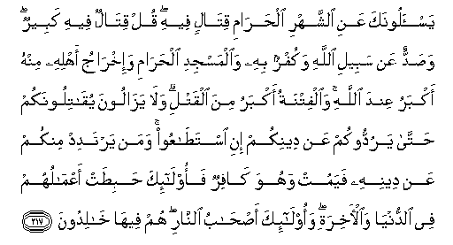

#يَسْأَلُونَكَ عَنِ الشَّهْرِ الْحَرَامِ قِتَالٍ فِيهِ ۖ قُلْ قِتَالٌ فِيهِ كَبِيرٌ ۖ وَصَدٌّ عَنْ سَبِيلِ اللَّهِ وَكُفْرٌ بِهِ وَالْمَسْجِدِ الْحَرَامِ وَإِخْرَاجُ أَهْلِهِ مِنْهُ أَكْبَرُ عِنْدَ اللَّهِ ۚ وَالْفِتْنَةُ أَكْبَرُ مِنَ الْقَتْلِ ۗ وَلَا يَزَالُونَ يُقَاتِلُونَكُمْ حَتَّىٰ يَرُدُّوكُمْ عَنْ دِينِكُمْ إِنِ اسْتَطَاعُوا ۚ وَمَنْ يَرْتَدِدْ مِنْكُمْ عَنْ دِينِهِ فَيَمُتْ وَهُوَ كَافِرٌ فَأُولَٰئِكَ حَبِطَتْ أَعْمَالُهُمْ فِي الدُّنْيَا وَالْآخِرَةِ ۖ وَأُولَٰئِكَ أَصْحَابُ النَّارِ ۖ هُمْ فِيهَا خَالِدُونَ 

##Yas-aloonaka AAani alshshahri alharami qitalin feehi qul qitalun feehi kabeerun wasaddun AAan sabeeli Allahi wakufrun bihi waalmasjidi alharami wa-ikhraju ahlihi minhu akbaru AAinda Allahi waalfitnatu akbaru mina alqatli wala yazaloona yuqatiloonakum hatta yaruddookum AAan deenikum ini istataAAoo waman yartadid minkum AAan deenihi fayamut wahuwa kafirun faola-ika habitat aAAmaluhum fee alddunya waal-akhirati waola-ika as-habu alnnari hum feeha khalidoona 

## 翻译(Translation)：

| Translator | 译文(Translation)                                            |
| :--------: | ------------------------------------------------------------ |
|    马坚    | 他们问你禁月内可以作战吗？你说：禁月内作战是大罪；妨碍主道，不信真主，妨碍（朝觐）禁寺，驱逐禁寺区的居民出境，这些行为，在真主看来，其罪更大。迫害是比杀戮还残酷的。如果他们能力充足，势必继续进攻你们，务使你们叛教。你们中谁背叛正教，至死还不信道，谁的善功在今世和後世完全无效。这等人，是火狱的居民，他们将永居其中。 |
|  YUSUFALI  | They ask thee concerning fighting in the Prohibited Month. Say: "Fighting therein is a grave (offence); but graver is it in the sight of Allah to prevent access to the path of Allah, to deny Him, to prevent access to the Sacred Mosque, and drive out its members." Tumult and oppression are worse than slaughter. Nor will they cease fighting you until they turn you back from your faith if they can. And if any of you Turn back from their faith and die in unbelief, their works will bear no fruit in this life and in the Hereafter; they will be companions of the Fire and will abide therein. |
| PICKTHALL  | They question thee (O Muhammad) with regard to warfare in the sacred month. Say: Warfare therein is a great (transgression), but to turn (men) from the way of Allah, and to disbelieve in Him and in the Inviolable Place of Worship, and to expel His people thence, is a greater with Allah; for persecution is worse than killing. And they will not cease from fighting against you till they have made you renegades from your religion, if they can. And whoso becometh a renegade and dieth in his disbelief: such are they whose works have fallen both in the world and the Hereafter. Such are rightful owners of the Fire: they will abide therein. |
|   SHAKIR   | They ask you concerning the sacred month about fighting in it. Say: Fighting in it is a grave matter, and hindering (men) from Allah's way and denying Him, and (hindering men from) the Sacred Mosque and turning its people out of it, are still graver with Allah, and persecution is graver than slaughter; and they will not cease fighting with you until they turn you back from your religion, if they can; and whoever of you turns back from his religion, then he dies while an unbeliever-- these it is whose works shall go for nothing in this world and the hereafter, and they are the inmates of the fire; therein they shall abide. |

---

## 对位释义(Words Interpretation)：

| No   | العربية | 中文    | English | 曾用词 |
| ---- | ------: | ------- | ------- | ------ |
| 序号 |    阿文 | Chinese | 英文    | Used   |
| 2:217.1  | يَسْأَلُونَكَ   | 他们问你       | They ask you       | 见2:189.1  |
| 2:217.2  | عَنِ        | 关于           | about              | 见2:189.2  |
| 2:217.3  | الشَّهْرِ     | 这个月         | the month          | 见2:185.16 |
| 2:217.4  | الْحَرَامِ    | 神圣的         | The Sacred         | 见2:144.14 |
| 2:217.5  | قِتَالٍ      | 战斗           | fighting           | 参2:216.3  |
| 2:217.6  | فِيهِ       | 它，其中       | in it              | 见2:2.5    |
| 2:217.7  | قُلْ        | 你说           | Say                | 见2:80.8   |
| 2:217.8  | قِتَالٌ      | 战斗           | fighting           | 见2:217.5  |
| 2:217.9  | فِيهِ       | 它，其中       | in it              | 见2:2.5    |
| 2:217.10 | كَبِيرٌ      | 大的           | great              |            |
| 2:217.11 | وَصَدٌّ       | 和妨碍         | and hindering      |            |
| 2:217.12 | عَنْ        | 从             | on                 | 见2:48.6   |
| 2:217.13 | سَبِيلِ      | 道路           | the way            | 见2:154.6  |
| 2:217.14 | اللَّهِ      | 安拉，真主     | Allah              | 见1:1.2    |
| 2:217.15 | وَكُفْرٌ      | 和不信         | and disbelieve     |            |
| 2:217.16 | بِهِ        | 以它           | with it            | 见2:22.13  |
| 2:217.17 | وَالْمَسْجِدِ   | 和清真寺       | and the mosque     | 参2:144.13 |
| 2:217.18 | الْحَرَامِ    | 神圣的         | The Sacred         | 见2:144.14 |
| 2:217.19 | وَإِخْرَاجُ    | 和驱逐         | and drive out      | 参2:85.22  |
| 2:217.20 | أَهْلِهِ      | 它的居民       | its people         |            |
| 2:217.21 | مِنْهُ       | 从它           | from it            | 见2:60.10  |
| 2:217.22 | أَكْبَرُ      | 更大           | greater            |            |
| 2:217.23 | عِنْدَ       | 以             | with               | 见2:54.20  |
| 2:217.24 | اللَّهِ      | 安拉，真主     | Allah              | 见1:1.2    |
| 2:217.25 | وَالْفِتْنَةُ   | 和迫害         | and persecution    | 见2:191.8  |
| 2:217.26 | أَكْبَرُ      | 更大           | greater            | 见2:217.22 |
| 2:217.27 | مِنَ        | 比             | than               | 见2:138.5  |
| 2:217.28 | الْقَتْلِ     | 杀戮           | slaughter          | 见2:191.11 |
| 2:217.29 | وَلَا       | 也不           | and not            | 见1:7.8    |
| 2:217.30 | يَزَالُونَ    | 他们停止       | they cease         |            |
| 2:217.31 | يُقَاتِلُونَكُمْ | 他们进攻你们   | they fight you     | 见2:190.6  |
| 2:217.32 | حَتَّىٰ       | 直到           | Until              | 见2:55.8   |
| 2:217.33 | يَرُدُّوكُمْ    | 他们使你们背弃 | they turn you back | 参2:109.7  |
| 2:217.34 | عَنْ        | 从             | on                 | 见2:48.6   |
| 2:217.35 | دِينِكُمْ     | 你们的宗教     | your religion      |            |
| 2:217.36 | إِنِ        | 如果           | if                 | 参2:23.18  |
| 2:217.37 | اسْتَطَاعُوا  | 他们能够       | they can           |            |
| 2:217.38 | وَمَنْ       | 和谁           | and who            | 见2:108.11 |
| 2:217.39 | يَرْتَدِدْ     | 他们背叛       | they turns back    |            |
| 2:217.40 | مِنْكُمْ      | 从你们         | Of you             | 见2:65.5   |
| 2:217.41 | عَنْ        | 从             | on                 | 见2:48.6   |
| 2:217.42 | دِينِهِ      | 他的宗教       | his religion       | 参2:217.35 |
| 2:217.43 | فَيَمُتْ      | 然后他死亡     | then he dies       |            |
| 2:217.44 | وَهُوَ       | 和他           | and he             | 见2:29.16  |
| 2:217.45 | كَافِرٌ      | 不信道者       | unbeliever         |            |
| 2:217.46 | فَأُولَٰئِكَ    | 然后那些人     | then those         | 见2:81.8   |
| 2:217.47 | حَبِطَتْ      | 无效           | go for nothing     |            |
| 2:217.48 | أَعْمَالُهُمْ   | 他们的行为     | them deeds         | 参2:139.9  |
| 2:217.49 | فِي        | 在             | in                 | 见2:10.1   |
| 2:217.50 | الدُّنْيَا    | 今世           | this world         | 见2:85.38  |
| 2:217.51 | وَالْآخِرَةِ   | 和后世         | and the Hereafter  | 参2:102.64 |
| 2:217.52 | وَأُولَٰئِكَ    | 和这等人       | and these are      | 见2:5.6    |
| 2:217.53 | أَصْحَابُ     | 居民           | inmates            | 见2:39.6   |
| 2:217.54 | النَّارِ     | 火狱           | the Fire           | 见2:24.7   |
| 2:217.55 | هُمْ        | 他们           | they               | 见2:4.11   |
| 2:217.56 | فِيهَا      | 在其中         | therein            | 见2:25.29  |
| 2:217.57 | خَالِدُونَ    | 不朽，永居     | Immortal           | 见2:25.34  |

---

