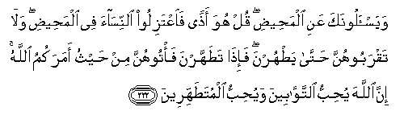

#وَيَسْأَلُونَكَ عَنِ الْمَحِيضِ ۖ قُلْ هُوَ أَذًى فَاعْتَزِلُوا النِّسَاءَ فِي الْمَحِيضِ ۖ وَلَا تَقْرَبُوهُنَّ حَتَّىٰ يَطْهُرْنَ ۖ فَإِذَا تَطَهَّرْنَ فَأْتُوهُنَّ مِنْ حَيْثُ أَمَرَكُمُ اللَّهُ ۚ إِنَّ اللَّهَ يُحِبُّ التَّوَّابِينَ وَيُحِبُّ الْمُتَطَهِّرِينَ 

##Wayas-aloonaka AAani almaheedi qul huwa athan faiAAtaziloo alnnisaa fee almaheedi walataqraboohunna hatta yathurna fa-itha tatahharna fa/toohunna min haythu amarakumu Allahu inna Allaha yuhibbu alttawwabeena wayuhibbu almutatahhireena 

## 翻译(Translation)：

| Translator | 译文(Translation)                                            |
| :--------: | ------------------------------------------------------------ |
|    马坚    | 他们问你月经的（律例），你说：月经是有害的，故在经期中你们应当离开妻子，不要与她们交接，直到她们清洁。当她们洗净的时候，你们可以在真主所命你们的部位与她们交接。真主的确喜爱悔罪的人，的确喜爱洁净的人。 |
|  YUSUFALI  | They ask thee concerning women's courses. Say: They are a hurt and a pollution: So keep away from women in their courses, and do not approach them until they are clean. But when they have purified themselves, ye may approach them in any manner, time, or place ordained for you by Allah. For Allah loves those who turn to Him constantly and He loves those who keep themselves pure and clean. |
| PICKTHALL  | They question thee (O Muhammad) concerning menstruation. Say: It is an illness, so let women alone at such times and go not in unto them till they are cleansed. And when they have purified themselves, then go in unto them as Allah hath enjoined upon you. Truly Allah loveth those who turn unto Him, and loveth those who have a care for cleanness. |
|   SHAKIR   | And they ask you about menstruation. Say: It is a discomfort; therefore keep aloof from the women during the menstrual discharge and do not go near them until they have become clean; then when they have cleansed themselves, go in to them as Allah has commanded you; surely Allah loves those who turn much (to Him), and He loves those who purify themselves. |

---

## 对位释义(Words Interpretation)：

| No   | العربية | 中文    | English | 曾用词 |
| ---- | ------: | ------- | ------- | ------ |
| 序号 |    阿文 | Chinese | 英文    | Used   |
| 2:222.1  | وَيَسْأَلُونَكَ  | 和他们问你     | and they ask you            | 见2:219.27 |
| 2:222.2  | عَنِ        | 关于           | about                       | 见2:189.2  |
| 2:222.3  | الْمَحِيضِ    | 月经           | menstruation                |            |
| 2:222.4  | قُلْ        | 你说           | Say                         | 见2:80.8   |
| 2:222.5  | هُوَ        | 他是           | He is                       | 见2:29.1   |
| 2:222.6  | أَذًى       | 些许伤害     | ailment                     | 见2:196.24 |
| 2:222.7  | فَاعْتَزِلُوا  | 因此你们应离开 | so keep away from           |            |
| 2:222.8  | النِّسَاءَ    | 妇女           | the women                   |            |
| 2:222.9  | فِي        | 在             | in                          | 见2:10.1   |
| 2:222.10 | الْمَحِيضِ    | 月经           | menstruation                | 见2:222.3  |
| 2:222.11 | وَلَا       | 也不           | and not                     | 见1:7.8    |
| 2:222.12 | تَقْرَبُوهُنَّ   | 接近她们       | approach them               |            |
| 2:222.13 | حَتَّىٰ       | 直到           | Until                       | 见2:55.8   |
| 2:222.14 | يَطْهُرْنَ     | 她们清洁       | they are clean              |            |
| 2:222.15 | فَإِذَا      | 然后当         | then when                   | 见2:196.34 |
| 2:222.16 | تَطَهَّرْنَ     | 她们清洁       | they are clean              | 见2:222.14 |
| 2:222.17 | فَأْتُوهُنَّ    | 然后来到她们   | then go into them           |            |
| 2:222.18 | مِنْ        | 从             | from                        | 见2:4.8    |
| 2:222.19 | حَيْثُ       | 无论哪里       | Where                       | 见2:35.11  |
| 2:222.20 | أَمَرَكُمُ     | 命令你们       | has commanded you           |            |
| 2:222.21 | اللَّهُ      | 安拉，真主     | Allah                       | 见1:1.2    |
| 2:222.22 | إِنَّ        | 的确           | surely                      | 见2:6.1    |
| 2:222.23 | اللَّهَ      | 安拉，真主     | Allah                       | 见1:1.2    |
| 2:222.24 | يُحِبُّ       | 喜欢           | love                        | 见2:190.12 |
| 2:222.25 | التَّوَّابِينَ  | 悔罪的人       | those who turn unto Him     |            |
| 2:222.26 | وَيُحِبُّ      | 和喜欢         | and love                    | 参2:190.12 |
| 2:222.27 | الْمُتَطَهِّرِينَ | 洁净的人       | those who purify themselves |            |

---

