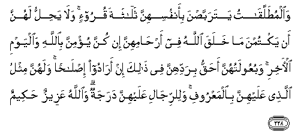

#وَالْمُطَلَّقَاتُ يَتَرَبَّصْنَ بِأَنْفُسِهِنَّ ثَلَاثَةَ قُرُوءٍ ۚ وَلَا يَحِلُّ لَهُنَّ أَنْ يَكْتُمْنَ مَا خَلَقَ اللَّهُ فِي أَرْحَامِهِنَّ إِنْ كُنَّ يُؤْمِنَّ بِاللَّهِ وَالْيَوْمِ الْآخِرِ ۚ وَبُعُولَتُهُنَّ أَحَقُّ بِرَدِّهِنَّ فِي ذَٰلِكَ إِنْ أَرَادُوا إِصْلَاحًا ۚ وَلَهُنَّ مِثْلُ الَّذِي عَلَيْهِنَّ بِالْمَعْرُوفِ ۚ وَلِلرِّجَالِ عَلَيْهِنَّ دَرَجَةٌ ۗ وَاللَّهُ عَزِيزٌ حَكِيمٌ 

##Waalmutallaqatu yatarabbasna bi-anfusihinna thalathata quroo-in wala yahillu lahunna an yaktumna ma khalaqa Allahu fee arhamihinna in kunna yu/minna biAllahi waalyawmi al-akhiri wabuAAoolatuhunna ahaqqu biraddihinna fee thalika in aradoo islahan walahunna mithlu allathee AAalayhinna bialmaAAroofi walilrrijali AAalayhinna darajatun waAllahu AAazeezun hakeemun 

## 翻译(Translation)：

| Translator | 译文(Translation)                                            |
| :--------: | ------------------------------------------------------------ |
|    马坚    | 被休的妇人，当期待三次月经；她们不得隐讳真主造化在她们的子宫里的东西，如果她们确信真主和末日。在等待的期间，她们的丈夫是宜当挽留她们的，如果他们愿意重修旧好。她们应享合理的权利，也应尽合理的义务；男人的权利，比她们高一级。真主是万能的，是至睿的。 |
|  YUSUFALI  | Divorced women shall wait concerning themselves for three monthly periods. Nor is it lawful for them to hide what Allah Hath created in their wombs, if they have faith in Allah and the Last Day. And their husbands have the better right to take them back in that period, if they wish for reconciliation. And women shall have rights similar to the rights against them, according to what is equitable; but men have a degree (of advantage) over them. And Allah is Exalted in Power, Wise. |
| PICKTHALL  | Women who are divorced shall wait, keeping themselves apart, three (monthly) courses. And it is not lawful for them that they should conceal that which Allah hath created in their wombs if they are believers in Allah and the Last Day. And their husbands would do better to take them back in that case if they desire a reconciliation. And they (women) have rights similar to those (of men) over them in kindness, and men are a degree above them. Allah is Mighty, Wise. |
|   SHAKIR   | And the divorced women should keep themselves in waiting for three courses; and it is not lawful for them that they should conceal what Allah has created in their wombs, if they believe in Allah and the last day; and their husbands have a better right to take them back in the meanwhile if they wish for reconciliation; and they have rights similar to those against them in a just manner, and the men are a degree above them, and Allah is Mighty, Wise. |

---

## 对位释义(Words Interpretation)：

| No   | العربية | 中文    | English | 曾用词 |
| ---- | ------: | ------- | ------- | ------ |
| 序号 |    阿文 | Chinese | 英文    | Used   |
| 2:228.1  | وَالْمُطَلَّقَاتُ | 和被休的妇女       | And the divorced women |            |
| 2:228.2  | يَتَرَبَّصْنَ    | 将等待             | shall wait             |            |
| 2:228.3  | بِأَنْفُسِهِنَّ   | 以她们自己         | with themselves        |            |
| 2:228.4  | ثَلَاثَةَ     | 三                 | three                  |            |
| 2:228.5  | قُرُوءٍ      | 月经               | monthly periods        |            |
| 2:228.6  | وَلَا       | 也不               | and not                | 见1:7.8    |
| 2:228.7  | يَحِلُّ       | 它允许             | it lawful              |            |
| 2:228.8  | لَهُنَّ       | 为她们             | for them               | 见2:187.13 |
| 2:228.9  | أَنْ        | 该                 | that                   | 见2:26.5   |
| 2:228.10 | يَكْتُمْنَ     | 她们隐瞒           | they conceal           |            |
| 2:228.11 | مَا        | 什么               | what/ that which       | 见2:17.8   |
| 2:228.12 | خَلَقَ       | 创造             | created                | 见2:29.3   |
| 2:228.13 | اللَّهُ      | 安拉，真主         | Allah                  | 见2:7.2 |
| 2:228.14 | فِي        | 在                 | in                     | 见2:10.1   |
| 2:228.15 | أَرْحَامِهِنَّ   | 她们的子宫         | their wombs            |            |
| 2:228.16 | إِنْ        | 如果               | if                     | 见2:23.18  |
| 2:228.17 | كُنَّ        | 她们是             | they are               |            |
| 2:228.18 | يُؤْمِنَّ      | 她们诚信           | they believe           | 见2:221.5  |
| 2:228.19 | بِاللَّهِ     | 在真主         | in Allah               | 见2:8.6    |
| 2:228.20 | وَالْيَوْمِ    | 和日子             | and the Day            | 见2:62.11  |
| 2:228.21 | الْآخِرِ     | 末                 | Last                   | 见2:8.8    |
| 2:228.22 | وَبُعُولَتُهُنَّ  | 和她们的丈夫       | and their husbands     |            |
| 2:228.23 | أَحَقُّ       | 有权               | right                  |            |
| 2:228.24 | بِرَدِّهِنَّ     | 在挽回她们         | to take them back      |            |
| 2:228.25 | فِي        | 在                 | in                     | 见2:10.1   |
| 2:228.26 | ذَٰلِكَ       | 这个         | this                   | 见2:2.1    |
| 2:228.27 | إِنْ        | 如果               | if                     | 见2:23.18  |
| 2:228.28 | أَرَادُوا    | 他们意向           | they wish              |            |
| 2:228.29 | إِصْلَاحًا    | 重修旧好           | for reconciliation     |            |
| 2:228.30 | وَلَهُنَّ      | 和为她们           | and for them           | 参2:187.13 |
| 2:228.31 | مِثْلُ       | 相似的             | similar                |            |
| 2:228.32 | الَّذِي      | 谁                 | who                    | 见2:17.3   |
| 2:228.33 | عَلَيْهِنَّ     | 在她们             | on they                | 参1:7.4    |
| 2:228.34 | بِالْمَعْرُوفِ  | 依照惯例           | according to usage     | 见2:178.23 |
| 2:228.35 | وَلِلرِّجَالِ   | 和为男人           | and for men            |            |
| 2:228.36 | عَلَيْهِنَّ     | 在她们             | on they                | 见2:228.33 |
| 2:228.37 | دَرَجَةٌ      | 一级               | a degree               |            |
| 2:228.38 | وَاللَّهُ     | 和安拉，真主       | and Allah              | 见2:19.17  |
| 2:228.39 | عَزِيزٌ      | 万能的             | Mighty                 | 见2:209.11 |
| 2:228.40 | حَكِيمٌ      | 至睿的             | Wise                   | 见2:209.12 |

---
