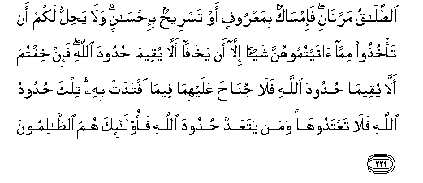

#الطَّلَاقُ مَرَّتَانِ ۖ فَإِمْسَاكٌ بِمَعْرُوفٍ أَوْ تَسْرِيحٌ بِإِحْسَانٍ ۗ وَلَا يَحِلُّ لَكُمْ أَنْ تَأْخُذُوا مِمَّا آتَيْتُمُوهُنَّ شَيْئًا إِلَّا أَنْ يَخَافَا أَلَّا يُقِيمَا حُدُودَ اللَّهِ ۖ فَإِنْ خِفْتُمْ أَلَّا يُقِيمَا حُدُودَ اللَّهِ فَلَا جُنَاحَ عَلَيْهِمَا فِيمَا افْتَدَتْ بِهِ ۗ تِلْكَ حُدُودُ اللَّهِ فَلَا تَعْتَدُوهَا ۚ وَمَنْ يَتَعَدَّ حُدُودَ اللَّهِ فَأُولَٰئِكَ هُمُ الظَّالِمُونَ 

##Alttalaqu marratani fa-imsakun bimaAAroofin aw tasreehun bi-ihsanin wala yahillu lakum an ta/khuthoo mimma ataytumoohunna shay-an illa an yakhafa alla yuqeema hudooda Allahi fa-in khiftum alla yuqeema hudooda Allahi fala junaha AAalayhima feema iftadat bihi tilka hudoodu Allahi falataAAtadooha waman yataAAadda hudooda Allahi faola-ika humu alththalimoona 

## 翻译(Translation)：

| Translator | 译文(Translation)                                            |
| :--------: | ------------------------------------------------------------ |
|    马坚    | 休妻是两次，此後应当以善意挽留（她们），或以优礼解放（她们）。你们已经给过她们的财产，丝毫不得取回，除非夫妻两人恐怕不能遵守真主的法度。如果你们恐怕他们俩不能遵守真主的法度，那末，她以财产赎身，对於他们俩是毫无罪过的。这是真主的法度，你们不要违犯它。谁违犯真主的法度，谁是不义的人。 |
|  YUSUFALI  | A divorce is only permissible twice: after that, the parties should either hold Together on equitable terms, or separate with kindness. It is not lawful for you, (Men), to take back any of your gifts (from your wives), except when both parties fear that they would be unable to keep the limits ordained by Allah. If ye (judges) do indeed fear that they would be unable to keep the limits ordained by Allah, there is no blame on either of them if she give something for her freedom. These are the limits ordained by Allah; so do not transgress them if any do transgress the limits ordained by Allah, such persons wrong (Themselves as well as others). |
|  PICKTHAL  | Divorce must be pronounced twice and then (a woman) must be retained in honour or released in kindness. And it is not lawful for you that ye take from women aught of that which ye have given them; except (in the case) when both fear that they may not be able to keep within the limits (imposed by) Allah. And if ye fear that they may not be able to keep the limits of Allah, in that case it is no sin for either of them if the woman ransom herself. These are the limits (imposed by) Allah. Transgress them not. For whoso transgresseth Allah's limits: such are wrong-doers. |
|   SHAKIR   | Divorce may be (pronounced) twice, then keep (them) in good fellowship or let (them) go with kindness; and it is not lawful for you to take any part of what you have given them, unless both fear that they cannot keep within the limits of Allah; then if you fear that they cannot keep within the limits of Allah, there is no blame on them for what she gives up to become free thereby. These are the limits of Allah, so do not exceed them and whoever exceeds the limits of Allah these it is that are the unjust. |

---

## 对位释义(Words Interpretation)：

| No   | العربية | 中文    | English | 曾用词 |
| ---- | ------: | ------- | ------- | ------ |
| 序号 |    阿文 | Chinese | 英文    | Used   |
| 2:229.1  | الطَّلَاقُ   | 休妻       | divorce             | 见2:227.3  |
| 2:229.2  | مَرَّتَانِ    | 两次       | twice               |            |
| 2:229.3  | فَإِمْسَاكٌ   | 然后挽回   | then keep           |            |
| 2:229.4  | بِمَعْرُوفٍ   | 以善意     | in kindness         |            |
| 2:229.5  | أَوْ       | 或         | or                  | 见2:19.1   |
| 2:229.6  | تَسْرِيحٌ    | 解放       | released            |            |
| 2:229.7  | بِإِحْسَانٍ   | 以好的礼节 | in kindness         | 见2:178.26 |
| 2:229.8  | وَلَا      | 也不       | and not             | 见1:7.8    |
| 2:229.9  | يَحِلُّ      | 它允许     | it lawful           | 见2:228.7  |
| 2:229.10 | لَكُمْ      | 为你们     | For you             | 见2:22.3   |
| 2:229.11 | أَنْ       | 该         | that                | 见2:26.5   |
| 2:229.12 | تَأْخُذُوا   | 取回       | take back           |            |
| 2:229.13 | مِمَّا      | 关于什么   | to what             | 见2:23.5   |
| 2:229.14 | آتَيْتُمُوهُنَّ | 你们给她们 | you have given them |            |
| 2:229.15 | شَيْئًا     | 一件事情   | a thing             | 见2:48.8   |
| 2:229.16 | إِلَّا      | 除了       | Except              | 见2:9.7    |
| 2:229.17 | أَنْ       | 该         | that                | 见2:26.5   |
| 2:229.18 | يَخَافَا    | 两者恐怕   | both fear           |            |
| 2:229.19 | أَلَّا      | 那个不     | that not            |            |
| 2:229.20 | يُقِيمَا    | 他们保持   | they keep           |            |
| 2:229.21 | حُدُودَ     | 限度       | the limits          |            |
| 2:229.22 | اللَّهِ     | 安拉，真主 | Allah               | 见1:1.2    |
| 2:229.23 | فَإِنْ      | 和如果     | and if              | 见2:24.1   |
| 2:229.24 | خِفْتُمْ     | 你们恐怕   | you fear            |            |
| 2:229.25 | أَلَّا      | 那个不     | that not            | 见2:229.19 |
| 2:229.26 | يُقِيمَا    | 他们保持   | they keep           | 见2:229.20 |
| 2:229.27 | حُدُودَ     | 限度       | the limits          | 见2:229.21 |
| 2:229.28 | اللَّهِ     | 安拉，真主 | Allah               | 见1:1.2    |
| 2:229.29 | فَلَا      | 因此不     | shall not           | 见2:22.18  |
| 2:229.30 | جُنَاحَ     | 罪         | sin                 | 见2:158.13 |
| 2:229.31 | عَلَيْهِمَا   | 在他俩     | on either of them   |            |
| 2:229.32 | فِيمَا     | 在什么     | in that             | 见2:113.28 |
| 2:229.33 | افْتَدَتْ    | 付赎金     | ransom              |            |
| 2:229.34 | بِهِ       | 以它       | with it             | 见2:22.13  |
| 2:229.35 | تِلْكَ      | 这些是    | These are           | 见2:111.11 |
| 2:229.36 | حُدُودُ     | 限度       | the limits          | 见2:229.21 |
| 2:229.37 | اللَّهِ     | 安拉，真主 | Allah               | 见1:1.2    |
| 2:229.38 | فَلَا      | 因此不     | shall not           | 见2:22.18  |
| 2:229.39 | تَعْتَدُوهَا  | 违犯他们   | transgress them     |            |
| 2:229.40 | وَمَنْ      | 和谁       | and who             | 见2:108.11 |
| 2:229.41 | يَتَعَدَّ     | 违犯       | exceeds             |            |
| 2:229.42 | حُدُودَ     | 限度       | the limits          | 见2:229.21 |
| 2:229.43 | اللَّهِ     | 安拉，真主 | Allah               | 见1:1.2    |
| 2:229.44 | فَأُولَٰئِكَ   | 然后那些人 | then those          | 见2:81.8   |
| 2:229.45 | هُمُ       | 他们       | they                | 见2:4.11   |
| 2:229.46 | الظَّالِمُونَ | 不义者     | the unjust          |            |

---
