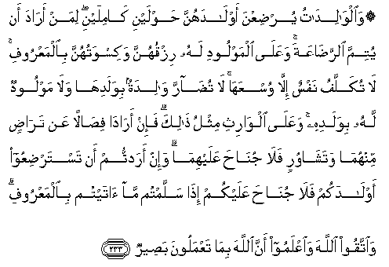

#۞ وَالْوَالِدَاتُ يُرْضِعْنَ أَوْلَادَهُنَّ حَوْلَيْنِ كَامِلَيْنِ ۖ لِمَنْ أَرَادَ أَنْ يُتِمَّ الرَّضَاعَةَ ۚ وَعَلَى الْمَوْلُودِ لَهُ رِزْقُهُنَّ وَكِسْوَتُهُنَّ بِالْمَعْرُوفِ ۚ لَا تُكَلَّفُ نَفْسٌ إِلَّا وُسْعَهَا ۚ لَا تُضَارَّ وَالِدَةٌ بِوَلَدِهَا وَلَا مَوْلُودٌ لَهُ بِوَلَدِهِ ۚ وَعَلَى الْوَارِثِ مِثْلُ ذَٰلِكَ ۗ فَإِنْ أَرَادَا فِصَالًا عَنْ تَرَاضٍ مِنْهُمَا وَتَشَاوُرٍ فَلَا جُنَاحَ عَلَيْهِمَا ۗ وَإِنْ أَرَدْتُمْ أَنْ تَسْتَرْضِعُوا أَوْلَادَكُمْ فَلَا جُنَاحَ عَلَيْكُمْ إِذَا سَلَّمْتُمْ مَا آتَيْتُمْ بِالْمَعْرُوفِ ۗ وَاتَّقُوا اللَّهَ وَاعْلَمُوا أَنَّ اللَّهَ بِمَا تَعْمَلُونَ بَصِيرٌ 

##Waalwalidatu yurdiAAna awladahunna hawlayni kamilayni liman arada an yutimma alrradaAAata waAAala almawloodi lahu rizquhunna wakiswatuhunna bialmaAAroofi la tukallafu nafsun illa wusAAahala tudarra walidatun biwaladiha wala mawloodun lahu biwaladihi waAAala alwarithi mithlu thalika fa-in arada fisalan AAan taradin minhuma watashawurin fala junaha AAalayhima wa-in aradtum an tastardiAAoo awladakum fala junaha AAalaykum itha sallamtum ma ataytum bialmaAAroofi waittaqoo Allaha waiAAlamoo anna Allaha bima taAAmaloona baseerun 

## 翻译(Translation)：

| Translator | 译文(Translation)                                            |
| :--------: | ------------------------------------------------------------ |
|    马坚    | 做母亲的，应当替欲哺满乳期的人，哺乳自己的婴儿两周岁。做父亲的，应当照例供给她们的衣食。每个人只依他的能力而受责成。不要使做母亲的为自己的婴儿而吃亏，也不要使做父亲的为自己的婴儿而吃亏。（如果做父亲的死了），继承人应负同样的责任。如果做父母的欲依协议而断乳，那末，他们俩毫无罪过。如果你们另顾乳母哺乳你们的婴儿，那末，你们毫无罪过，但须交付照例应给的工资。你们当敬畏真主，当知道真主是明察你们的行为的。 |
|  YUSUFALI  | The mothers shall give such to their offspring for two whole years, if the father desires to complete the term. But he shall bear the cost of their food and clothing on equitable terms. No soul shall have a burden laid on it greater than it can bear. No mother shall be Treated unfairly on account of her child. Nor father on account of his child, an heir shall be chargeable in the same way. If they both decide on weaning, by mutual consent, and after due consultation, there is no blame on them. If ye decide on a foster-mother for your offspring, there is no blame on you, provided ye pay (the mother) what ye offered, on equitable terms. But fear Allah and know that Allah sees well what ye do. |
| PICKTHALL  | Mothers shall suckle their children for two whole years; (that is) for those who wish to complete the suckling. The duty of feeding and clothing nursing mothers in a seemly manner is upon the father of the child. No-one should be charged beyond his capacity. A mother should not be made to suffer because of her child, nor should he to whom the child is born (be made to suffer) because of his child. And on the (father's) heir is incumbent the like of that (which was incumbent on the father). If they desire to wean the child by mutual consent and (after) consultation, it is no sin for them; and if ye wish to give your children out to nurse, it is no sin for you, provide that ye pay what is due from you in kindness. Observe your duty to Allah, and know that Allah is Seer of what ye do. |
|   SHAKIR   | And the mothers should suckle their children for two whole years for him who desires to make complete the time of suckling; and their maintenance and their clothing must be-- borne by the father according to usage; no soul shall have imposed upon it a duty but to the extent of its capacity; neither shall a mother be made to suffer harm on account of her child, nor a father on account of his child, and a similar duty (devolves) on the (father's) heir, but if both desire weaning by mutual consent and counsel, there is no blame on them, and if you wish to engage a wet-nurse for your children, there is no blame on you so long as you pay what you promised for according to usage; and be careful of (your duty to) Allah and know that Allah sees what you do. |

---

## 对位释义(Words Interpretation)：

| No   | العربية | 中文    | English | 曾用词 |
| ---- | ------: | ------- | ------- | ------ |
| 序号 |    阿文 | Chinese | 英文    | Used   |
| 2:233.1  | وَالْوَالِدَاتُ | 和母亲             | and the mothers     |            |
| 2:233.2  | يُرْضِعْنَ     | 哺乳               | suckle              |            |
| 2:233.3  | أَوْلَادَهُنَّ   | 她们的孩子         | their children      |            |
| 2:233.4  | حَوْلَيْنِ     | 两年               | two years           |            |
| 2:233.5  | كَامِلَيْنِ    | 全部               | whole               |            |
| 2:233.6  | لِمَنْ       | 对谁               | of who              | 见2:154.3  |
| 2:233.7  | أَرَادَ      | 宗旨，希望         | want, wish          | 见2:26.25  |
| 2:233.8  | أَنْ        | 该                 | that                | 见2:26.5   |
| 2:233.9  | يُتِمَّ       | 完成               | complete            |            |
| 2:233.10 | الرَّضَاعَةَ   | 哺乳               | the suckling        |            |
| 2:233.11 | وَعَلَى      | 和在               | and on              | 见2:184.14 |
| 2:233.12 | الْمَوْلُودِ   | 父亲               | the father          |            |
| 2:233.13 | لَهُ        | 对他               | for he              | 见2:102.62 |
| 2:233.14 | رِزْقُهُنَّ     | 她们的食物         | their food          |            |
| 2:233.15 | وَكِسْوَتُهُنَّ   | 和她们的衣服       | and their clothing  |            |
| 2:233.16 | بِالْمَعْرُوفِ  | 依照惯例           | according to usage  | 见2:178.23 |
| 2:233.17 | لَا        | 不，不是，没有     | no                  | 见2:2.3    |
| 2:233.18 | تُكَلَّفُ      | 被责成             | be charged          |            |
| 2:233.19 | نَفْسٌ       | 一个人             | one                 | 见2:48.5   |
| 2:233.20 | إِلَّا       | 除了               | Except              | 见2:9.7    |
| 2:233.21 | وُسْعَهَا     | 它的能力           | its capacity        |            |
| 2:233.22 | لَا        | 不，不是，没有     | no                  | 见2:2.3    |
| 2:233.23 | تُضَارَّ      | 被亏待             | be Treated unfairly |            |
| 2:233.24 | وَالِدَةٌ     | 母亲               | mother              |            |
| 2:233.25 | بِوَلَدِهَا    | 以她的孩子         | of her child        |            |
| 2:233.26 | وَلَا       | 也不               | and not             | 见1:7.8    |
| 2:233.27 | مَوْلُودٌ     | 父亲               | father              | 参2:233.12 |
| 2:233.28 | لَهُ        | 对他               | for he              | 见2:102.62 |
| 2:233.29 | بِوَلَدِهِ     | 以他的孩子         | of his child        | 参2:233.25 |
| 2:233.30 | وَعَلَى      | 和在               | and on              | 见2:184.14 |
| 2:233.31 | الْوَارِثِ    | 继承人             | the heir            |            |
| 2:233.32 | مِثْلُ       | 相似的             | similar             | 见2:228.31 |
| 2:233.33 | ذَٰلِكَ       | 这个           | this                | 见2:2.1    |
| 2:233.34 | فَإِنْ       | 因此如果       | then if             | 见2:24.1   |
| 2:233.35 | أَرَادَا     | 他俩决定           | they both decide    |            |
| 2:233.36 | فِصَالًا     | 断乳               | weaning             |            |
| 2:233.37 | عَنْ        | 从                 | on                  | 见2:48.6   |
| 2:233.38 | تَرَاضٍ      | 同意               | consent             |            |
| 2:233.39 | مِنْهُمَا     | 从他俩             | from these two      | 见2:102.36 |
| 2:233.40 | وَتَشَاوُرٍ    | 和协议             | and consultation    |            |
| 2:233.41 | فَلَا       | 因此不             | shall not           | 见2:22.18  |
| 2:233.42 | جُنَاحَ      | 罪                 | sin                 | 见2:158.13 |
| 2:233.43 | عَلَيْهِمَا    | 在他俩             | on either of them   | 见2:229.31 |
| 2:233.44 | وَإِنْ       | 和如果             | and if              | 见2:137.9  |
| 2:233.45 | أَرَدْتُمْ     | 你们决定           | you decide          |            |
| 2:233.46 | أَنْ        | 该                 | that                | 见2:26.5   |
| 2:233.47 | تَسْتَرْضِعُوا  | 雇一个乳母         | engage a wet-nurse  |            |
| 2:233.48 | أَوْلَادَكُمْ   | 你们的孩子         | your children       |            |
| 2:233.49 | فَلَا       | 因此不             | shall not           | 见2:22.18  |
| 2:233.50 | جُنَاحَ      | 罪                 | sin                 | 见2:158.13 |
| 2:233.51 | عَلَيْكُمْ     | 在你们             | on you              | 见2:40.8   |
| 2:233.52 | إِذَا       | 当时               | when                | 见2:156.2  |
| 2:233.53 | سَلَّمْتُمْ     | 你们付             | you pay             |            |
| 2:233.54 | مَا        | 什么               | what/ that which    | 见2:17.8   |
| 2:233.55 | آتَيْتُمْ     | 你们应付           | you promised        |            |
| 2:233.56 | بِالْمَعْرُوفِ  | 依照惯例           | according to usage  | 见2:178.23 |
| 2:233.57 | وَاتَّقُوا    | 和畏惧             | And fear            | 见2:48.1   |
| 2:233.58 | اللَّهَ      | 安拉，真主         | Allah               | 见2:9.2 |
| 2:233.59 | وَاعْلَمُوا   | 和知道             | and know            | 见2:194.18 |
| 2:233.60 | أَنَّ        | 该                 | that                | 见2:26.5   |
| 2:233.61 | اللَّهَ      | 安拉，真主         | Allah               | 见2:9.2 |
| 2:233.62 | بِمَا       | 在什么             | in what             | 见2:4.3    |
| 2:233.63 | تَعْمَلُونَ    | 你们行为           | you do              | 见2:74.37  |
| 2:233.64 | بَصِيرٌ      | 明察               | sees well           | 见2:96.23  |

---
