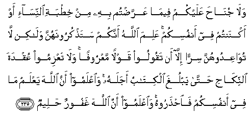

#وَلَا جُنَاحَ عَلَيْكُمْ فِيمَا عَرَّضْتُمْ بِهِ مِنْ خِطْبَةِ النِّسَاءِ أَوْ أَكْنَنْتُمْ فِي أَنْفُسِكُمْ ۚ عَلِمَ اللَّهُ أَنَّكُمْ سَتَذْكُرُونَهُنَّ وَلَٰكِنْ لَا تُوَاعِدُوهُنَّ سِرًّا إِلَّا أَنْ تَقُولُوا قَوْلًا مَعْرُوفًا ۚ وَلَا تَعْزِمُوا عُقْدَةَ النِّكَاحِ حَتَّىٰ يَبْلُغَ الْكِتَابُ أَجَلَهُ ۚ وَاعْلَمُوا أَنَّ اللَّهَ يَعْلَمُ مَا فِي أَنْفُسِكُمْ فَاحْذَرُوهُ ۚ وَاعْلَمُوا أَنَّ اللَّهَ غَفُورٌ حَلِيمٌ 

##Wala junaha AAalaykum feema AAarradtum bihi min khitbati alnnisa-i aw aknantum fee anfusikum AAalima Allahu annakum satathkuroonahunna walakin la tuwaAAidoohunna sirran illa an taqooloo qawlan maAAroofan wala taAAzimoo AAuqdata alnnikahi hatta yablugha alkitabu ajalahu waiAAlamoo anna Allaha yaAAlamu ma fee anfusikum faihtharoohu waiAAlamoo anna Allaha ghafoorun haleemun 

## 翻译(Translation)：

| Translator | 译文(Translation)                                            |
| :--------: | ------------------------------------------------------------ |
|    马坚    | 你们用含蓄的言词，向待婚的妇女求婚，或将你们的意思隐藏在心里，对於你们都是毫无罪过的。真主已知道你们不久要向她们提及婚约，（故准你们对她们有所表示），但不要与她们订密约，只可说合理的话；不要缔结婚约，直到守制满期。你们当晓得真主知道你们的心事，故你们当防备他；并当知道真主是至赦的，是至容的。 |
|  YUSUFALI  | There is no blame on you if ye make an offer of betrothal or hold it in your hearts. Allah knows that ye cherish them in your hearts: But do not make a secret contract with them except in terms Honourable, nor resolve on the tie of marriage till the term prescribed is fulfilled. And know that Allah Knoweth what is in your hearts, and take heed of Him; and know that Allah is Oft-forgiving, Most Forbearing. |
| PICKTHALL  | There is no sin for you in that which ye proclaim or hide in your minds concerning your troth with women. Allah knoweth that ye will remember them. But plight not your troth with women except by uttering a recognised form of words. And do not consummate the marriage until (the term) prescribed is run. Know that Allah knoweth what is in your minds, so beware of Him; and know that Allah is Forgiving, Clement. |
|   SHAKIR   | And there is no blame on you respecting that which you speak indirectly in the asking of (such) women in marriage or keep (the proposal) concealed within your minds; Allah knows that you win mention them, but do not give them a promise in secret unless you speak in a lawful manner, and do not confirm the marriage tie until the writing is fulfilled, and know that Allah knows what is in your minds, therefore beware of Him, and know that Allah is Forgiving, Forbearing. |

---

## 对位释义(Words Interpretation)：

| No   | العربية | 中文    | English | 曾用词 |
| ---- | ------: | ------- | ------- | ------ |
| 序号 |    阿文 | Chinese | 英文    | Used   |
| 2:235.1  | وَلَا       | 也不             | and not                | 见1:7.8    |
| 2:235.2  | جُنَاحَ      | 罪               | sin                    | 见2:158.13 |
| 2:235.3  | عَلَيْكُمْ     | 在你们           | on you                 | 见2:40.8   |
| 2:235.4  | فِيمَا      | 在什么           | in that                | 见2:113.28 |
| 2:235.5  | عَرَّضْتُمْ     | 你们提出         | you proclaim           |            |
| 2:235.6  | بِهِ        | 以它             | with it                | 见2:22.13  |
| 2:235.7  | مِنْ        | 从               | from                   | 见2:4.8    |
| 2:235.8  | خِطْبَةِ      | 求婚             | betrothal              |            |
| 2:235.9  | النِّسَاءِ    | 妇女们的         | of women               |            |
| 2:235.10 | أَوْ        | 或               | or                     | 见2:19.1   |
| 2:235.11 | أَكْنَنْتُمْ    | 隐藏             | hide                   |            |
| 2:235.12 | فِي        | 在               | in                     | 见2:10.1   |
| 2:235.13 | أَنْفُسِكُمْ    | 你们自己         | yourselves             |            |
| 2:235.14 | عَلِمَ       | 知道             | know                   | 见2:60.15  |
| 2:235.15 | اللَّهُ      | 安拉，真主       | Allah                  | 见2:7.2 |
| 2:235.16 | أَنَّكُمْ      | 那个你们         | that you               | 见2:187.16 |
| 2:235.17 | سَتَذْكُرُونَهُنَّ | 你将记得她们     | you will remember them |            |
| 2:235.18 | وَلَٰكِنْ      | 并且但是         | and but                | 见2:12.5   |
| 2:235.19 | لَا        | 不，不是，没有   | no                     | 见2:2.3    |
| 2:235.20 | تُوَاعِدُوهُنَّ  | 与她们订约       | give them a promise    |            |
| 2:235.21 | سِرًّا       | 秘密地           | secret                 |            |
| 2:235.22 | إِلَّا       | 除了             | Except                 | 见2:9.7    |
| 2:235.23 | أَنْ        | 该               | that                   | 见2:26.5   |
| 2:235.24 | تَقُولُوا    | 你们说           | You say                | 见2:104.6  |
| 2:235.25 | قَوْلًا      | 话语             | The word               | 见2:59.4   |
| 2:235.26 | مَعْرُوفًا    | 合理的           | a recognised form      |            |
| 2:235.27 | وَلَا       | 也不             | and not                | 见1:7.8    |
| 2:235.28 | تَعْزِمُوا    | 缔结             | consummate             |            |
| 2:235.29 | عُقْدَةَ      | 约言             | the tie                |            |
| 2:235.30 | النِّكَاحِ    | 结婚             | the marriage           |            |
| 2:235.31 | حَتَّىٰ       | 直到             | Until                  | 见2:55.8   |
| 2:235.32 | يَبْلُغَ      | 达到             | reaches                | 见2:196.15 |
| 2:235.33 | الْكِتَابُ    | 这本书           | the book               | 参2:2.2    |
| 2:235.34 | أَجَلَهُ      | 结束             | fulfilled              |            |
| 2:235.35 | وَاعْلَمُوا   | 和知道           | and know               | 见2:194.18 |
| 2:235.36 | أَنَّ        | 该               | that                   | 见2:26.5   |
| 2:235.37 | اللَّهَ      | 安拉，真主       | Allah                  | 见2:9.2 |
| 2:235.38 | يَعْلَمُ      | 知道             | knows                  | 见2:77.5   |
| 2:235.39 | مَا        | 什么             | what/ that which       | 见2:17.8   |
| 2:235.40 | فِي        | 在               | in                     | 见2:10.1   |
| 2:235.41 | أَنْفُسِكُمْ    | 你们自己         | yourselves             | 见2:235.13 |
| 2:235.42 | فَاحْذَرُوهُ   | 因此你们应防备他 | so beware of Him       |            |
| 2:235.43 | وَاعْلَمُوا   | 和知道           | and know               | 见2:194.18 |
| 2:235.44 | أَنَّ        | 该               | that                   | 见2:26.5   |
| 2:235.45 | اللَّهَ      | 安拉，真主       | Allah                  | 见2:9.2 |
| 2:235.46 | غَفُورٌ      | 至赦的           | Forgiving              | 见2:173.24 |
| 2:235.47 | حَلِيمٌ      | 至容的           | Forbearing             | 见2:225.14 |

---