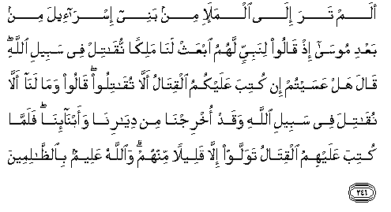

#أَلَمْ تَرَ إِلَى الْمَلَإِ مِنْ بَنِي إِسْرَائِيلَ مِنْ بَعْدِ مُوسَىٰ إِذْ قَالُوا لِنَبِيٍّ لَهُمُ ابْعَثْ لَنَا مَلِكًا نُقَاتِلْ فِي سَبِيلِ اللَّهِ ۖ قَالَ هَلْ عَسَيْتُمْ إِنْ كُتِبَ عَلَيْكُمُ الْقِتَالُ أَلَّا تُقَاتِلُوا ۖ قَالُوا وَمَا لَنَا أَلَّا نُقَاتِلَ فِي سَبِيلِ اللَّهِ وَقَدْ أُخْرِجْنَا مِنْ دِيَارِنَا وَأَبْنَائِنَا ۖ فَلَمَّا كُتِبَ عَلَيْهِمُ الْقِتَالُ تَوَلَّوْا إِلَّا قَلِيلًا مِنْهُمْ ۗ وَاللَّهُ عَلِيمٌ بِالظَّالِمِينَ 

##Alam tara ila almala-i min banee isra-eela min baAAdi moosa ith qaloo linabiyyin lahumu ibAAath lana malikan nuqatil fee sabeeli Allahi qala hal AAasaytum in kutiba AAalaykumu alqitalu alla tuqatiloo qaloo wama lana alla nuqatila fee sabeeli Allahi waqad okhrijna min diyarina waabna-ina falammakutiba AAalayhimu alqitalu tawallaw illa qaleelan minhum waAllahu AAaleemun bialththalimeena 

## 翻译(Translation)：

| Translator | 译文(Translation)                                            |
| :--------: | ------------------------------------------------------------ |
|    马坚    | 你不知道穆萨死後以色列人中的领袖吗？当时他们对一个同族的先知说：请你替我们立一个国王，我们就为主道而战斗。他说：如果战斗成为你们的定制，你们会不战斗吗？他们说：我们已被敌人逐出故乡，父子离散，我们怎能不为主道而战斗呢？战斗已成为他们的定制的时候，他们除少数人外，都违背命令了。真主是全知不义的人的。 |
|  YUSUFALI  | Hast thou not Turned thy vision to the Chiefs of the Children of Israel after (the time of) Moses? they said to a prophet (That was) among them: "Appoint for us a king, that we May fight in the cause of Allah." He said: "Is it not possible, if ye were commanded to fight, that that ye will not fight?" They said: "How could we refuse to fight in the cause of Allah, seeing that we were turned out of our homes and our families?" but when they were commanded to fight, they turned back, except a small band among them. But Allah Has full knowledge of those who do wrong. |
| PICKTHALL  | Bethink thee of the leaders of the Children of Israel after Moses, how they said unto a prophet whom they had: Set up for us a king and we will fight in Allah's way. He said: Would ye then refrain from fighting if fighting were prescribed for you? They said: Why should we not fight in Allah's way when we have been driven from our dwellings with our children? Yet, when fighting was prescribed for them, they turned away, all save a few of them. Allah is aware of evil-doers. |
|   SHAKIR   | Have you not considered the chiefs of the children of Israel after Musa, when they said to a prophet of theirs: Raise up for us a king, (that) we may fight in the way of Allah. He said: May it not be that you would not fight if fighting is ordained for you? They said: And what reason have we that we should not fight in the way of Allah, and we have indeed been compelled to abandon our homes and our children. But when fighting was ordained for them, they turned back, except a few of them, and Allah knows the unjust. |

---

## 对位释义(Words Interpretation)：

| No   | العربية | 中文    | English | 曾用词 |
| ---- | ------: | ------- | ------- | ------ |
| 序号 |    阿文 | Chinese | 英文    | Used   |
| 2:246.1  | أَلَمْ       | 难道不       | did not             | 见2:33.10  |
| 2:246.2  | تَرَ        | 你知道       | you consider        | 见2:243.2  |
| 2:246.3  | إِلَى       | 至           | to                  | 见2:14.9   |
| 2:246.4  | الْمَلَإِ     | 领袖         | the chiefs          |            |
| 2:246.5  | مِنْ        | 从           | from                | 见2:4.8    |
| 2:246.6  | بَنِي       | 后裔         | Children            | 见2:40.2   |
| 2:246.7  | إِسْرَائِيلَ   | 以色列       | Israel              | 见2:40.3   |
| 2:246.8  | مِنْ        | 从           | from                | 见2:4.8    |
| 2:246.9  | بَعْدِ       | 之后         | after               | 见2:27.6   |
| 2:246.10 | مُوسَىٰ      | 穆萨         | Moses               | 见2:51.3   |
| 2:246.11 | إِذْ        | 当时         | when                | 见2:131.1  |
| 2:246.12 | قَالُوا     | 他们说，     | They said           | 见2:11.8   |
| 2:246.13 | لِنَبِيٍّ      | 对一个先知   | to a prophet        |            |
| 2:246.14 | لَهُمُ       | 对他们       | for them            | 见2:11.3   |
| 2:246.15 | ابْعَثْ      | 指派         | set up              |            |
| 2:246.16 | لَنَا       | 为我们       | for us              | 见2:32.5   |
| 2:246.17 | مَلِكًا      | 一个国王     | a king              |            |
| 2:246.18 | نُقَاتِلْ     | 我们战斗     | we may fight        |            |
| 2:246.19 | فِي        | 在           | in                  | 见2:10.1   |
| 2:246.20 | سَبِيلِ      | 道路         | the way             | 见2:154.6  |
| 2:246.21 | اللَّهِ      | 安拉，真主   | Allah               | 见1:1.2    |
| 2:246.22 | قَالَ       | 他说，       | He said             | 见2:30.2   |
| 2:246.23 | هَلْ        | 是吗？       | Do you              | 见2:210.1  |
| 2:246.24 | عَسَيْتُمْ     | 你们希望     | you will            |            |
| 2:246.25 | إِنْ        | 如果         | if                  | 见2:23.18  |
| 2:246.26 | كُتِبَ       | 被规定       | is prescribed       | 见2:178.5  |
| 2:246.27 | عَلَيْكُمُ     | 在你们       | on you              | 见2:40.8   |
| 2:246.28 | الْقِتَالُ    | 战争         | fighting            | 见2:216.3  |
| 2:246.29 | أَلَّا       | 那个不       | that not            | 见2:229.19 |
| 2:246.30 | تُقَاتِلُوا   | 你们战斗     | you fight           |            |
| 2:246.31 | قَالُوا     | 他们说，     | They said           | 见2:11.8   |
| 2:246.32 | وَمَا       | 和什么       | and that            | 见2:4.6    |
| 2:246.33 | لَنَا       | 为我们       | for us              | 见2:32.5   |
| 2:246.34 | أَلَّا       | 那个不       | that not            | 见2:229.19 |
| 2:246.35 | نُقَاتِلَ     | 我们战斗     | we may fight        | 见2:246.18 |
| 2:246.36 | فِي        | 在           | in                  | 见2:10.1   |
| 2:246.37 | سَبِيلِ      | 道路         | the way             | 见2:154.6  |
| 2:246.38 | اللَّهِ      | 安拉，真主   | Allah               | 见1:1.2    |
| 2:246.39 | وَقَدْ       | 和当然       | and may             | 见2:75.5   |
| 2:246.40 | أُخْرِجْنَا    | 我们被逐出   | we have been driven |            |
| 2:246.41 | مِنْ        | 从           | from                | 见2:4.8    |
| 2:246.42 | دِيَارِنَا    | 我们的家     | our homes           |            |
| 2:246.43 | وَأَبْنَائِنَا  | 和我们的孩子 | and our children    |            |
| 2:246.44 | فَلَمَّا      | 但是当       | but when            | 见2:17.6   |
| 2:246.45 | كُتِبَ       | 被规定       | is prescribed       | 见2:178.5  |
| 2:246.46 | عَلَيْهِمُ     | 在他们       | on they             | 见1:7.4    |
| 2:246.47 | الْقِتَالُ    | 战争         | fighting            | 见2:216.3  |
| 2:246.48 | تَوَلَّوْا     | 你们转向     | you turn            | 见2:115.5  |
| 2:246.49 | إِلَّا       | 除了         | Except              | 见2:9.7    |
| 2:246.50 | قَلِيلًا     | 微小的       | A little            | 见2:41.16  |
| 2:246.51 | مِنْهُمْ      | 从他们       | from them           | 见2:75.8   |
| 2:246.52 | وَاللَّهُ     | 和安拉，真主 | and Allah           | 见2:19.17  |
| 2:246.53 | عَلِيمٌ      | 全知的       | Knowing             | 见2:29.19  |
| 2:246.54 | بِالظَّالِمِينَ | 不义的人     | The unjust          | 见2:95.9   |

---
