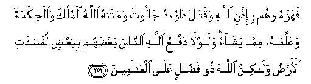

#فَهَزَمُوهُمْ بِإِذْنِ اللَّهِ وَقَتَلَ دَاوُودُ جَالُوتَ وَآتَاهُ اللَّهُ الْمُلْكَ وَالْحِكْمَةَ وَعَلَّمَهُ مِمَّا يَشَاءُ ۗ وَلَوْلَا دَفْعُ اللَّهِ النَّاسَ بَعْضَهُمْ بِبَعْضٍ لَفَسَدَتِ الْأَرْضُ وَلَٰكِنَّ اللَّهَ ذُو فَضْلٍ عَلَى الْعَالَمِينَ 

## 

## 翻译(Translation)：

| Translator | 译文(Translation) |
| :--------: | ----------------- |
|    马坚    |                   |
|  YUSUFALI  |                   |
|  PICKTHAL  |                   |
|   SHAKIR   |                   |

---

## 对位释义(Words Interpretation)：

| No   | العربية | 中文    | English | 曾用词 |
| ---- | ------: | ------- | ------- | ------ |
| 序号 |    阿文 | Chinese | 英文    | Used   |
|      |         |         |         |        |

---
