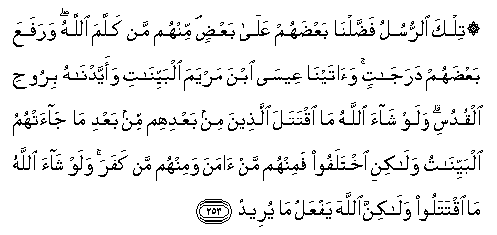

#۞ تِلْكَ الرُّسُلُ فَضَّلْنَا بَعْضَهُمْ عَلَىٰ بَعْضٍ ۘ مِنْهُمْ مَنْ كَلَّمَ اللَّهُ ۖ وَرَفَعَ بَعْضَهُمْ دَرَجَاتٍ ۚ وَآتَيْنَا عِيسَى ابْنَ مَرْيَمَ الْبَيِّنَاتِ وَأَيَّدْنَاهُ بِرُوحِ الْقُدُسِ ۗ وَلَوْ شَاءَ اللَّهُ مَا اقْتَتَلَ الَّذِينَ مِنْ بَعْدِهِمْ مِنْ بَعْدِ مَا جَاءَتْهُمُ الْبَيِّنَاتُ وَلَٰكِنِ اخْتَلَفُوا فَمِنْهُمْ مَنْ آمَنَ وَمِنْهُمْ مَنْ كَفَرَ ۚ وَلَوْ شَاءَ اللَّهُ مَا اقْتَتَلُوا وَلَٰكِنَّ اللَّهَ يَفْعَلُ مَا يُرِيدُ 

##Tilka alrrusulu faddalna baAAdahum AAala baAAdin minhum man kallama Allahu warafaAAa baAAdahum darajatin waatayna AAeesa ibna maryama albayyinati waayyadnahu biroohi alqudusi walaw shaa Allahu ma iqtatala allatheena min baAAdihim min baAAdi ma jaat-humu albayyinatu walakini ikhtalafoo faminhum man amana waminhum man kafara walaw shaa Allahu ma iqtataloo walakinna Allaha yafAAalu ma yureedu 

## 翻译(Translation)：

| Translator | 译文(Translation)                                            |
| :--------: | ------------------------------------------------------------ |
|    马坚    | 这些使者，我使他们的品格互相超越；他们中有真主曾和他们说话的，有真主提升他若干等级的。我曾以许多明证赏赐麦尔彦之子尔撤，并且以玄灵扶助他。假若真主意欲，他们的信徒在明证降临之後，必不互相残杀，但他们意见分歧，他们中有信道的，有不信道的。假若真主意欲，他们必不互相攻击，但真主是为所欲为的。 |
|  YUSUFALI  | Those messengers We endowed with gifts, some above others: To one of them Allah spoke; others He raised to degrees (of honour); to Jesus the son of Mary We gave clear (Signs), and strengthened him with the holy spirit. If Allah had so willed, succeeding generations would not have fought among each other, after clear (Signs) had come to them, but they (chose) to wrangle, some believing and others rejecting. If Allah had so willed, they would not have fought each other; but Allah Fulfilleth His plan. |
| PICKTHALL  | Of those messengers, some of whom We have caused to excel others, and of whom there are some unto whom Allah spake, while some of them He exalted (above others) in degree; and We gave Jesus, son of Mary, clear proofs (of Allah's Sovereignty) and We supported him with the holy Spirit. And if Allah had so wiled it, those who followed after them would not have fought one with another after the clear proofs had come unto them. But they differed, some of them believing and some disbelieving. And if Allah had so willed it, they would not have fought one with another; but Allah doeth what He will. |
|   SHAKIR   | We have made some of these messengers to excel the others among them are they to whom Allah spoke, and some of them He exalted by (many degrees of) rank; and We gave clear miracles to Isa son of Marium, and strengthened him with the holy spirit. And if Allah had pleased, those after them would not have fought one with another after clear arguments had come to them, but they disagreed; so there were some of them who believed and others who denied; and if Allah had pleased they would not have fought one with another, but Allah brings about what He intends. |

---

## 对位释义(Words Interpretation)：

| No   | العربية | 中文    | English | 曾用词 |
| ---- | ------: | ------- | ------- | ------ |
| 序号 |    阿文 | Chinese | 英文    | Used   |
| 2:253.1  | تِلْكَ     | 这些是       | These are                         | 见2:111.11 |
| 2:253.2  | الرُّسُلُ   | 使者         | the messengers                    | 参2:87.8   |
| 2:253.3  | فَضَّلْنَا   | 我们赋予     | We endowed                        |            |
| 2:253.4  | بَعْضَهُمْ   | 他们的一些   | Some of them                      | 见2:76.9   |
| 2:253.5  | عَلَىٰ     | 至           | On                                | 见2:5.2    |
| 2:253.6  | بَعْضٍ     | 一部分       | Some                              | 见2:76.11  |
| 2:253.7  | مِنْهُمْ    | 从他们       | from them                         | 见2:75.8   |
| 2:253.8  | مَنْ      | 谁           | who                               | 见2:97.2   |
| 2:253.9  | كَلَّمَ     | 说话         | spoke                             |            |
| 2:253.10 | اللَّهُ    | 安拉，真主   | Allah                             | 见2:7.2 |
| 2:253.11 | وَرَفَعَ    | 提升         | raised                            |            |
| 2:253.12 | بَعْضَهُمْ   | 他们的一些   | Some of them                      | 见2:76.9   |
| 2:253.13 | دَرَجَاتٍ   | 等级         | degree                            |            |
| 2:253.14 | وَآتَيْنَا  | 和我们给     | and we gave                       | 见2:87.9   |
| 2:253.15 | عِيسَى    | 尔撒         | Isa                               | 见2:87.10  |
| 2:253.16 | ابْنَ     | 儿子         | Son                               | 见2:87.11  |
| 2:253.17 | مَرْيَمَ    | 麦尔彦       | Marium                            | 见2:87.12  |
| 2:253.18 | الْبَيِّنَاتِ | 明证         | Clear Signs                       | 见2:87.13  |
| 2:253.19 | وَأَيَّدْنَاهُ | 和我们扶助他 | and We supported him              | 见2:87.14  |
| 2:253.20 | بِرُوحِ    | 以灵         | with spirit                       | 见2:87.15  |
| 2:253.21 | الْقُدُسِ   | 神圣的       | the Holy                          | 见2:87.16  |
| 2:253.22 | وَلَوْ     | 和如果       | and if                            | 见2:20.14  |
| 2:253.23 | شَاءَ     | 意欲         | Will                              | 见2:20.15  |
| 2:253.24 | اللَّهُ    | 安拉，真主   | Allah                             | 见2:7.2 |
| 2:253.25 | مَا      | 不           | not                               | 见2:120.24 |
| 2:253.26 | اقْتَتَلَ   | 他互相残杀   | have fought one with another      |            |
| 2:253.27 | الَّذِينَ   | 谁，那些     | those who                         | 见2:6.2    |
| 2:253.28 | مِنْ      | 从           | from                              | 见2:4.8    |
| 2:253.29 | بَعْدِهِمْ   | 他们之后     | after them                        | 参2:27.6   |
| 2:253.30 | مِنْ      | 从           | from                              | 见2:4.8    |
| 2:253.31 | بَعْدِ     | 之后         | after                             | 见2:27.6   |
| 2:253.32 | مَا      | 什么         | what/ that which                  | 见2:17.8   |
| 2:253.33 | جَاءَتْهُمُ  | 来至他们     | come to them                      | 见2:213.29 |
| 2:253.34 | الْبَيِّنَاتُ | 明证         | the clear Signs                   | 见2:209.7  |
| 2:253.35 | وَلَٰكِنِ    | 并且但是     | and but                           | 见2:12.5   |
| 2:253.36 | اخْتَلَفُوا | 争论         | differed                          | 见2:176.9  |
| 2:253.37 | فَمِنْهُمْ   | 然后从他们   | then from them                    | 参2:75.8   |
| 2:253.38 | مَنْ      | 谁           | who                               | 见2:97.2   |
| 2:253.39 | آمَنَ     | 相信         | believe                           | 见2:13.6   |
| 2:253.40 | وَمِنْهُمْ   | 和从他们     | and from them                     | 见2:78.1   |
| 2:253.41 | مَنْ      | 谁           | who                               | 见2:97.2   |
| 2:253.42 | كَفَرَ     | 不信         | disbelieve                        | 见2:102.9  |
| 2:253.43 | وَلَوْ     | 和如果       | and if                            | 见2:20.14  |
| 2:253.44 | شَاءَ     | 意欲         | Will                              | 见2:20.15  |
| 2:253.45 | اللَّهُ    | 安拉，真主   | Allah                             | 见2:7.2 |
| 2:253.46 | مَا      | 不           | not                               | 见2:120.24 |
| 2:253.47 | اقْتَتَلُوا | 他们互相残杀 | they have fought one with another | 参2:253.26 |
| 2:253.48 | وَلَٰكِنَّ    | 并且但是     | and but                           | 见2:12.5   |
| 2:253.49 | اللَّهَ    | 安拉，真主   | Allah                             | 见2:9.2 |
| 2:253.50 | يَفْعَلُ    | 做           | do                                | 见2:85.31  |
| 2:253.51 | مَا      | 什么         | what/ that which                  | 见2:17.8   |
| 2:253.52 | يُرِيدُ    | 希望         | desire                            | 见2:185.29 |

---
