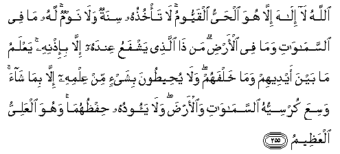

#اللَّهُ لَا إِلَٰهَ إِلَّا هُوَ الْحَيُّ الْقَيُّومُ ۚ لَا تَأْخُذُهُ سِنَةٌ وَلَا نَوْمٌ ۚ لَهُ مَا فِي السَّمَاوَاتِ وَمَا فِي الْأَرْضِ ۗ مَنْ ذَا الَّذِي يَشْفَعُ عِنْدَهُ إِلَّا بِإِذْنِهِ ۚ يَعْلَمُ مَا بَيْنَ أَيْدِيهِمْ وَمَا خَلْفَهُمْ ۖ وَلَا يُحِيطُونَ بِشَيْءٍ مِنْ عِلْمِهِ إِلَّا بِمَا شَاءَ ۚ وَسِعَ كُرْسِيُّهُ السَّمَاوَاتِ وَالْأَرْضَ ۖ وَلَا يَئُودُهُ حِفْظُهُمَا ۚ وَهُوَ الْعَلِيُّ الْعَظِيمُ 

##Allahu la ilaha illa huwa alhayyu alqayyoomu la ta/khuthuhu sinatun wala nawmun lahu ma fee alssamawati wama fee al-ardi man tha allathee yashfaAAu AAindahu illa bi-ithnihi yaAAlamu ma bayna aydeehim wama khalfahum wala yuheetoona bishay-in min AAilmihi illa bima shaa wasiAAa kursiyyuhu alssamawati waal-arda wala yaooduhu hifthuhuma wahuwa alAAaliyyu alAAatheemu 

## 翻译(Translation)：

| Translator | 译文(Translation)                                            |
| :--------: | ------------------------------------------------------------ |
|    马坚    | 真主，除他外绝无应受崇拜的；他是永生不灭的，是维护万物的；瞌睡不能侵犯他，睡眠不能克服他；天地万物都是他的；不经他的许可，谁能在他那里替人说情呢？他知道他们面前的事，和他们身後的事；除他所启示的外，他们绝不能窥测他的玄妙；他的知觉，包罗天地。天地的维持，不能使他疲倦。他确是至尊的，确是至大的。 |
|  YUSUFALI  | Allah! There is no god but He,-the Living, the Self-subsisting, Eternal. No slumber can seize Him nor sleep. His are all things in the heavens and on earth. Who is there can intercede in His presence except as He permitteth? He knoweth what (appeareth to His creatures as) before or after or behind them. Nor shall they compass aught of His knowledge except as He willeth. His Throne doth extend over the heavens and the earth, and He feeleth no fatigue in guarding and preserving them for He is the Most High, the Supreme (in glory). |
| PICKTHALL  | Allah! There is no deity save Him, the Alive, the Eternal. Neither slumber nor sleep overtaketh Him. Unto Him belongeth whatsoever is in the heavens and whatsoever is in the earth. Who is he that intercedeth with Him save by His leave? He knoweth that which is in front of them and that which is behind them, while they encompass nothing of His knowledge save what He will. His throne includeth the heavens and the earth, and He is never weary of preserving them. He is the Sublime, the Tremendous. |
|   SHAKIR   | Allah is He besides Whom there is no god, the Everliving, the Self-subsisting by Whom all subsist; slumber does not overtake Him nor sleep; whatever is in the heavens and whatever is in the earth is His; who is he that can intercede with Him but by His permission? He knows what is before them and what is behind them, and they cannot comprehend anything out of His knowledge except what He pleases, His knowledge extends over the heavens and the earth, and the preservation of them both tires Him not, and He is the Most High, the Great. |

---

## 对位释义(Words Interpretation)：

| No   | العربية | 中文    | English | 曾用词 |
| ---- | ------: | ------- | ------- | ------ |
| 序号 |    阿文 | Chinese | 英文    | Used   |
| 2:255.1  | اللَّهُ     | 安拉，真主     | Allah               | 见2:7.2 |
| 2:255.2  | لَا       | 不，不是，没有 | no                  | 见2:2.3    |
| 2:255.3  | إِلَٰهَ      | 主宰           | Allah               | 见2:163.3  |
| 2:255.4  | إِلَّا      | 除了           | Except              | 见2:9.7    |
| 2:255.5  | هُوَ       | 他是           | He is               | 见2:29.1   |
| 2:255.6  | الْحَيُّ     | 永生的         | the Everliving      |            |
| 2:255.7  | الْقَيُّومُ   | 维护万物的     | the Self-subsisting |            |
| 2:255.8  | لَا       | 不，不是，没有 | no                  | 见2:2.3    |
| 2:255.9  | تَأْخُذُهُ    | 侵犯他         | seize Him           |            |
| 2:255.10 | سِنَةٌ      | 瞌睡           | slumber             |            |
| 2:255.11 | وَلَا      | 也不           | and not             | 见1:7.8    |
| 2:255.12 | نَوْمٌ      | 睡眠           | sleep               |            |
| 2:255.13 | لَهُ       | 对他           | for he              | 见2:102.62 |
| 2:255.14 | مَا       | 什么           | what/ that which    | 见2:17.8   |
| 2:255.15 | فِي       | 在             | in                  | 见2:10.1   |
| 2:255.16 | السَّمَاوَاتِ | 诸天的       | of the heavens      | 见2:33.16  |
| 2:255.17 | وَمَا      | 和什么         | and that            | 见2:4.6    |
| 2:255.18 | فِي       | 在             | in                  | 见2:10.1   |
| 2:255.19 | الْأَرْضِ    | 大地           | Earth               | 见2:22.4   |
| 2:255.20 | مَنْ       | 谁             | who                 | 见2:97.2   |
| 2:255.21 | ذَا       | 拥有           | is                  | 见2:245.2  |
| 2:255.22 | الَّذِي     | 谁             | who                 | 见2:17.3   |
| 2:255.23 | يَشْفَعُ     | 他说情         | he intercedes       |            |
| 2:255.24 | عِنْدَهُ     | 他有           | he has              | 见2:140.23 |
| 2:255.25 | إِلَّا      | 除了           | Except              | 见2:9.7    |
| 2:255.26 | بِإِذْنِهِ    | 以他的意旨     | by His will         | 见2:213.42 |
| 2:255.27 | يَعْلَمُ     | 知道           | knows               | 见2:77.5   |
| 2:255.28 | مَا       | 什么           | what/ that which    | 见2:17.8   |
| 2:255.29 | بَيْنَ      | 之间           | between             | 见2:66.4   |
| 2:255.30 | أَيْدِيهِمْ   | 他们的手       | Their hands         | 见2:79.20  |
| 2:255.31 | وَمَا      | 和什么         | and that            | 见2:4.6    |
| 2:255.32 | خَلْفَهُمْ    | 他们的后面     | behind them         |            |
| 2:255.33 | وَلَا      | 也不           | and not             | 见1:7.8    |
| 2:255.34 | يُحِيطُونَ   | 他们了解       | they comprehend     |            |
| 2:255.35 | بِشَيْءٍ     | 在某些事物     | with something      | 见2:155.2  |
| 2:255.36 | مِنْ       | 从             | from                | 见2:4.8    |
| 2:255.37 | عِلْمِهِ     | 他的知识       | His knowledge       |            |
| 2:255.38 | إِلَّا      | 除了           | Except              | 见2:9.7    |
| 2:255.39 | بِمَا      | 在什么         | in what             | 见2:4.3    |
| 2:255.40 | شَاءَ      | 意欲           | Will                | 见2:20.15  |
| 2:255.41 | وَسِعَ      | 伸展           | extends             |            |
| 2:255.42 | كُرْسِيُّهُ    | 他的宝座       | His throne          |            |
| 2:255.43 | السَّمَاوَاتِ | 诸天的       | of the heavens      | 见2:33.16  |
| 2:255.44 | وَالْأَرْضَ   | 和土地         | and earth           | 见2:33.17  |
| 2:255.45 | وَلَا      | 也不           | and not             | 见1:7.8    |
| 2:255.46 | يَئُودُهُ    | 疲倦他         | weary Him           |            |
| 2:255.47 | حِفْظُهُمَا   | 维持他俩       | preserving them     |            |
| 2:255.48 | وَهُوَ      | 和他           | and he              | 见2:29.16  |
| 2:255.49 | الْعَلِيُّ    | 至高的         | the Most High       |            |
| 2:255.50 | الْعَظِيمُ   | 至大的         | the Great           |            |

---
