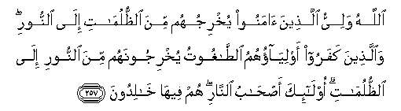

#اللَّهُ وَلِيُّ الَّذِينَ آمَنُوا يُخْرِجُهُمْ مِنَ الظُّلُمَاتِ إِلَى النُّورِ ۖ وَالَّذِينَ كَفَرُوا أَوْلِيَاؤُهُمُ الطَّاغُوتُ يُخْرِجُونَهُمْ مِنَ النُّورِ إِلَى الظُّلُمَاتِ ۗ أُولَٰئِكَ أَصْحَابُ النَّارِ ۖ هُمْ فِيهَا خَالِدُونَ 

##Allahu waliyyu allatheena amanoo yukhrijuhum mina alththulumati ila alnnoori waallatheena kafaroo awliyaohumu alttaghootu yukhrijoonahum mina alnnoori ila alththulumati ola-ika as-habu alnnari hum feeha khalidoona 

## 翻译(Translation)：

| Translator | 译文(Translation)                                            |
| :--------: | ------------------------------------------------------------ |
|    马坚    | 真主是信道的人的保佑者，使他们从重重黑暗走入光明；不信道的人的保佑者是恶魔，使他们从光明走入重重黑暗。这等人，是火狱的居民，他们将永居其中。 |
|  YUSUFALI  | Allah is the Protector of those who have faith: from the depths of darkness He will lead them forth into light. Of those who reject faith the patrons are the evil ones: from light they will lead them forth into the depths of darkness. They will be companions of the fire, to dwell therein (For ever). |
|  PICKTHAL  | Allah is the Protecting Guardian of those who believe. He bringeth them out of darkness into light. As for those who disbelieve, their patrons are false deities. They bring them out of light into darkness. Such are rightful owners of the Fire. They will abide therein. |
|   SHAKIR   | Allah is the guardian of those who believe. He brings them out of the darkness into the light; and (as to) those who disbelieve, their guardians are Shaitans who take them out of the light into the darkness; they are the inmates of the fire, in it they shall abide. |

---

## 对位释义(Words Interpretation)：

| No   | العربية | 中文    | English | 曾用词 |
| ---- | ------: | ------- | ------- | ------ |
| 序号 |    阿文 | Chinese | 英文    | Used   |
| 2:257.1  | اللَّهُ     | 安拉，真主   | Allah               | 见1:1.2    |
| 2:257.2  | وَلِيُّ      | 保护者       | Guardian            | 见2:107.15 |
| 2:257.3  | الَّذِينَ    | 谁，那些     | those who           | 见2:6.2    |
| 2:257.4  | آمَنُوا    | 诚信         | believe             | 见2:9.4    |
| 2:257.5  | يُخْرِجُهُمْ   | 他带出他们   | He brings them out  |            |
| 2:257.6  | مِنَ       | 从           | from                | 见2:4.8    |
| 2:257.7  | الظُّلُمَاتِ  | 重重黑暗     | the darkness        |            |
| 2:257.8  | إِلَى      | 至           | to                  | 见2:14.9   |
| 2:257.9  | النُّورِ    | 光明         | the light           |            |
| 2:257.10 | وَالَّذِينَ   | 和那些       | and those who       | 见2:21.8   |
| 2:257.11 | كَفَرُوا    | 不信         | disbelieve          | 见2:6.3    |
| 2:257.12 | أَوْلِيَاؤُهُمُ | 他们的保护者 | their guardians     |            |
| 2:257.13 | الطَّاغُوتُ  | 恶魔         | the evil ones       |            |
| 2:257.14 | يُخْرِجُونَهُمْ | 他们带出他们 | They bring them out | 参2:257.5  |
| 2:257.15 | مِنَ       | 从           | from                | 见2:4.8    |
| 2:257.16 | النُّورِ    | 光明         | the light           | 见2:257.9  |
| 2:257.17 | إِلَى      | 至           | to                  | 见2:14.9   |
| 2:257.18 | الظُّلُمَاتِ  | 重重黑暗     | the darkness        | 见2:257.7  |
| 2:257.19 | أُولَٰئِكَ    | 这等人       | These are           | 见2:5.1    |
| 2:257.20 | أَصْحَابُ    | 居民         | inmates             | 见2:39.6   |
| 2:257.21 | النَّارِ    | 火狱         | the Fire            | 见2:24.7   |
| 2:257.22 | هُمْ       | 他们         | they                | 见2:4.11   |
| 2:257.23 | فِيهَا     | 在其中       | therein             | 见2:25.29  |
| 2:257.24 | خَالِدُونَ   | 不朽，永居   | Immortal            | 见2:25.34  |

---
