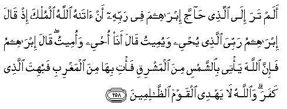

#أَلَمْ تَرَ إِلَى الَّذِي حَاجَّ إِبْرَاهِيمَ فِي رَبِّهِ أَنْ آتَاهُ اللَّهُ الْمُلْكَ إِذْ قَالَ إِبْرَاهِيمُ رَبِّيَ الَّذِي يُحْيِي وَيُمِيتُ قَالَ أَنَا أُحْيِي وَأُمِيتُ ۖ قَالَ إِبْرَاهِيمُ فَإِنَّ اللَّهَ يَأْتِي بِالشَّمْسِ مِنَ الْمَشْرِقِ فَأْتِ بِهَا مِنَ الْمَغْرِبِ فَبُهِتَ الَّذِي كَفَرَ ۗ وَاللَّهُ لَا يَهْدِي الْقَوْمَ الظَّالِمِينَ 

##Alam tara ila allathee hajja ibraheema fee rabbihi an atahu Allahu almulka ith qala ibraheemu rabbiya allathee yuhyee wayumeetu qala ana ohyee waomeetu qala ibraheemu fa-inna Allaha ya/tee bialshshamsi mina almashriqi fa/ti biha mina almaghribi fabuhita allathee kafara waAllahu la yahdee alqawma alththalimeena 

## 翻译(Translation)：

| Translator | 译文(Translation)                                            |
| :--------: | ------------------------------------------------------------ |
|    马坚    | 难道你没有看见那个人吗？真主把国权赏赐他，故他与易卜拉欣争论他的主。当时，易卜拉欣说：我的主能使死者生，能使生者死。他说：我也能使死者生，能使生者死。易卜拉欣说：真主的确能使太阳从东方升起，你使它从西方升起吧。那个不信道的人，就哑口无言了。真主不引导不义的民众。 |
|  YUSUFALI  | Hast thou not Turned thy vision to one who disputed with Abraham About his Lord, because Allah had granted him power? Abraham said: "My Lord is He Who Giveth life and death." He said: "I give life and death". Said Abraham: "But it is Allah that causeth the sun to rise from the east: Do thou then cause him to rise from the West." Thus was he confounded who (in arrogance) rejected faith. Nor doth Allah Give guidance to a people unjust. |
| PICKTHALL  | Bethink thee of him who had an argument with Abraham about his Lord, because Allah had given him the kingdom; how, when Abraham said: My Lord is He Who giveth life and causeth death, he answered: I give life and cause death. Abraham said: Lo! Allah causeth the sun to rise in the East, so do thou cause it to come up from the West. Thus was the disbeliever abashed. And Allah guideth not wrongdoing folk. |
|   SHAKIR   | Have you not considered him (Namrud) who disputed with Ibrahim about his Lord, because Allah had given him the kingdom? When Ibrahim said: My Lord is He who gives life and causes to die, he said: I give life and cause death. Ibrahim said: So surely Allah causes the sun to rise from the east, then make it rise from the west; thus he who disbelieved was confounded; and Allah does not guide aright the unjust people. |

---

## 对位释义(Words Interpretation)：

| No   | العربية | 中文    | English | 曾用词 |
| ---- | ------: | ------- | ------- | ------ |
| 序号 |    阿文 | Chinese | 英文    | Used   |
| 2:258.1  | أَلَمْ      | 难道不         | did not                | 见2:33.10  |
| 2:258.2  | تَرَ       | 你知道         | you consider           | 见2:243.2  |
| 2:258.3  | إِلَى      | 至             | to                     | 见2:14.9   |
| 2:258.4  | الَّذِي     | 谁             | who                    | 见2:17.3   |
| 2:258.5  | حَاجَّ      | 争辩           | disputed with          |            |
| 2:258.6  | إِبْرَاهِيمَ  | 易卜拉欣       | Ibrahim                | 见2:124.3  |
| 2:258.7  | فِي       | 在             | in                     | 见2:10.1   |
| 2:258.8  | رَبِّهِ      | 他的主         | His Lord               | 见2:37.4   |
| 2:258.9  | أَنْ       | 该             | that                   | 见2:26.5   |
| 2:258.10 | آتَاهُ     | 赏赐他         | had given him          |            |
| 2:258.11 | اللَّهُ     | 安拉，真主     | Allah                  | 见2:7.2 |
| 2:258.12 | الْمُلْكَ    | 国权           | the kingdom            | 见2:251.9  |
| 2:258.13 | إِذْ       | 当时           | when                   | 见2:131.1  |
| 2:258.14 | قَالَ      | 他说，         | He said                | 见2:30.2   |
| 2:258.15 | إِبْرَاهِيمُ  | 易卜拉欣       | Ibrahim                | 见2:126.3  |
| 2:258.16 | رَبِّيَ      | 我的养主       | My Lord                |            |
| 2:258.17 | الَّذِي     | 谁             | who                    | 见2:17.3   |
| 2:258.18 | يُحْيِي     | 他给生命       | brings ... to life     | 见2:73.5   |
| 2:258.19 | وَيُمِيتُ    | 和他使死亡     | and causes to die      |            |
| 2:258.20 | قَالَ      | 他说，         | He said                | 见2:30.2   |
| 2:258.21 | أَنَا      | 我             | I                      |            |
| 2:258.22 | أُحْيِي     | 我给生命       | I give life            | 参2:73.5   |
| 2:258.23 | وَأُمِيتُ    | 和我使死亡     | and I cause death      | 参2:258.19 |
| 2:258.24 | قَالَ      | 他说，         | He said                | 见2:30.2   |
| 2:258.25 | إِبْرَاهِيمُ  | 易卜拉欣       | Ibrahim                | 见2:126.3  |
| 2:258.26 | فَإِنَّ      | 因此确实       | so surely              | 见2:61.34  |
| 2:258.27 | اللَّهَ     | 安拉，真主     | Allah                  | 见2:9.2 |
| 2:258.28 | يَأْتِي     | 他使           | he causes              |            |
| 2:258.29 | بِالشَّمْسِ   | 在太阳         | with the sun           |            |
| 2:258.30 | مِنَ       | 从             | from                   | 见2:19.3 |
| 2:258.31 | الْمَشْرِقِ   | 东方           | the East               | 见2:115.2  |
| 2:258.32 | فَأْتِ      | 然后你使       | then you cause         |            |
| 2:258.33 | بِهَا      | 在他们         | in them                | 见2:99.8   |
| 2:258.34 | مِنَ       | 从             | from                   | 见2:19.3 |
| 2:258.35 | الْمَغْرِبِ   | 西方           | the west               |            |
| 2:258.36 | فَبُهِتَ     | 因此他被哑口   | Thus was he confounded |            |
| 2:258.37 | الَّذِي     | 谁             | who                    | 见2:17.3   |
| 2:258.38 | كَفَرَ      | 不信           | disbelieve             | 见2:102.9  |
| 2:258.39 | وَاللَّهُ    | 和安拉，真主   | and Allah              | 见2:19.17  |
| 2:258.40 | لَا       | 不，不是，没有 | no                     | 见2:2.3    |
| 2:258.41 | يَهْدِي     | 他引导         | he guides              | 见2:142.16 |
| 2:258.42 | الْقَوْمَ    | 人们           | folk                   | 见2:250.14 |
| 2:258.43 | الظَّالِمِينَ | 不义的人       | unjust                 | 见2:35.19  |

---
