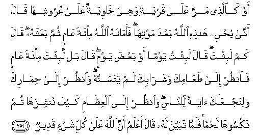

#أَوْ كَالَّذِي مَرَّ عَلَىٰ قَرْيَةٍ وَهِيَ خَاوِيَةٌ عَلَىٰ عُرُوشِهَا قَالَ أَنَّىٰ يُحْيِي هَٰذِهِ اللَّهُ بَعْدَ مَوْتِهَا ۖ فَأَمَاتَهُ اللَّهُ مِائَةَ عَامٍ ثُمَّ بَعَثَهُ ۖ قَالَ كَمْ لَبِثْتَ ۖ قَالَ لَبِثْتُ يَوْمًا أَوْ بَعْضَ يَوْمٍ ۖ قَالَ بَلْ لَبِثْتَ مِائَةَ عَامٍ فَانْظُرْ إِلَىٰ طَعَامِكَ وَشَرَابِكَ لَمْ يَتَسَنَّهْ ۖ وَانْظُرْ إِلَىٰ حِمَارِكَ وَلِنَجْعَلَكَ آيَةً لِلنَّاسِ ۖ وَانْظُرْ إِلَى الْعِظَامِ كَيْفَ نُنْشِزُهَا ثُمَّ نَكْسُوهَا لَحْمًا ۚ فَلَمَّا تَبَيَّنَ لَهُ قَالَ أَعْلَمُ أَنَّ اللَّهَ عَلَىٰ كُلِّ شَيْءٍ قَدِيرٌ 

##Aw kaallathee marra AAala qaryatin wahiya khawiyatun AAala AAurooshiha qala anna yuhyee hathihi Allahu baAAda mawtiha faamatahu Allahu mi-ata AAamin thumma baAAathahu qala kam labithta qala labithtu yawman aw baAAda yawmin qala bal labithta mi-ata AAamin faonthur ilataAAamika washarabika lam yatasannah waonthur ila himarika walinajAAalaka ayatan lilnnasi waonthur ila alAAithami kayfa nunshizuha thumma naksooha lahman falamma tabayyana lahu qala aAAlamu anna Allaha AAala kulli shay-in qadeerun 

## 翻译(Translation)：

| Translator | 译文(Translation)                                            |
| :--------: | ------------------------------------------------------------ |
|    马坚    | 难道你没有看见那个人吗？他经过一个荒凉的颓废的城市，他说：真主怎样使这个已死的城市复活呢？故真主使他在死亡的状态下逗留了一百年，然後使他复活。他说：你逗留了多久？他说：我逗留了一日，或不到一日。他说：不然，你已逗留了一百年。你看你的饮食，没有腐败。你看你的驴子。我要以你为世人的迹象。你看这些骸骨，我怎样配合他，怎样以肉套在它的上面。当他明白这件事的时候，他说：我知道真主对於万事是全能的。 |
|  YUSUFALI  | Or (take) the similitude of one who passed by a hamlet, all in ruins to its roofs. He said: "Oh! how shall Allah bring it (ever) to life, after (this) its death?" but Allah caused him to die for a hundred years, then raised him up (again). He said: "How long didst thou tarry (thus)?" He said: (Perhaps) a day or part of a day." He said: "Nay, thou hast tarried thus a hundred years; but look at thy food and thy drink; they show no signs of age; and look at thy donkey: And that We may make of thee a sign unto the people, Look further at the bones, how We bring them together and clothe them with flesh." When this was shown clearly to him, he said: "I know that Allah hath power over all things." |
| PICKTHALL  | Or (bethink thee of) the like of him who, passing by a township which had fallen into utter ruin, exclaimed: How shall Allah give this township life after its death? And Allah made him die a hundred years, then brought him back to life. He said: How long hast thou tarried? (The man) said: I have tarried a day or part of a day. (He) said: Nay, but thou hast tarried for a hundred years. Just look at thy food and drink which have not rotted! Look at thine ass! And, that We may make thee a token unto mankind, look at the bones, how We adjust them and then cover them with flesh! And when (the matter) became clear unto him, he said: I know now that Allah is Able to do all things. |
|   SHAKIR   | Or the like of him (Uzair) who passed by a town, and it had fallen down upon its roofs; he said: When will Allah give it life after its death? So Allah caused him to die for a hundred years, then raised him to life. He said: How long have you tarried? He said: I have tarried a day, or a part of a day. Said He: Nay! you have tarried a hundred years; then look at your food and drink-- years have not passed over it; and look at your ass; and that We may make you a sign to men, and look at the bones, how We set them together, then clothed them with flesh; so when it became clear to him, he said: I know that Allah has power over all things. |

---

## 对位释义(Words Interpretation)：

| No   | العربية | 中文    | English | 曾用词 |
| ---- | ------: | ------- | ------- | ------ |
| 序号 |    阿文 | Chinese | 英文    | Used   |
| 2:259.1  | أَوْ      | 或               | or                       | 见2:19.1   |
| 2:259.2  | كَالَّذِي   | 像那个人         | the like of him who      | 参2:17.3   |
| 2:259.3  | مَرَّ      | 经过             | pass by                  |            |
| 2:259.4  | عَلَىٰ     | 至               | On                       | 见2:5.2    |
| 2:259.5  | قَرْيَةٍ    | 一个城镇         | a town                   |            |
| 2:259.6  | وَهِيَ     | 和它             | and it                   |            |
| 2:259.7  | خَاوِيَةٌ   | 荒凉             | in ruins                 |            |
| 2:259.8  | عَلَىٰ     | 至               | On                       | 见2:5.2    |
| 2:259.9  | عُرُوشِهَا  | 它的屋顶         | its roofs                |            |
| 2:259.10 | قَالَ     | 他说，           | He said                  | 见2:30.2   |
| 2:259.11 | أَنَّىٰ     | 如何             | how                      | 见2:223.6  |
| 2:259.12 | يُحْيِي    | 他给生命         | brings ... to life       | 见2:73.5   |
| 2:259.13 | هَٰذِهِ     | 这个             | this                     | 见2:35.15  |
| 2:259.14 | اللَّهُ    | 安拉，真主       | Allah                    | 见2:7.2 |
| 2:259.15 | بَعْدَ     | 之后             | after                    | 见2:27.6   |
| 2:259.16 | مَوْتِهَا   | 它死亡           | its death                | 见2:164.28 |
| 2:259.17 | فَأَمَاتَهُ  | 然后他使他死亡   | So he caused him to die  |            |
| 2:259.18 | اللَّهُ    | 安拉，真主       | Allah                    | 见2:7.2 |
| 2:259.19 | مِائَةَ    | 一百             | a hundred                |            |
| 2:259.20 | عَامٍ     | 年               | years                    |            |
| 2:259.21 | ثُمَّ      | 然后             | Then                     | 见2:28.7   |
| 2:259.22 | بَعَثَهُ    | 复活他           | raised him to life       |            |
| 2:259.23 | قَالَ     | 他说，           | He said                  | 见2:30.2   |
| 2:259.24 | كَمْ      | 多少？           | how many                 | 见2:211.4  |
| 2:259.25 | لَبِثْتَ    | 你逗留           | have you tarried         |            |
| 2:259.26 | قَالَ     | 他说，           | He said                  | 见2:30.2   |
| 2:259.27 | لَبِثْتُ    | 我逗留           | I have tarried           | 参2:259.25 |
| 2:259.28 | يَوْمًا    | 日子             | a day                    | 见2:48.2   |
| 2:259.29 | أَوْ      | 或               | or                       | 见2:19.1   |
| 2:259.30 | بَعْضَ     | 一部分           | Some                     | 见2:76.11  |
| 2:259.31 | يَوْمٍ     | 日，日子，时候的 | day                      | 见1:4.2    |
| 2:259.32 | قَالَ     | 他说，           | He said                  | 见2:30.2   |
| 2:259.33 | بَلْ      | 不然             | Nay, but                 | 见2:88.4   |
| 2:259.34 | لَبِثْتَ    | 你逗留           | have you tarried         | 见2:259.25 |
| 2:259.35 | مِائَةَ    | 一百             | a hundred                | 见2:259.19 |
| 2:259.36 | عَامٍ     | 年               | years                    | 见2:259.20 |
| 2:259.37 | فَانْظُرْ   | 因此你看         | then look                |            |
| 2:259.38 | إِلَىٰ     | 至               | to                       | 见2:14.9   |
| 2:259.39 | طَعَامِكَ   | 你的食物         | your food                |            |
| 2:259.40 | وَشَرَابِكَ  | 和你的饮料       | and your drink           |            |
| 2:259.41 | لَمْ      | 不，没有         | did not                  | 见2:6.8    |
| 2:259.42 | يَتَسَنَّهْ   | 它腐败           | rotted                   |            |
| 2:259.43 | وَانْظُرْ   | 和你看           | and look                 | 参2:259.37 |
| 2:259.44 | إِلَىٰ     | 至               | to                       | 见2:14.9   |
| 2:259.45 | حِمَارِكَ   | 你的驴子         | your donkey              |            |
| 2:259.46 | وَلِنَجْعَلَكَ | 和我们为了使你   | and that We may make you |            |
| 2:259.47 | آيَةً     | 一个迹象         | a sign                   | 参2:106.4  |
| 2:259.48 | لِلنَّاسِ   | 对世人           | For people               | 见2:83.17  |
| 2:259.49 | وَانْظُرْ   | 和你看           | and look                 | 见2:259.43 |
| 2:259.50 | إِلَى     | 至               | to                       | 见2:14.9   |
| 2:259.51 | الْعِظَامِ  | 骸骨             | the bones                |            |
| 2:259.52 | كَيْفَ     | 如何             | How                      | 见2:28.1   |
| 2:259.53 | نُنْشِزُهَا  | 我们集合他们     | We bring them together   |            |
| 2:259.54 | ثُمَّ      | 然后             | Then                     | 见2:28.7   |
| 2:259.55 | نَكْسُوهَا  | 给他们套上       | clothed them with        |            |
| 2:259.56 | لَحْمًا    | 肉               | flesh                    |            |
| 2:259.57 | فَلَمَّا    | 但是当           | but when                 | 见2:17.6   |
| 2:259.58 | تَبَيَّنَ    | 明白             | become manifest          | 见2:109.19 |
| 2:259.59 | لَهُ      | 对他             | for he                   | 见2:102.62 |
| 2:259.60 | قَالَ     | 他说，           | He said                  | 见2:30.2   |
| 2:259.61 | أَعْلَمُ    | 至知             | know best                | 见2:30.25  |
| 2:259.62 | أَنَّ      | 该               | that                     | 见2:26.5   |
| 2:259.63 | اللَّهَ    | 安拉，真主       | Allah                    | 见2:9.2 |
| 2:259.64 | عَلَىٰ     | 至               | On                       | 见2:5.2    |
| 2:259.65 | كُلِّ      | 所有             | All                      | 见2:20.23  |
| 2:259.66 | شَيْءٍ     | 事物             | Thing                    | 见2:20.24  |
| 2:259.67 | قَدِيرٌ    | 全能，大能的     | Mighty                   | 见2:20.25  |

---
