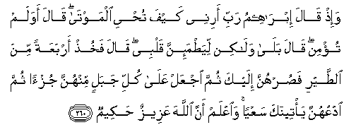

#وَإِذْ قَالَ إِبْرَاهِيمُ رَبِّ أَرِنِي كَيْفَ تُحْيِي الْمَوْتَىٰ ۖ قَالَ أَوَلَمْ تُؤْمِنْ ۖ قَالَ بَلَىٰ وَلَٰكِنْ لِيَطْمَئِنَّ قَلْبِي ۖ قَالَ فَخُذْ أَرْبَعَةً مِنَ الطَّيْرِ فَصُرْهُنَّ إِلَيْكَ ثُمَّ اجْعَلْ عَلَىٰ كُلِّ جَبَلٍ مِنْهُنَّ جُزْءًا ثُمَّ ادْعُهُنَّ يَأْتِينَكَ سَعْيًا ۚ وَاعْلَمْ أَنَّ اللَّهَ عَزِيزٌ حَكِيمٌ 

##Wa-ith qala ibraheemu rabbi arinee kayfa tuhyee almawta qala awa lam tu/min qala bala walakin liyatma-inna qalbee qala fakhuth arbaAAatan mina alttayri fasurhunna ilayka thumma ijAAal AAala kulli jabalin minhunna juz-an thumma odAAuhunna ya/teenaka saAAyan waiAAlam anna Allaha AAazeezunhakeemun 

## 翻译(Translation)：

| Translator | 译文(Translation)                                            |
| :--------: | ------------------------------------------------------------ |
|    马坚    | 当时，易卜拉欣说：我的主啊！求你昭示我你怎样使死人复活。真主说：难道你不信吗？他说：不然，（我要求实验）以便我的心安定。真主说：你取四只鸟，使它们倾向你，然後，在每座山上安置它们中的一部分，然後，你叫唤它们，它们就飞到你的面前来。你当知道真主是万能的，是至睿的。 |
|  YUSUFALI  | When Abraham said: "Show me, Lord, how You will raise the dead, " He replied: "Have you no faith?" He said "Yes, but just to reassure my heart." Allah said, "Take four birds, draw them to you, and cut their bodies to pieces. Scatter them over the mountain-tops, then call them back. They will come swiftly to you. Know that Allah is Mighty, Wise." |
|  PICKTHAL  | And when Abraham said (unto his Lord): My Lord! Show me how Thou givest life to the dead, He said: Dost thou not believe? Abraham said: Yea, but (I ask) in order that my heart may be at ease. (His Lord) said: Take four of the birds and cause them to incline unto thee, then place a part of them on each hill, then call them, they will come to thee in haste, and know that Allah is Mighty, Wise. |
|   SHAKIR   | And when Ibrahim said: My Lord! show me how Thou givest life to the dead, He said: What! and do you not believe? He said: Yes, but that my heart may be at ease. He said: Then take four of the birds, then train them to follow you, then place on every mountain a part of them, then call them, they will come to you flying; and know that Allah is Mighty, Wise. |

---

## 对位释义(Words Interpretation)：

| No   | العربية | 中文    | English | 曾用词 |
| ---- | ------: | ------- | ------- | ------ |
| 序号 |    阿文 | Chinese | 英文    | Used   |
| 2:260.1  | وَإِذْ     | 当时           | and when         | 见2:30.1   |
| 2:260.2  | قَالَ     | 他说，         | He said          | 见2:30.2   |
| 2:260.3  | إِبْرَاهِيمُ | 易卜拉欣       | Ibrahim          | 见2:124.3  |
| 2:260.4  | رَبِّ      | 主，养育，调养 | Lord             | 见1:2.3    |
| 2:260.5  | أَرِنِي    | 显示我         | show me          |            |
| 2:260.6  | كَيْفَ     | 如何           | How              | 见2:28.1   |
| 2:260.7  | تُحْيِي    | 你给生命       | you give life to | 参2:73.5   |
| 2:260.8  | الْمَوْتَىٰ  | 死者           | The dead         | 见2:73.7   |
| 2:260.9  | قَالَ     | 他说，         | He said          | 见2:30.2   |
| 2:260.10 | أَوَلَمْ    | 和不吗？       | and do not       |            |
| 2:260.11 | تُؤْمِنْ    | 相信           | believe          |            |
| 2:260.12 | قَالَ     | 他说，         | He said          | 见2:30.2   |
| 2:260.13 | بَلَىٰ     | 不然           | Nay, but         | 见2:81.1   |
| 2:260.14 | وَلَٰكِنْ    | 并且但是       | and but          | 见2:12.5   |
| 2:260.15 | لِيَطْمَئِنَّ  | 为了它满足     | may be at ease   |            |
| 2:260.16 | قَلْبِي    | 我的心         | my heart         |            |
| 2:260.17 | قَالَ     | 他说，         | He said          | 见2:30.2   |
| 2:260.18 | فَخُذْ     | 然后取         | then take        |            |
| 2:260.19 | أَرْبَعَةً   | 四             | four             | 见2:226.6  |
| 2:260.20 | مِنَ      | 从             | from             | 见2:4.8    |
| 2:260.21 | الطَّيْرِ   | 鸟             | the birds        |            |
| 2:260.22 | فَصُرْهُنَّ   | 然后使它们倾向 | then draw them   |            |
| 2:260.23 | إِلَيْكَ    | 至你           | to you           | 见2:4.5    |
| 2:260.24 | ثُمَّ      | 然后           | Then             | 见2:28.7   |
| 2:260.25 | اجْعَلْ    | 使             | make             | 见2:126.5  |
| 2:260.26 | عَلَىٰ     | 至             | On               | 见2:5.2    |
| 2:260.27 | كُلِّ      | 所有           | All              | 见2:20.23  |
| 2:260.28 | جَبَلٍ     | 山             | mountain         |            |
| 2:260.29 | مِنْهُنَّ    | 从它们         | from them        |            |
| 2:260.30 | جُزْءًا    | 一部分         | a part           |            |
| 2:260.31 | ثُمَّ      | 然后           | Then             | 见2:28.7   |
| 2:260.32 | ادْعُهُنَّ   | 召唤它们       | call them        |            |
| 2:260.33 | يَأْتِينَكَ  | 它们来至你     | they come to you |            |
| 2:260.34 | سَعْيًا    | 急忙           | swiftly          |            |
| 2:260.35 | وَاعْلَمْ   | 和知道         | and know         |            |
| 2:260.36 | أَنَّ      | 该             | that             | 见2:26.5   |
| 2:260.37 | اللَّهَ    | 安拉，真主     | Allah            | 见1:1.2    |
| 2:260.38 | عَزِيزٌ    | 万能的         | Mighty           | 见2:209.11 |
| 2:260.39 | حَكِيمٌ    | 至睿的         | Wise             | 见2:209.12 |

---
