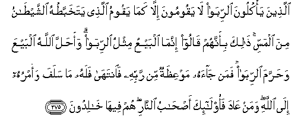

#الَّذِينَ يَأْكُلُونَ الرِّبَا لَا يَقُومُونَ إِلَّا كَمَا يَقُومُ الَّذِي يَتَخَبَّطُهُ الشَّيْطَانُ مِنَ الْمَسِّ ۚ ذَٰلِكَ بِأَنَّهُمْ قَالُوا إِنَّمَا الْبَيْعُ مِثْلُ الرِّبَا ۗ وَأَحَلَّ اللَّهُ الْبَيْعَ وَحَرَّمَ الرِّبَا ۚ فَمَنْ جَاءَهُ مَوْعِظَةٌ مِنْ رَبِّهِ فَانْتَهَىٰ فَلَهُ مَا سَلَفَ وَأَمْرُهُ إِلَى اللَّهِ ۖ وَمَنْ عَادَ فَأُولَٰئِكَ أَصْحَابُ النَّارِ ۖ هُمْ فِيهَا خَالِدُونَ 

##Allatheena ya/kuloona alrriba la yaqoomoona illa kama yaqoomu allathee yatakhabbatuhu alshshaytanu mina almassi thalika bi-annahum qaloo innama albayAAu mithlu alrriba waahalla Allahu albayAAa waharrama alrriba faman jaahu mawAAithatun min rabbihi faintaha falahu ma salafa waamruhu ila Allahi waman AAada faola-ika as-habu alnnari hum feeha khalidoona 

## 翻译(Translation)：

| Translator | 译文(Translation)                                            |
| :--------: | ------------------------------------------------------------ |
|    马坚    | 吃利息的人，要象中了魔的人一样，疯疯癫癫地站起来。这是因为他们说：买卖恰象利息。真主准许买卖，而禁止利息。奉到主的教训後，就遵守禁令的，得已往不咎，他的事归真主判决。再犯的人，是火狱的居民，他们将永居其中。 |
|  YUSUFALI  | Those who devour usury will not stand except as stand one whom the Evil one by his touch Hath driven to madness. That is because they say: "Trade is like usury," but Allah hath permitted trade and forbidden usury. Those who after receiving direction from their Lord, desist, shall be pardoned for the past; their case is for Allah (to judge); but those who repeat (The offence) are companions of the Fire: They will abide therein (for ever). |
| PICKTHALL  | Those who swallow usury cannot rise up save as he ariseth whom the devil hath prostrated by (his) touch. That is because they say: Trade is just like usury; whereas Allah permitteth trading and forbiddeth usury. He unto whom an admonition from his Lord cometh, and (he) refraineth (in obedience thereto), he shall keep (the profits of) that which is past, and his affair (henceforth) is with Allah. As for him who returneth (to usury) - Such are rightful owners of the Fire. They will abide therein. |
|   SHAKIR   | Those who swallow down usury cannot arise except as one whom Shaitan has prostrated by (his) touch does rise. That is because they say, trading is only like usury; and Allah has allowed trading and forbidden usury. To whomsoever then the admonition has come from his Lord, then he desists, he shall have what has already passed, and his affair is in the hands of Allah; and whoever returns (to it)-- these arc the inmates of the fire; they shall abide in it. |

---

## 对位释义(Words Interpretation)：

| No   | العربية | 中文    | English | 曾用词 |
| ---- | ------: | ------- | ------- | ------ |
| 序号 |    阿文 | Chinese | 英文    | Used   |
| 2:275.1  | الَّذِينَ   | 谁，那些           | those who              | 见2:6.2    |
| 2:275.2  | يَأْكُلُونَ  | 他们吃             | they eat               | 见2:174.15 |
| 2:275.3  | الرِّبَا   | 利息               | usury                  |            |
| 2:275.4  | لَا      | 不，不是，没有     | no                     | 见2:2.3    |
| 2:275.5  | يَقُومُونَ  | 他们站立           | they stand             |            |
| 2:275.6  | إِلَّا     | 除了               | Except                 | 见2:9.7    |
| 2:275.7  | كَمَا     | 如                 | as such                | 见2:13.5   |
| 2:275.8  | يَقُومُ    | 他站立             | he stand               | 参2:275.6  |
| 2:275.9  | الَّذِي    | 谁                 | who                    | 见2:17.3   |
| 2:275.10 | يَتَخَبَّطُهُ  | 使他混乱           | have driven to madness |            |
| 2:275.11 | الشَّيْطَانُ | 恶魔               | Satan                  | 见2:36.2   |
| 2:275.12 | مِنَ      | 从                 | from                   | 见2:19.3 |
| 2:275.13 | الْمَسِّ    | 接触               | touch                  |            |
| 2:275.14 | ذَٰلِكَ     | 这个           | this                   | 见2:2.1    |
| 2:275.15 | بِأَنَّهُمْ   | 因为那个他们       | That they are          | 见2:61.47  |
| 2:275.16 | قَالُوا   | 他们说，           | They said              | 见2:11.8   |
| 2:275.17 | إِنَّمَا    | 仅仅               | only                   | 见2:11.9   |
| 2:275.18 | الْبَيْعُ   | 贸易               | trading                |            |
| 2:275.19 | مِثْلُ     | 相似的             | similar                | 见2:228.31 |
| 2:275.20 | الرِّبَا   | 利息               | usury                  | 见2:275.3  |
| 2:275.21 | وَأَحَلَّ    | 和允许             | and allowed            |            |
| 2:275.22 | اللَّهُ    | 安拉，真主         | Allah                  | 见2:7.2 |
| 2:275.23 | الْبَيْعَ   | 贸易               | trading                |            |
| 2:275.24 | وَحَرَّمَ    | 和禁止             | and forbidden          | 参2:173.2  |
| 2:275.25 | الرِّبَا   | 利息               | usury                  | 见2:275.3  |
| 2:275.26 | فَمَنْ     | 无论谁             | whosoever              | 见2:38.9   |
| 2:275.27 | جَاءَهُ    | 来到               | come                   |            |
| 2:275.28 | مَوْعِظَةٌ   | 命令               | an admonition          |            |
| 2:275.29 | مِنْ      | 从                 | from                   | 见2:4.8    |
| 2:275.30 | رَبِّهِ     | 他的主             | His Lord               | 见2:37.4   |
| 2:275.31 | فَانْتَهَىٰ  | 然后他禁止         | then he desists        |            |
| 2:275.32 | فَلَهُ     | 必定他             | surly he               | 见2:112.8  |
| 2:275.33 | مَا      | 什么               | what/ that which       | 见2:17.8   |
| 2:275.34 | سَلَفَ     | 过去               | passed                 |            |
| 2:275.35 | وَأَمْرُهُ   | 和他的事情         | and his affair         |            |
| 2:275.36 | إِلَى     | 至                 | to                     | 见2:14.9   |
| 2:275.37 |    اللَّهِ | 真主的         | of Allah               | 见2:23.17  |
| 2:275.38 | وَمَنْ     | 和谁               | and who                | 见2:108.11 |
| 2:275.39 | عَادَ     | 再犯               | returns                |            |
| 2:275.40 | فَأُولَٰئِكَ  | 然后那些人         | then those             | 见2:81.8   |
| 2:275.41 | أَصْحَابُ   | 居民               | companions      | 见2:39.6   |
| 2:275.42 | النَّارِ   | 火狱               | the Fire               | 见2:24.7   |
| 2:275.43 | هُمْ      | 他们               | they                   | 见2:4.11   |
| 2:275.44 | فِيهَا    | 在其中             | therein                | 见2:25.29  |
| 2:275.45 | خَالِدُونَ  | 不朽，永居         | Immortal               | 见2:25.34  |

---
