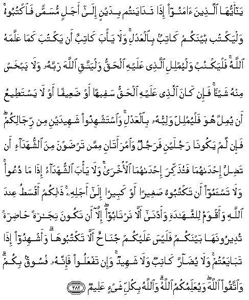

#يَا أَيُّهَا الَّذِينَ آمَنُوا إِذَا تَدَايَنْتُمْ بِدَيْنٍ إِلَىٰ أَجَلٍ مُسَمًّى فَاكْتُبُوهُ ۚ وَلْيَكْتُبْ بَيْنَكُمْ كَاتِبٌ بِالْعَدْلِ ۚ وَلَا يَأْبَ كَاتِبٌ أَنْ يَكْتُبَ كَمَا عَلَّمَهُ اللَّهُ ۚ فَلْيَكْتُبْ وَلْيُمْلِلِ الَّذِي عَلَيْهِ الْحَقُّ وَلْيَتَّقِ اللَّهَ رَبَّهُ وَلَا يَبْخَسْ مِنْهُ شَيْئًا ۚ فَإِنْ كَانَ الَّذِي عَلَيْهِ الْحَقُّ سَفِيهًا أَوْ ضَعِيفًا أَوْ لَا يَسْتَطِيعُ أَنْ يُمِلَّ هُوَ فَلْيُمْلِلْ وَلِيُّهُ بِالْعَدْلِ ۚ وَاسْتَشْهِدُوا شَهِيدَيْنِ مِنْ رِجَالِكُمْ ۖ فَإِنْ لَمْ يَكُونَا رَجُلَيْنِ فَرَجُلٌ وَامْرَأَتَانِ مِمَّنْ تَرْضَوْنَ مِنَ الشُّهَدَاءِ أَنْ تَضِلَّ إِحْدَاهُمَا فَتُذَكِّرَ إِحْدَاهُمَا الْأُخْرَىٰ ۚ وَلَا يَأْبَ الشُّهَدَاءُ إِذَا مَا دُعُوا ۚ وَلَا تَسْأَمُوا أَنْ تَكْتُبُوهُ صَغِيرًا أَوْ كَبِيرًا إِلَىٰ أَجَلِهِ ۚ ذَٰلِكُمْ أَقْسَطُ عِنْدَ اللَّهِ وَأَقْوَمُ لِلشَّهَادَةِ وَأَدْنَىٰ أَلَّا تَرْتَابُوا ۖ إِلَّا أَنْ تَكُونَ تِجَارَةً حَاضِرَةً تُدِيرُونَهَا بَيْنَكُمْ فَلَيْسَ عَلَيْكُمْ جُنَاحٌ أَلَّا تَكْتُبُوهَا ۗ وَأَشْهِدُوا إِذَا تَبَايَعْتُمْ ۚ وَلَا يُضَارَّ كَاتِبٌ وَلَا شَهِيدٌ ۚ وَإِنْ تَفْعَلُوا فَإِنَّهُ فُسُوقٌ بِكُمْ ۗ وَاتَّقُوا اللَّهَ ۖ وَيُعَلِّمُكُمُ اللَّهُ ۗ وَاللَّهُ بِكُلِّ شَيْءٍ عَلِيمٌ 

##Ya ayyuha allatheena amanoo itha tadayantum bidaynin ila ajalin musamman faoktuboohu walyaktub baynakum katibun bialAAadli wala ya/ba katibun an yaktuba kama AAallamahu Allahu falyaktub walyumlili allathee AAalayhi alhaqqu walyattaqi Allaha rabbahu wala yabkhas minhu shay-an fa-in kana allathee AAalayhi alhaqqu safeehan aw daAAeefan aw la yastateeAAu an yumilla huwa falyumlil waliyyuhu bialAAadli waistashhidoo shaheedayni min rijalikum fa-in lam yakoona rajulayni farajulun waimraatani mimman tardawna mina alshshuhada-i an tadilla ihdahuma fatuthakkira ihdahumaal-okhra wala ya/ba alshshuhadao itha ma duAAoo wala tas-amoo an taktuboohu sagheeran aw kabeeran ila ajalihi thalikum aqsatu AAinda Allahi waaqwamu lilshshahadati waadna alla tartaboo illa an takoona tijaratan hadiratan tudeeroonaha baynakum falaysa AAalaykum junahun alla taktuboohawaashhidoo itha tabayaAAtum wala yudarra katibun wala shaheedun wa-in tafAAaloo fa-innahu fusooqun bikum waittaqoo Allaha wayuAAallimukumu Allahu waAllahu bikulli shay-in AAaleemun 

## 翻译(Translation)：

| Translator | 译文(Translation)                                            |
| :--------: | ------------------------------------------------------------ |
|    马坚    | 信道的人们啊！你们彼此间成立定期借贷的时候，你们应当写一张借券，请一个会写字的人，秉公代写。代书人不得拒绝，当遵照真主所教他的方法而书写。由债务者口授，（他口授时），当敬畏真主──他的主──不要减少债额一丝毫。如果债务者是愚蠢的，或老弱的，或不能亲自口授的，那末，叫他的监护人秉公地替他口授。你们当从你们的男人中邀请两个人作证；如果没有两个男人，那末，从你们所认可的证人中请一个男人和两个女人作证。这个女人遗忘的时候，那个女人可以提醒她。证人被邀请的时候，不得拒绝。无论债额多寡，不可厌烦，都要写在借券上，并写明偿还的日期。在真主看来，这是最公平的，最易作证的，最可怯疑的。但你们彼此间的现款交易，虽不写买卖契约，对于你们是毫无罪过的。你们成立商业契约的时候，宜请证人，对代书者和作证着，不得加以妨害；否则，就是你们犯罪。你们应当敬畏真主，真主教诲你们。真主是全知万物的。 |
|  YUSUFALI  | O ye who believe! When ye deal with each other, in transactions involving future obligations in a fixed period of time, reduce them to writing Let a scribe write down faithfully as between the parties: let not the scribe refuse to write: as Allah Has taught him, so let him write. Let him who incurs the liability dictate, but let him fear His Lord Allah, and not diminish aught of what he owes. If they party liable is mentally deficient, or weak, or unable Himself to dictate, Let his guardian dictate faithfully, and get two witnesses, out of your own men, and if there are not two men, then a man and two women, such as ye choose, for witnesses, so that if one of them errs, the other can remind her. The witnesses should not refuse when they are called on (For evidence). Disdain not to reduce to writing (your contract) for a future period, whether it be small or big: it is juster in the sight of Allah, More suitable as evidence, and more convenient to prevent doubts among yourselves but if it be a transaction which ye carry out on the spot among yourselves, there is no blame on you if ye reduce it not to writing. But take witness whenever ye make a commercial contract; and let neither scribe nor witness suffer harm. If ye do (such harm), it would be wickedness in you. So fear Allah; For it is Good that teaches you. And Allah is well acquainted with all things. If ye are on a journey, and cannot find a scribe, a pledge with possession (may serve the purpose). And if one of you deposits a thing on trust with another, let the trustee (faithfully) discharge his trust, and let him Fear his Lord conceal not evidence; for whoever conceals it, - his heart is tainted with sin. And Allah knoweth all that ye do. |
| PICKTHALL  | O ye who believe! When ye contract a debt for a fixed term, record it in writing. Let a scribe record it in writing between you in (terms of) equity. No scribe should refuse to write as Allah hath taught him, so let him write, and let him who incurreth the debt dictate, and let him observe his duty to Allah his Lord, and diminish naught thereof. But if he who oweth the debt is of low understanding, or weak, or unable himself to dictate, then let the guardian of his interests dictate in (terms of) equity. And call to witness, from among your men, two witnesses. And if two men be not (at hand) then a man and two women, of such as ye approve as witnesses, so that if the one erreth (through forgetfulness) the other will remember. And the witnesses must not refuse when they are summoned. Be not averse to writing down (the contract) whether it be small or great, with (record of) the term thereof. That is more equitable in the sight of Allah and more sure for testimony, and the best way of avoiding doubt between you; save only in the case when it is actual merchandise which ye transfer among yourselves from hand to hand. In that case it is no sin for you if ye write it not. And have witnesses when ye sell one to another, and let no harm be done to scribe or witness. If ye do (harm to them) lo! it is a sin in you. Observe your duty to Allah. Allah is teaching you. And Allah is knower of all things. |
|   SHAKIR   | O you who believe! when you deal with each other in contracting a debt for a fixed time, then write it down; and let a scribe write it down between you with fairness; and the scribe should not refuse to write as Allah has taught him, so he should write; and let him who owes the debt dictate, and he should be careful of (his duty to) Allah, his Lord, and not diminish anything from it; but if he who owes the debt is unsound in understanding, or weak, or (if) he is not able to dictate himself, let his guardian dictate with fairness; and call in to witness from among your men two witnesses; but if there are not two men, then one man and two women from among those whom you choose to be witnesses, so that if one of the two errs, the second of the two may remind the other; and the witnesses should not refuse when they are summoned; and be not averse to writing it (whether it is) small or large, with the time of its falling due; this is more equitable in the sight of Allah and assures greater accuracy in testimony, and the nearest (way) that you may not entertain doubts (afterwards), except when it is ready merchandise which you give and take among yourselves from hand to hand, then there is no blame on you in not writing it down; and have witnesses when you barter with one another, and let no harm be done to the scribe or to the witness; and if you do (it) then surely it will be a transgression in you, and be careful of (your duty) to Allah, Allah teaches you, and Allah knows all things. |

---

## 对位释义(Words Interpretation)：

| No   | العربية | 中文    | English | 曾用词 |
| ---- | ------: | ------- | ------- | ------ |
| 序号 |    阿文 | Chinese | 英文    | Used   |
| 2:282.1   | يَا        | 啊             | Oh                          | 见2:21.1   |
| 2:282.2   | أَيُّهَا      | 语气词         | O                           | 见2:21.2   |
| 2:282.3   | الَّذِينَ     | 谁，那些       | those who                   | 见2:6.2    |
| 2:282.4   | آمَنُوا     | 诚信           | believe                     | 见2:9.4    |
| 2:282.5   | إِذَا       | 当时           | when                        | 见2:156.2  |
| 2:282.6   | تَدَايَنْتُمْ   | 你们签定       | you deal                    |            |
| 2:282.7   | بِدَيْنٍ      | 以一个债       | with a debt                 |            |
| 2:282.8   | إِلَىٰ       | 至             | to                          | 见2:14.9   |
| 2:282.9   | أَجَلٍ       | 一个期间       | a time                      |            |
| 2:282.10  | مُسَمًّى      | 固定的         | fixed                       |            |
| 2:282.11  | فَاكْتُبُوهُ   | 然后写下它     | then write it down          |            |
| 2:282.12  | وَلْيَكْتُبْ    | 和使他写下     | and let he write it down    |            |
| 2:282.13  | بَيْنَكُمْ     | 你们之中       | among yourselves            | 见2:188.4  |
| 2:282.14  | كَاتِبٌ      | 书写者         | a scribe                    |            |
| 2:282.15  | بِالْعَدْلِ    | 在公正         | with fairness               |            |
| 2:282.16  | وَلَا       | 也不           | and not                     | 见1:7.8    |
| 2:282.17  | يَأْبَ       | 拒绝           | refuse                      |            |
| 2:282.18  | كَاتِبٌ      | 书写者         | a scribe                    | 见2:282.14 |
| 2:282.19  | أَنْ        | 该             | that                        | 见2:26.5   |
| 2:282.20  | يَكْتُبَ      | 写下           | write                       |            |
| 2:282.21  | كَمَا       | 如             | as such                     | 见2:13.5   |
| 2:282.22  | عَلَّمَهُ      | 教他           | teach him                   |            |
| 2:282.23  | اللَّهُ      | 安拉，真主     | Allah                       | 见2:7.2 |
| 2:282.24  | فَلْيَكْتُبْ    | 因此使他写     | so let him write            |            |
| 2:282.25  | وَلْيُمْلِلِ    | 和使他口述     | and let him dictate         |            |
| 2:282.26  | الَّذِي      | 谁             | who                         | 见2:17.3   |
| 2:282.27  | عَلَيْهِ      | 在他           | on him                      | 见2:37.7   |
| 2:282.28  | الْحَقُّ      | 正确的，真理   | Right, truth                | 见2:26.17  |
| 2:282.29  | وَلْيَتَّقِ     | 和使他敬畏     | and let him fear            |            |
| 2:282.30  | اللَّهَ      | 安拉，真主     | Allah                       | 见2:9.2 |
| 2:282.31  | رَبَّهُ       | 他的主         | His Lord                    | 见2:37.4   |
| 2:282.32  | وَلَا       | 也不           | and not                     | 见1:7.8    |
| 2:282.33  | يَبْخَسْ      | 减少           | diminish                    |            |
| 2:282.34  | مِنْهُ       | 从它           | from it                     | 见2:60.10  |
| 2:282.35  | شَيْئًا      | 一件事情       | a thing                     | 见2:48.8   |
| 2:282.36  | فَإِنْ       | 因此如果       | then if                     | 见2:24.1   |
| 2:282.37  | كَانَ       | 他是           | It was                      | 见2:75.6   |
| 2:282.38  | الَّذِي      | 谁             | who                         | 见2:17.3   |
| 2:282.39  | عَلَيْهِ      | 在他           | on him                      | 见2:37.7   |
| 2:282.40  | الْحَقُّ      | 正确的，真理   | Right, truth                | 见2:26.17  |
| 2:282.41  | سَفِيهًا     | 低             | low                         |            |
| 2:282.42  | أَوْ        | 或             | or                          | 见2:19.1   |
| 2:282.43  | ضَعِيفًا     | 弱             | weak                        |            |
| 2:282.44  | أَوْ        | 或             | or                          | 见2:19.1   |
| 2:282.45  | لَا        | 不，不是，没有 | no                          | 见2:2.3    |
| 2:282.46  | يَسْتَطِيعُ    | 他能够        | able                        |            |
| 2:282.47  | أَنْ        | 该             | that                        | 见2:26.5   |
| 2:282.48  | يُمِلَّ       | 口述           | dictate                     | 参2:282.25 |
| 2:282.49  | هُوَ        | 他是           | He is                       | 见2:29.1   |
| 2:282.50  | فَلْيُمْلِلْ    | 然后使他口述   | then let him dictate        | 参2:282.25 |
| 2:282.51  | وَلِيُّهُ      | 他的监护人     | his guardian                |            |
| 2:282.52  | بِالْعَدْلِ    | 在公正         | with fairness               | 见2:282.15 |
| 2:282.53  | وَاسْتَشْهِدُوا | 和邀请作证     | and call in to witness      |            |
| 2:282.54  | شَهِيدَيْنِ    | 两个证人       | two witnesses               |            |
| 2:282.55  | مِنْ        | 从             | from                        | 见2:4.8    |
| 2:282.56  | رِجَالِكُمْ    | 你们的男人     | your men                    |            |
| 2:282.57  | فَإِنْ       | 因此如果       | then if                     | 见2:24.1   |
| 2:282.58  | لَمْ        | 不，没有       | did not                     | 见2:6.8    |
| 2:282.59  | يَكُونَا     | 他俩是         | there are                   |            |
| 2:282.60  | رَجُلَيْنِ     | 两个男人       | two men                     |            |
| 2:282.61  | فَرَجُلٌ      | 然后一个男人   | then one man                |            |
| 2:282.62  | وَامْرَأَتَانِ  | 和两个女人     | and two women               |            |
| 2:282.63  | مِمَّنْ       | 比谁           | than who                    | 见2:114.3  |
| 2:282.64  | تَرْضَوْنَ     | 你们同意       | you approve                 |            |
| 2:282.65  | مِنَ        | 从             | from                        | 见2:4.8    |
| 2:282.66  | الشُّهَدَاءِ   | 证人           | witnesses                   |            |
| 2:282.67  | أَنْ        | 该             | that                        | 见2:26.5   |
| 2:282.68  | تَضِلَّ       | 错             | err                         |            |
| 2:282.69  | إِحْدَاهُمَا   | 一个她俩的     | one of the two              |            |
| 2:282.70  | فَتُذَكِّرَ     | 然后提醒       | then remember               |            |
| 2:282.71  | إِحْدَاهُمَا   | 一个她俩的     | one of the two              | 见2:282.69 |
| 2:282.72  | الْأُخْرَىٰ    | 另一个         | the other                   |            |
| 2:282.73  | وَلَا       | 也不           | and not                     | 见1:7.8    |
| 2:282.74  | يَأْبَ       | 拒绝           | refuse                      | 见2:282.17 |
| 2:282.75  | الشُّهَدَاءُ   | 证人           | witnesses                   | 见2:282.66 |
| 2:282.76  | إِذَا       | 当时           | when                        | 见2:156.2  |
| 2:282.77  | مَا        | 什么           | what/ that which            | 见2:17.8   |
| 2:282.78  | دُعُوا      | 他们被邀请     | they are summoned           |            |
| 2:282.79  | وَلَا       | 也不           | and not                     | 见1:7.8    |
| 2:282.80  | تَسْأَمُوا    | 厌烦           | averse                      |            |
| 2:282.81  | أَنْ        | 该             | that                        | 见2:26.5   |
| 2:282.82  | تَكْتُبُوهُ    | 写下它         | writing it                  |            |
| 2:282.83  | صَغِيرًا     | 小的           | small                       |            |
| 2:282.84  | أَوْ        | 或             | or                          | 见2:19.1   |
| 2:282.85  | كَبِيرًا     | 大的           | large                       |            |
| 2:282.86  | إِلَىٰ       | 至             | to                          | 见2:14.9   |
| 2:282.87  | أَجَلِهِ      | 它的期间       | its time                    |            |
| 2:282.88  | ذَٰلِكُمْ      | 那个是         | That's it                   | 见2:49.14  |
| 2:282.89  | أَقْسَطُ      | 最公正         | more equitable              |            |
| 2:282.90  | عِنْدَ       | 以             | with                        | 见2:54.20  |
| 2:282.91  |      اللَّهِ | 真主的         | of Allah                    | 见2:23.17  |
| 2:282.92  | وَأَقْوَمُ     | 和更可信       | and greater accuracy        |            |
| 2:282.93  | لِلشَّهَادَةِ   | 对作证         | in testimony                |            |
| 2:282.94  | وَأَدْنَىٰ     | 和较近         | and the nearest             |            |
| 2:282.95  | أَلَّا       | 那个不         | that not                    | 见2:229.19 |
| 2:282.96  | تَرْتَابُوا   | 你们怀疑       | you doubts                  |            |
| 2:282.97  | إِلَّا       | 除了           | Except                      | 见2:9.7    |
| 2:282.98  | أَنْ        | 该             | that                        | 见2:26.5   |
| 2:282.99  | تَكُونَ      | 它是           | there is                    | 见2:193.5  |
| 2:282.100 | تِجَارَةً     | 一个交易       | merchandise                 |            |
| 2:282.101 | حَاضِرَةً     | 现款           | ready                       |            |
| 2:282.102 | تُدِيرُونَهَا  | 你们实行       | you transfer                |            |
| 2:282.103 | بَيْنَكُمْ     | 你们之中       | among yourselves            | 见2:188.4  |
| 2:282.104 | فَلَيْسَ      | 因此他不       | then he is not              | 见2:249.13 |
| 2:282.105 | عَلَيْكُمْ     | 在你们         | on you                      | 见2:40.8   |
| 2:282.106 | جُنَاحٌ      | 罪行           | crime                       | 见2:198.3  |
| 2:282.107 | أَلَّا       | 那个不         | that not                    | 见2:229.19 |
| 2:282.108 | تَكْتُبُوهَا   | 写下它         | writing it down             |            |
| 2:282.109 | وَأَشْهِدُوا   | 和作证         | and have witnesses          |            |
| 2:282.110 | إِذَا       | 当时           | when                        | 见2:156.2  |
| 2:282.111 | تَبَايَعْتُمْ   | 你们彼此交易   | you barter with one another |            |
| 2:282.112 | وَلَا       | 也不           | and not                     | 见1:7.8    |
| 2:282.113 | يُضَارَّ      | 伤害           | harm                        |            |
| 2:282.114 | كَاتِبٌ      | 书写者         | a scribe                    | 见2:282.14 |
| 2:282.115 | وَلَا       | 也不           | and not                     | 见1:7.8    |
| 2:282.116 | شَهِيدٌ      | 作证者         | the witness                 |            |
| 2:282.117 | وَإِنْ       | 和如果         | and if                      | 见2:137.9  |
| 2:282.118 | تَفْعَلُوا    | 做             | Do                          | 见2:24.3   |
| 2:282.119 | فَإِنَّهُ      | 因此确实他     | for surely he               | 见2:97.6   |
| 2:282.120 | فُسُوقٌ      | 邪恶           | a sin                       |            |
| 2:282.121 | بِكُمْ       | 在你们         | in you                      |            |
| 2:282.122 | وَاتَّقُوا    | 和畏惧         | And fear                    | 见2:48.1   |
| 2:282.123 | اللَّهَ      | 安拉，真主     | Allah                       | 见2:9.2 |
| 2:282.124 | وَيُعَلِّمُكُمُ   | 和教授你们     | and teach you               | 见2:151.10 |
| 2:282.125 | اللَّهُ      | 安拉，真主     | Allah                       | 见2:7.2 |
| 2:282.126 | وَاللَّهُ     | 和安拉，真主   | and Allah                   | 见2:19.17  |
| 2:282.127 | بِكُلِّ       | 所有           | All                         | 见2:29.17  |
| 2:282.128 | شَيْءٍ       | 事物           | Thing                       | 见2:20.24  |
| 2:282.129 | عَلِيمٌ      | 全知的         | Knowing                     | 见2:29.19  |

---
