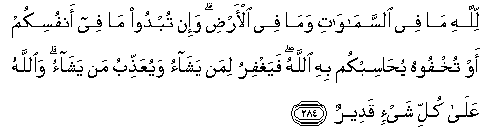

#لِلَّهِ مَا فِي السَّمَاوَاتِ وَمَا فِي الْأَرْضِ ۗ وَإِنْ تُبْدُوا مَا فِي أَنْفُسِكُمْ أَوْ تُخْفُوهُ يُحَاسِبْكُمْ بِهِ اللَّهُ ۖ فَيَغْفِرُ لِمَنْ يَشَاءُ وَيُعَذِّبُ مَنْ يَشَاءُ ۗ وَاللَّهُ عَلَىٰ كُلِّ شَيْءٍ قَدِيرٌ 

##Lillahi ma fee alssamawati wama fee al-ardi wa-in tubdoo ma fee anfusikum aw tukhfoohu yuhasibkum bihi Allahu fayaghfiru liman yashao wayuAAaththibu man yashao waAllahu AAala kulli shay-in qadeerun 

## 翻译(Translation)：

| Translator | 译文(Translation)                                            |
| :--------: | ------------------------------------------------------------ |
|    马坚    | 天地万物，都是真主的。你们的心事，无论加以表白，或加以隐讳，真主都要依它而清算你们。然後，要赦宥谁，就赦宥谁；要惩罚谁，就惩罚谁。真主对於万事是全能的。 |
|  YUSUFALI  | To Allah belongeth all that is in the heavens and on earth. Whether ye show what is in your minds or conceal it, Allah Calleth you to account for it. He forgiveth whom He pleaseth, and punisheth whom He pleaseth, for Allah hath power over all things. |
| PICKTHALL  | Unto Allah (belongeth) whatsoever is in the heavens and whatsoever is in the earth; and whether ye make known what is in your minds or hide it, Allah will bring you to account for it. He will forgive whom He will and He will punish whom He will. Allah is Able to do all things. |
|   SHAKIR   | Whatever is in the heavens and whatever is in the earth is Allah's; and whether you manifest what is in your minds or hide it, Allah will call you to account according to it; then He will forgive whom He pleases and chastise whom He pleases, and Allah has power over all things. |

---

## 对位释义(Words Interpretation)：

| No   | العربية | 中文    | English | 曾用词 |
| ---- | ------: | ------- | ------- | ------ |
| 序号 |    阿文 | Chinese | 英文    | Used   |
| 2:284.1  | لِلَّهِ      | 为真主       | for Allah            | 见1:2.2    |
| 2:284.2  | مَا       | 什么         | what/ that which     | 见2:17.8   |
| 2:284.3  | فِي       | 在           | in                   | 见2:10.1   |
| 2:284.4  | السَّمَاوَاتِ | 诸天的     | of the heavens       | 见2:33.16  |
| 2:284.5  | وَمَا      | 和什么       | and that             | 见2:4.6    |
| 2:284.6  | فِي       | 在           | in                   | 见2:10.1   |
| 2:284.7  | الْأَرْضِ    | 大地         | Earth                | 见2:22.4   |
| 2:284.8  | وَإِنْ      | 和如果       | and if               | 见2:23.1 |
| 2:284.9  | تُبْدُوا    | 你们公开     | you publish          | 见2:271.2  |
| 2:284.10 | مَا       | 什么         | what/ that which     | 见2:17.8   |
| 2:284.11 | فِي       | 在           | in                   | 见2:10.1   |
| 2:284.12 | أَنْفُسِكُمْ   | 你们自己     | yourselves           | 见2:235.13 |
| 2:284.13 | أَوْ       | 或           | or                   | 见2:19.1   |
| 2:284.14 | تُخْفُوهُ    | 隐藏它       | hide it              |            |
| 2:284.15 | يُحَاسِبْكُمْ  | 清算你们     | bring you to account |            |
| 2:284.16 | بِهِ       | 以它         | with it              | 见2:22.13  |
| 2:284.17 | اللَّهُ     | 安拉，真主   | Allah                | 见2:7.2 |
| 2:284.18 | فَيَغْفِرُ    | 然后他赦宥   | then He will forgive |            |
| 2:284.19 | لِمَنْ      | 对谁         | of who               | 见2:154.3  |
| 2:284.20 | يَشَاءُ     | 他意欲       | He pleases           | 见2:90.18  |
| 2:284.21 | وَيُعَذِّبُ    | 和他惩罚     | and He will punish   |            |
| 2:284.22 | مَنْ       | 谁           | who                  | 见2:97.2   |
| 2:284.23 | يَشَاءُ     | 他意欲       | He pleases           | 见2:90.18  |
| 2:284.24 | وَاللَّهُ    | 和安拉，真主 | and Allah            | 见2:19.17  |
| 2:284.25 | عَلَىٰ      | 至           | On                   | 见2:5.2    |
| 2:284.26 | كُلِّ       | 所有         | All                  | 见2:20.23  |
| 2:284.27 | شَيْءٍ      | 事物         | Thing                | 见2:20.24  |
| 2:284.28 | قَدِيرٌ     | 全能，大能的 | Mighty               | 见2:20.25  |

---
