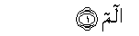

# آل عمران
# 仪姆兰的家属
# Sūra III.: Āl-i-’Imrān, or The Family of ’Imrān.
- 麦地那(200)

---

## بِسْمِ اللَّهِ الرَّحْمَٰنِ الرَّحِيمِ
---
## ٣:١

### [3:1](003_001.md) الم
### 3:1 Alif-lam-meem
### 3:1 艾列弗，俩目，米目。
### 3:1 A.L.M.
---
## ٣:١

---
## ٣:٢

---
## ٣:٣

---
## ٣:٤

---
## ٣:٥

---
## ٣:٦

---
## ٣:٧

---
## ٣:٨

---
## ٣:٩

---
## ٣:١٠

---
## ٣:١١

---
## ٣:١٢

---
## ٣:١٣

---
## ٣:١٤

---
## ٣:١٥

---
## ٣:١٦

---
## ٣:١٧

---
## ٣:١٨

---
## ٣:١٩

---
## ٣:٢٠

---

