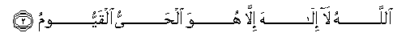

#اللَّهُ لَا إِلَٰهَ إِلَّا هُوَ الْحَيُّ الْقَيُّومُ 

##Allahu la ilaha illa huwa alhayyu alqayyoomu 

## 翻译(Translation)：

| Translator | 译文(Translation)                                            |
| :--------: | ------------------------------------------------------------ |
|    马坚    | 真主，除他外，绝无应受崇拜的；他是永生不灭的，是维护万物的。 |
|  YUSUFALI  | Allah! There is no god but He,-the Living, the Self-Subsisting, Eternal. |
|  PICKTHAL  | Allah! There is no Allah save Him, the Alive, the Eternal.   |
|   SHAKIR   | Allah, (there is) no god but He, the Everliving, the Self-subsisting by Whom all things subsist |

---

## 对位释义(Words Interpretation)：

| No   | العربية | 中文    | English | 曾用词 |
| ---- | ------: | ------- | ------- | ------ |
| 序号 |    阿文 | Chinese | 英文    | Used   |
| 3:2.1 | اللَّهُ   | 安拉，真主     | Allah               | 见1:1.2   |
| 3:2.2 | لَا     | 不，不是，没有 | no                  | 见2:2.3   |
| 3:2.3 | إِلَٰهَ    | 主宰           | Allah               | 见2:163.3 |
| 3:2.4 | إِلَّا    | 除了           | Except              | 见2:9.7   |
| 3:2.5 | هُوَ     | 他是           | He is               | 见2:29.1  |
| 3:2.6 | الْحَيُّ   | 永生的         | the Everliving      | 见2:255.6 |
| 3:2.7 | الْقَيُّومُ | 维护万物的     | the Self-subsisting | 见2:255.7 |

---
