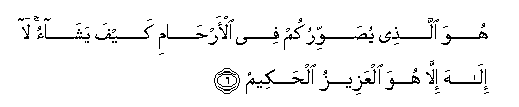

#هُوَ الَّذِي يُصَوِّرُكُمْ فِي الْأَرْحَامِ كَيْفَ يَشَاءُ ۚ لَا إِلَٰهَ إِلَّا هُوَ الْعَزِيزُ الْحَكِيمُ 

##Huwa allathee yusawwirukum fee al-arhami kayfa yashao la ilaha illa huwa alAAazeezu alhakeemu 

## 翻译(Translation)：

| Translator | 译文(Translation)                                            |
| :--------: | ------------------------------------------------------------ |
|    马坚    | 你们在子宫里的时候，他随意地以形状赋于你们。除他外，绝无应受崇拜的；他确是万能的，确是至睿的。 |
|  YUSUFALI  | He it is Who shapes you in the wombs as He pleases. There is no god but He, the Exalted in Might, the Wise. |
| PICKTHALL  | He it is Who fashioneth you in the wombs as pleaseth Him. There is no Allah save Him, the Almighty, the Wise. |
|   SHAKIR   | He it is Who shapes you in the wombs as He likes; there is no god but He, the Mighty, the Wise. |

---

## 对位释义(Words Interpretation)：

| No   | العربية | 中文    | English | 曾用词 |
| ---- | ------: | ------- | ------- | ------ |
| 序号 |    阿文 | Chinese | 英文    | Used   |
| 3:6.1  | هُوَ      | 他是           | He is      | 见2:29.1   |
| 3:6.2  | الَّذِي    | 谁             | who        | 见2:17.3   |
| 3:6.3  | يُصَوِّرُكُمْ  | 赋形于你们     | shapes you |            |
| 3:6.4  | فِي      | 在             | in         | 见2:10.1   |
| 3:6.5  | الْأَرْحَامِ | 子宫           | the wombs  |            |
| 3:6.6  | كَيْفَ     | 如何           | How        | 见2:28.1   |
| 3:6.7  | يَشَاءُ    | 他意欲         | He pleases | 见2:90.18  |
| 3:6.8  | لَا      | 不，不是，没有 | no         | 见2:2.3    |
| 3:6.9  | إِلَٰهَ     | 主宰           | Allah      | 见2:163.3  |
| 3:6.10 | إِلَّا     | 除了           | Except     | 见2:9.7    |
| 3:6.11 | هُوَ      | 他是           | He is      | 见2:29.1   |
| 3:6.12 | الْعَزِيزُ  | 万能的         | the Mighty | 见2:129.15 |
| 3:6.13 | الْحَكِيمُ  | 至睿的         | the wise   | 见2:32.12  |

---
