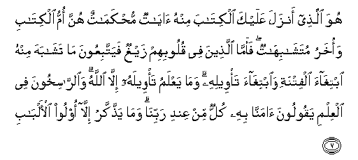

#هُوَ الَّذِي أَنْزَلَ عَلَيْكَ الْكِتَابَ مِنْهُ آيَاتٌ مُحْكَمَاتٌ هُنَّ أُمُّ الْكِتَابِ وَأُخَرُ مُتَشَابِهَاتٌ ۖ فَأَمَّا الَّذِينَ فِي قُلُوبِهِمْ زَيْغٌ فَيَتَّبِعُونَ مَا تَشَابَهَ مِنْهُ ابْتِغَاءَ الْفِتْنَةِ وَابْتِغَاءَ تَأْوِيلِهِ ۗ وَمَا يَعْلَمُ تَأْوِيلَهُ إِلَّا اللَّهُ ۗ وَالرَّاسِخُونَ فِي الْعِلْمِ يَقُولُونَ آمَنَّا بِهِ كُلٌّ مِنْ عِنْدِ رَبِّنَا ۗ وَمَا يَذَّكَّرُ إِلَّا أُولُو الْأَلْبَابِ 

##Huwa allathee anzala AAalayka alkitaba minhu ayatun muhkamatun hunna ommu alkitabi waokharu mutashabihatun faamma allatheena fee quloobihim zayghun fayattabiAAoona ma tashabaha minhu ibtighaa alfitnati waibtighaa ta/weelihi wama yaAAlamu ta/weelahu illa Allahu waalrrasikhoona fee alAAilmi yaqooloona amanna bihi kullun min AAindi rabbina wama yaththakkaru illa oloo al-albabi 

## 翻译(Translation)：

| Translator | 译文(Translation)                                            |
| :--------: | ------------------------------------------------------------ |
|    马坚    | 他降示你这部经典，其中有许多明确的节文，是全经的基本；还有别的许多隐微的节文。心存邪念的人，遵从隐微的节文，企图淆惑人心，探求经义的究竟。只有真主和学问文精通的人才知道经义的究竟。他们说：我们已确信它，明确的和隐微的，都是从我们的主那里降示的。惟有理智的人，才会觉悟。 |
|  YUSUFALI  | He it is Who has sent down to thee the Book: In it are verses basic or fundamental (of established meaning); they are the foundation of the Book: others are allegorical. But those in whose hearts is perversity follow the part thereof that is allegorical, seeking discord, and searching for its hidden meanings, but no one knows its hidden meanings except Allah. And those who are firmly grounded in knowledge say: "We believe in the Book; the whole of it is from our Lord:" and none will grasp the Message except men of understanding. |
| PICKTHALL  | He it is Who hath revealed unto thee (Muhammad) the Scripture wherein are clear revelations - they are the substance of the Book - and others (which are) allegorical. But those in whose hearts is doubt pursue, forsooth, that which is allegorical seeking (to cause) dissension by seeking to explain it. None knoweth its explanation save Allah. And those who are of sound instruction say: We believe therein; the whole is from our Lord; but only men of understanding really heed. |
|   SHAKIR   | He it is Who has revealed the Book to you; some of its verses are decisive, they are the basis of the Book, and others are allegorical; then as for those in whose hearts there is perversity they follow the part of it which is allegorical, seeking to mislead and seeking to give it (their own) interpretation. but none knows its interpretation except Allah, and those who are firmly rooted in knowledge say: We believe in it, it is all from our Lord; and none do mind except those having understanding. |

---

## 对位释义(Words Interpretation)：

| No   | العربية | 中文    | English | 曾用词 |
| ---- | ------: | ------- | ------- | ------ |
| 序号 |    阿文 | Chinese | 英文    | Used   |
| 3:7.1  | هُوَ        | 他是                   | He is                           | 见2:29.1   |
| 3:7.2  | الَّذِي      | 谁                     | who                             | 见2:17.3   |
| 3:7.3  | أَنْزَلَ      | 下降，颁降，降示，揭秘 | get down                        | 见2:4.4    |
| 3:7.4  | عَلَيْكَ      | 在你                   | on you                          | 见2:252.5  |
| 3:7.5  | الْكِتَابَ    | 这部经，这本书         | the book                        | 见2:2.2    |
| 3:7.6  | مِنْهُ       | 从它                   | from it                         | 见2:60.10  |
| 3:7.7  | آيَاتٌ      | 节文                   | verses                          |            |
| 3:7.8  | مُحْكَمَاتٌ    | 明确的                 | decisive                        |            |
| 3:7.9  | هُنَّ        | 她们是                 | they are                        | 见2:187.8  |
| 3:7.10 | أُمُّ        | 基础                   | basis                           |            |
| 3:7.11 | الْكِتَابِ    | 这部经的               | of the Book                     | 见2:85.25  |
| 3:7.12 | وَأُخَرُ      | 和其他                 | and others                      |            |
| 3:7.13 | مُتَشَابِهَاتٌ  | 隐微的                 | allegorical                     |            |
| 3:7.14 | فَأَمَّا      | 然后至于               | then as for                     | 见2:26.12  |
| 3:7.15 | الَّذِينَ     | 谁，那些               | those who                       | 见2:6.2    |
| 3:7.16 | فِي        | 在                     | in                              | 见2:10.1   |
| 3:7.17 | قُلُوبِهِمْ    | 他们的心               | Their hearts                    | 见2:7.4    |
| 3:7.18 | زَيْغٌ       | 邪恶                   | perversity                      |            |
| 3:7.19 | فَيَتَّبِعُونَ   | 然后他们遵从           | then they follow                |            |
| 3:7.20 | مَا        | 什么                   | what/ that which                | 见2:17.8   |
| 3:7.21 | تَشَابَهَ     | 隐微的                 | allegorical                     | 异2:70.11  |
| 3:7.22 | مِنْهُ       | 从它                   | from it                         | 见2:60.10  |
| 3:7.23 | ابْتِغَاءَ    | 寻求                   | seeking                         | 见2:207.6  |
| 3:7.24 | الْفِتْنَةِ    | 淆惑人心               | dissension                      |            |
| 3:7.25 | وَابْتِغَاءَ   | 和寻求                 | and seeking                     | 参2:207.6  |
| 3:7.26 | تَأْوِيلِهِ    | 它的究竟               | it interpretation               |            |
| 3:7.27 | وَمَا       | 和什么                 | and that                        | 见2:4.6    |
| 3:7.28 | يَعْلَمُ      | 知道                   | knows                           | 见2:77.5   |
| 3:7.29 | تَأْوِيلَهُ    | 它的究竟               | it interpretation               | 参3:7.26   |
| 3:7.30 | إِلَّا       | 除了                   | Except                          | 见2:9.7    |
| 3:7.31 | اللَّهُ      | 安拉，真主             | Allah                           | 见2:7.2 |
| 3:7.32 | وَالرَّاسِخُونَ | 和众精通者             | and those who are firmly rooted |            |
| 3:7.33 | فِي        | 在                     | in                              | 见2:10.1   |
| 3:7.34 | الْعِلْمِ     | 知识                   | the knowledge                   | 见2:120.23 |
| 3:7.35 | يَقُولُونَ    | 他们说                 | They say                        | 见2:79.7   |
| 3:7.36 | آمَنَّا      | 我们相信               | we believe                      | 见2:8.5    |
| 3:7.37 | بِهِ        | 以它                   | with it                         | 见2:22.13  |
| 3:7.38 | كُلٌّ        | 所有                   | All                             | 见2:20.23  |
| 3:7.39 | مِنْ        | 从                     | from                            | 见2:4.8    |
| 3:7.40 | عِنْدِ       | 以                     | with                            | 见2:54.20  |
| 3:7.41 | رَبِّنَا      | 我们的主               | Our Lord                        | 参2:127.8 |
| 3:7.42 | وَمَا       | 和什么                 | and that                        | 见2:4.6    |
| 3:7.43 | يَذَّكَّرُ      | 觉悟                   | remember                        | 见2:269.13 |
| 3:7.44 | إِلَّا       | 除了                   | Except                          | 见2:9.7    |
| 3:7.45 | أُولُو      | 那些人                 | men                             | 见2:269.15 |
| 3:7.46 | الْأَلْبَابِ   | 理智的                 | of understanding                | 见2:179.7  |

---
