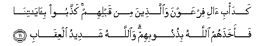

#كَدَأْبِ آلِ فِرْعَوْنَ وَالَّذِينَ مِنْ قَبْلِهِمْ ۚ كَذَّبُوا بِآيَاتِنَا فَأَخَذَهُمُ اللَّهُ بِذُنُوبِهِمْ ۗ وَاللَّهُ شَدِيدُ الْعِقَابِ 

##Kada/bi ali firAAawna waallatheena min qablihim kaththaboo bi-ayatina faakhathahumu Allahu bithunoobihim waAllahu shadeedu alAAiqabi 

## 翻译(Translation)：

| Translator | 译文(Translation)                                            |
| :--------: | ------------------------------------------------------------ |
|    马坚    | （他们的情状），犹如法老的百姓和他们以前的各民族的情状一样；他们否认真主的迹象，故真主因他们的罪恶而惩治他们。真主的刑罚是严厉的。 |
|  YUSUFALI  | (Their plight will be) no better than that of the people of Pharaoh, and their predecessors: They denied our Signs, and Allah called them to account for their sins. For Allah is strict in punishment. |
| PICKTHALL  | Like Pharaoh's folk and those who were before them, they disbelieved Our revelations and so Allah seized them for their sins. And Allah is severe in punishment. |
|   SHAKIR   | Like the striving of the people of Firon and those before them; they rejected Our communications, so Allah destroyed them on account of their faults; and Allah is severe in requiting (evil). |

---

## 对位释义(Words Interpretation)：

| No   | العربية | 中文    | English | 曾用词 |
| ---- | ------: | ------- | ------- | ------ |
| 序号 |    阿文 | Chinese | 英文    | Used   |
| 3:11.1  | كَدَأْبِ    | 犹如情状       | like              |            |
| 3:11.2  | آلِ      | 百姓           | The people        | 见2:49.4   |
| 3:11.3  | فِرْعَوْنَ   | 法老           | Pharaoh           | 见2:49.5   |
| 3:11.4  | وَالَّذِينَ  | 和那些         | and those who     | 见2:21.8   |
| 3:11.5  | مِنْ      | 从             | from              | 见2:4.8    |
| 3:11.6  | قَبْلِهِمْ   | 在他们以前     | Before them       | 见2:118.15 |
| 3:11.7  | كَذَّبُوا   | 他们否认       | they denied       | 参2:39.3   |
| 3:11.8  | بِآيَاتِنَا | 在我们的迹象   | in Our signs      | 见2:39.4   |
| 3:11.9  | فَأَخَذَهُمُ  | 因此惩治他们   | so destroyed them |            |
| 3:11.10 | اللَّهُ    | 安拉，真主     | Allah             | 见1:1.2    |
| 3:11.11 | بِذُنُوبِهِمْ | 因为他们的罪恶 | for their sins    |            |
| 3:11.12 | وَاللَّهُ   | 和安拉，真主   | and Allah         | 见2:19.17  |
| 3:11.13 | شَدِيدُ    | 严厉           | strongly          | 见2:165.30 |
| 3:11.14 | الْعِقَابِ  | 刑罚           | punishment        | 见2:196.73 |

---
