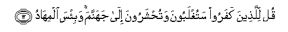

#قُلْ لِلَّذِينَ كَفَرُوا سَتُغْلَبُونَ وَتُحْشَرُونَ إِلَىٰ جَهَنَّمَ ۚ وَبِئْسَ الْمِهَادُ 

##Qul lillatheena kafaroo satughlaboona watuhsharoona ila jahannama wabi/sa almihadu 

## 翻译(Translation)：

| Translator | 译文(Translation)                                            |
| :--------: | ------------------------------------------------------------ |
|    马坚    | 你对不信道者说：你们将被克服，将被集合于火狱。那卧褥真恶劣！ |
|  YUSUFALI  | Say to those who reject Faith: "Soon will ye be vanquished and gathered together to Hell,-an evil bed indeed (to lie on)! |
|  PICKTHAL  | Say (O Muhammad) unto those who disbelieve: Ye shall be overcome and gathered unto Hell, an evil resting-place. |
|   SHAKIR   | Say to those who disbelieve: You shall be vanquished, and driven together to hell; and evil is the resting-place. |

---

## 对位释义(Words Interpretation)：

| No   | العربية | 中文    | English | 曾用词 |
| ---- | ------: | ------- | ------- | ------ |
| 序号 |    阿文 | Chinese | 英文    | Used   |
| 3:12.1 | قُلْ      | 你说         | Say                     | 见2:80.8   |
| 3:12.2 | لِلَّذِينَ   | 对那些人     | to those who            | 见2:79.2   |
| 3:12.3 | كَفَرُوا   | 不信         | disbelieve              | 见2:6.3    |
| 3:12.4 | سَتُغْلَبُونَ | 你们将被克服 | You shall be vanquished |            |
| 3:12.5 | وَتُحْشَرُونَ | 和被集合     | and gathered together   |            |
| 3:12.6 | إِلَىٰ     | 至           | to                      | 见2:14.9   |
| 3:12.7 | جَهَنَّمَ    | 火狱         | Hell                    |            |
| 3:12.8 | وَبِئْسَ    | 和恶劣       | and evil                | 见2:126.29 |
| 3:12.9 | الْمِهَادُ  | 安息处       | resting place           | 见2:206.12 |

---
