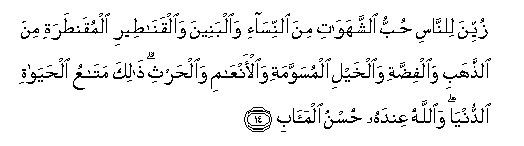

#زُيِّنَ لِلنَّاسِ حُبُّ الشَّهَوَاتِ مِنَ النِّسَاءِ وَالْبَنِينَ وَالْقَنَاطِيرِ الْمُقَنْطَرَةِ مِنَ الذَّهَبِ وَالْفِضَّةِ وَالْخَيْلِ الْمُسَوَّمَةِ وَالْأَنْعَامِ وَالْحَرْثِ ۗ ذَٰلِكَ مَتَاعُ الْحَيَاةِ الدُّنْيَا ۖ وَاللَّهُ عِنْدَهُ حُسْنُ الْمَآبِ 

##Zuyyina lilnnasi hubbu alshshahawati mina alnnisa-i waalbaneena waalqanateeri almuqantarati mina alththahabi waalfiddati waalkhayli almusawwamati waal-anAAami waalharthi thalika mataAAu alhayati alddunya waAllahu AAindahu husnu almaabi 

## 翻译(Translation)：

| Translator | 译文(Translation)                                            |
| :--------: | ------------------------------------------------------------ |
|    马坚    | 迷惑世人的，是令人爱好的事物，如妻子，儿女，金银，宝藏，骏马，牲畜，禾稼等。这些是今世生活的享受；而真主那里，却有优美的归宿。 |
|  YUSUFALI  | Fair in the eyes of men is the love of things they covet: Women and sons; Heaped-up hoards of gold and silver; horses branded (for blood and excellence); and (wealth of) cattle and well-tilled land. Such are the possessions of this world's life; but in nearness to Allah is the best of the goals (To return to). |
|  PICKTHAL  | Beautified for mankind is love of the joys (that come) from women and offspring; and stored-up heaps of gold and silver, and horses branded (with their mark), and cattle and land. That is comfort of the life of the world. Allah! With Him is a more excellent abode. |
|   SHAKIR   | The love of desires, of women and sons and hoarded treasures of gold and silver and well bred horses and cattle and tilth, is made to seem fair to men; this is the provision of the life of this world; and Allah is He with Whom is the good goal (of life). |

---

## 对位释义(Words Interpretation)：

| No   | العربية | 中文    | English | 曾用词 |
| ---- | ------: | ------- | ------- | ------ |
| 序号 |    阿文 | Chinese | 英文    | Used   |
| 3:14.1  | زُيِّنَ       | 诱惑的             | alluring        | 见2:212.1  |
| 3:14.2  | لِلنَّاسِ     | 对世人             | For people      | 见2:83.17  |
| 3:14.3  | حُبُّ        | 爱好               | love            |            |
| 3:14.4  | الشَّهَوَاتِ   | 众事物的           | of things       |            |
| 3:14.5  | مِنَ        | 从                 | from            | 见2:4.8    |
| 3:14.6  | النِّسَاءِ    | 妇女们的           | of women        | 见2:235.9  |
| 3:14.7  | وَالْبَنِينَ   | 和儿女             | and sons        |            |
| 3:14.8  | وَالْقَنَاطِيرِ | 和大量             | and heaps       |            |
| 3:14.9  | الْمُقَنْطَرَةِ  | 堆积的             | hoards of       |            |
| 3:14.10 | مِنَ        | 从                 | from            | 见2:4.8    |
| 3:14.11 | الذَّهَبِ     | 金                 | gold            |            |
| 3:14.12 | وَالْفِضَّةِ    | 和银               | and silver      |            |
| 3:14.13 | وَالْخَيْلِ    | 和马               | and horses      |            |
| 3:14.14 | الْمُسَوَّمَةِ   | 烙印               | branded         |            |
| 3:14.15 | وَالْأَنْعَامِ  | 和牛               | and cattle      |            |
| 3:14.16 | وَالْحَرْثِ    | 和禾稼             | and land        |            |
| 3:14.17 | ذَٰلِكَ       | 这个         | this            | 见2:2.1    |
| 3:14.18 | مَتَاعُ      | 财产               | the possessions |            |
| 3:14.19 | الْحَيَاةِ    | 生活               | Life            | 见2:85.37  |
| 3:14.20 | الدُّنْيَا    | 今世               | this world      | 见2:85.38  |
| 3:14.21 | وَاللَّهُ     | 和安拉，真主       | and Allah       | 见2:19.17  |
| 3:14.22 | عِنْدَهُ      | 他有               | he has          | 见2:140.23 |
| 3:14.23 | حُسْنُ       | 优美               | the good        |            |
| 3:14.24 | الْمَآبِ     | 归宿               | the goals       |            |

---
