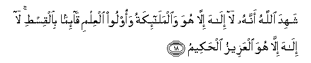

#شَهِدَ اللَّهُ أَنَّهُ لَا إِلَٰهَ إِلَّا هُوَ وَالْمَلَائِكَةُ وَأُولُو الْعِلْمِ قَائِمًا بِالْقِسْطِ ۚ لَا إِلَٰهَ إِلَّا هُوَ الْعَزِيزُ الْحَكِيمُ 

##Shahida Allahu annahu la ilaha illa huwa waalmala-ikatu waoloo alAAilmi qa-iman bialqisti la ilaha illahuwa alAAazeezu alhakeemu 

## 翻译(Translation)：

| Translator | 译文(Translation)                                            |
| :--------: | ------------------------------------------------------------ |
|    马坚    | 真主秉公作证：除他外，绝无应受崇拜的；众天神和一般学者，也这样作证：除他外，绝无应受崇拜的，他是万能的，是至睿的。 |
|  YUSUFALI  | There is no god but He: That is the witness of Allah, His angels, and those endued with knowledge, standing firm on justice. There is no god but He, the Exalted in Power, the Wise. |
| PICKTHALL  | Allah (Himself) is Witness that there is no Allah save Him. And the angels and the men of learning (too are witness). Maintaining His creation in justice, there is no Allah save Him the Almighty, the Wise. |
|   SHAKIR   | Allah bears witness that there is no god but He, and (so do) the angels and those possessed of knowledge, maintaining His creation with justice; there is no god but He, the Mighty, the Wise. |

---

## 对位释义(Words Interpretation)：

| No   | العربية | 中文    | English | 曾用词 |
| ---- | ------: | ------- | ------- | ------ |
| 序号 |    阿文 | Chinese | 英文    | Used   |
| 3:18.1  | شَهِدَ       | 见证           | is present     | 见2:185.14 |
| 3:18.2  | اللَّهُ      | 安拉，真主     | Allah          | 见2:7.2 |
| 3:18.3  | أَنَّهُ       | 他是           | that he is     | 见2:26.16  |
| 3:18.4  | لَا        | 不，不是，没有 | no             | 见2:2.3    |
| 3:18.5  | إِلَٰهَ       | 主宰           | Allah          | 见2:163.3  |
| 3:18.6  | إِلَّا       | 除了           | Except         | 见2:9.7    |
| 3:18.7  | هُوَ        | 他是           | He is          | 见2:29.1   |
| 3:18.8  | وَالْمَلَائِكَةُ | 和众天使       | and the angels | 见2:210.11 |
| 3:18.9  | وَأُولُو     | 和那些人       | and men        | 参2:269.15 |
| 3:18.10 | الْعِلْمِ     | 知识           | the knowledge  | 见2:120.23 |
| 3:18.11 | قَائِمًا     | 坚持           | standing firm  |            |
| 3:18.12 | بِالْقِسْطِ    | 在公正         | on justice     |            |
| 3:18.13 | لَا        | 不，不是，没有 | no             | 见2:2.3    |
| 3:18.14 | إِلَٰهَ       | 主宰           | Allah          | 见2:163.3  |
| 3:18.15 | إِلَّا       | 除了           | Except         | 见2:9.7    |
| 3:18.16 | هُوَ        | 他是           | He is          | 见2:29.1   |
| 3:18.17 | الْعَزِيزُ    | 万能的         | the Mighty     | 见2:129.15 |
| 3:18.18 | الْحَكِيمُ    | 至睿的         | the wise       | 见2:32.12  |

---
