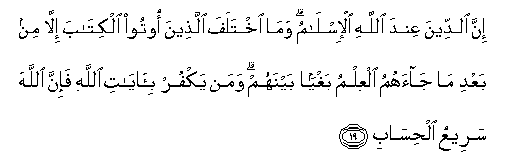

#إِنَّ الدِّينَ عِنْدَ اللَّهِ الْإِسْلَامُ ۗ وَمَا اخْتَلَفَ الَّذِينَ أُوتُوا الْكِتَابَ إِلَّا مِنْ بَعْدِ مَا جَاءَهُمُ الْعِلْمُ بَغْيًا بَيْنَهُمْ ۗ وَمَنْ يَكْفُرْ بِآيَاتِ اللَّهِ فَإِنَّ اللَّهَ سَرِيعُ الْحِسَابِ 

##Inna alddeena AAinda Allahi al-islamu wama ikhtalafa allatheena ootoo alkitaba illa min baAAdi majaahumu alAAilmu baghyan baynahum waman yakfur bi-ayati Allahi fa-inna Allaha sareeAAu alhisabi 

## 翻译(Translation)：

| Translator | 译文(Translation)                                            |
| :--------: | ------------------------------------------------------------ |
|    马坚    | 真主所喜悦的宗教，确是伊斯兰教。曾受天经的人，除在知识降临他们之后，由于互相嫉妒外，对于伊斯兰教也没有异议。谁不信真主的迹象，（真主不久就要惩治谁），因为真主确是清算神速的。 |
|  YUSUFALI  | The Religion before Allah is Islam (submission to His Will): Nor did the People of the Book dissent therefrom except through envy of each other, after knowledge had come to them. But if any deny the Signs of Allah, Allah is swift in calling to account. |
| PICKTHALL  | Lo! religion with Allah (is) the Surrender (to His Will and Guidance). Those who (formerly) received the Scripture differed only after knowledge came unto them, through transgression among themselves. Whoso disbelieveth the revelations of Allah (will find that) lo! Allah is swift at reckoning. |
|   SHAKIR   | Surely the (true) religion with Allah is Islam, and those to whom the Book had been given did not show opposition but after knowledge had come to them, out of envy among themselves; and whoever disbelieves in the communications of Allah then surely Allah is quick in reckoning. |

---

## 对位释义(Words Interpretation)：

| No   | العربية | 中文    | English | 曾用词 |
| ---- | ------: | ------- | ------- | ------ |
| 序号 |    阿文 | Chinese | 英文    | Used   |
| 3:19.1  | إِنَّ      | 的确                   | surely             | 见2:6.1    |
| 3:19.2  | الدِّينَ   | 宗教，信仰，报应，回报 | religion, judgment | 见1:4.3    |
| 3:19.3  | عِنْدَ     | 以                     | with               | 见2:54.20  |
| 3:19.4  | اللَّهِ    | 安拉，真主             | Allah              | 见1:1.2    |
| 3:19.5  | الْإِسْلَامُ | 伊斯兰                 | Islam              |            |
| 3:19.6  | وَمَا     | 和什么                 | and that           | 见2:4.6    |
| 3:19.7  | اخْتَلَفَ   | 争论                   | differed           | 见2:213.21 |
| 3:19.8  | الَّذِينَ   | 谁，那些               | those who          | 见2:6.2    |
| 3:19.9  | أُوتُوا   | 被给                   | were given         | 见2:101.14 |
| 3:19.10 | الْكِتَابَ  | 这部经，这本书         | the book           | 见2:2.2    |
| 3:19.11 | إِلَّا     | 除了                   | Except             | 见2:9.7    |
| 3:19.12 | مِنْ      | 从                     | from               | 见2:4.8    |
| 3:19.13 | بَعْدِ     | 之后                   | after              | 见2:27.6   |
| 3:19.14 | مَا      | 什么                   | what/ that which   | 见2:17.8   |
| 3:19.15 | جَاءَهُمُ   | 来至他们               | had come to them   |            |
| 3:19.16 | الْعِلْمُ   | 知识                   | the knowledge      | 见2:120.23 |
| 3:19.17 | بَغْيًا    | 嫉妒                   | grudging           | 见2:90.10  |
| 3:19.18 | بَيْنَهُمْ   | 他们之间               | between them       | 见2:113.25 |
| 3:19.19 | وَمَنْ     | 和谁                   | and who            | 见2:108.11 |
| 3:19.20 | يَكْفُرْ    | 他不信                 | he disbelieve      | 见2:99.7   |
| 3:19.21 | بِآيَاتِ   | 在众迹象               | in the Signs of    | 见2:61.50  |
| 3:19.22 | اللَّهِ    | 安拉，真主             | Allah              | 见1:1.2    |
| 3:19.23 | فَإِنَّ     | 和确实                 | so surely          | 见2:98.9   |
| 3:19.24 | اللَّهَ    | 安拉，真主             | Allah              | 见1:1.2    |
| 3:19.25 | سَرِيعُ    | 神速                   | swift in           | 见2:202.7  |
| 3:19.26 | الْحِسَابِ  | 清算                   | reckoning          | 见2:202.8  |

---
