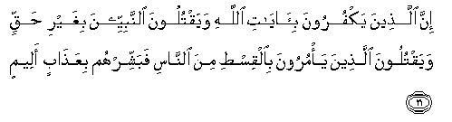

#إِنَّ الَّذِينَ يَكْفُرُونَ بِآيَاتِ اللَّهِ وَيَقْتُلُونَ النَّبِيِّينَ بِغَيْرِ حَقٍّ وَيَقْتُلُونَ الَّذِينَ يَأْمُرُونَ بِالْقِسْطِ مِنَ النَّاسِ فَبَشِّرْهُمْ بِعَذَابٍ أَلِيمٍ 

##Inna allatheena yakfuroona bi-ayati Allahi wayaqtuloona alnnabiyyeena bighayri haqqin wayaqtuloona allatheena ya/muroona bialqisti mina alnnasi fabashshirhum biAAathabin aleemin 

## 翻译(Translation)：

| Translator | 译文(Translation)                                            |
| :--------: | ------------------------------------------------------------ |
|    马坚    | 对于不信真主的迹象，而且枉杀众先知，枉杀以正义命人者的人，你应当以痛苦的刑罚向他们报喜。 |
|  YUSUFALI  | As to those who deny the Signs of Allah and in defiance of right, slay the prophets, and slay those who teach just dealing with mankind, announce to them a grievous penalty. |
| PICKTHALL  | Lo! those who disbelieve the revelations of Allah, and slay the prophets wrongfully, and slay those of mankind who enjoin equity: promise them a painful doom. |
|   SHAKIR   | Surely (as for) those who disbelieve in the communications of Allah and slay the prophets unjustly and slay those among men who enjoin justice, announce to them a painful chastisement. |

---

## 对位释义(Words Interpretation)：

| No   | العربية | 中文    | English | 曾用词 |
| ---- | ------: | ------- | ------- | ------ |
| 序号 |    阿文 | Chinese | 英文    | Used   |
| 3:21.1  | إِنَّ      | 的确           | surely                | 见2:6.1   |
| 3:21.2  | الَّذِينَ   | 谁，那些       | those who             | 见2:6.2   |
| 3:21.3  | يَكْفُرُونَ  | 他们不信       | They disbelieve       | 见2:61.49 |
| 3:21.4  | بِآيَاتِ   | 在众迹象       | in the Signs of       | 见2:61.50 |
| 3:21.5  | اللَّهِ    | 安拉，真主     | Allah                 | 见1:1.2   |
| 3:21.6  | وَيَقْتُلُونَ | 和他们杀害     | and they are killed   | 见2:61.52 |
| 3:21.7  | النَّبِيِّينَ | 众先知         | The Prophets          | 见2:61.53 |
| 3:21.8  | بِغَيْرِ    | 没有           | without               | 见2:61.54 |
| 3:21.9  | حَقٍّ      | 正确的，真理   | Right, truth          | 见2:121.5 |
| 3:21.10 | وَيَقْتُلُونَ | 和他们杀害     | and they are killed   | 见2:61.52 |
| 3:21.11 | الَّذِينَ   | 谁，那些       | those who             | 见2:6.2   |
| 3:21.12 | يَأْمُرُونَ  | 他们命令       | they enjoin           |           |
| 3:21.13 | بِالْقِسْطِ  | 在公正         | on justice            | 见3:18.12 |
| 3:21.14 | مِنَ      | 从             | from                  | 见2:4.8   |
| 3:21.15 | النَّاسِ   | 人             | People                | 见2:8.2   |
| 3:21.16 | فَبَشِّرْهُمْ  | 然后向他们宣布 | then announce to them |           |
| 3:21.17 | بِعَذَابٍ   | 以刑罚         | with a chastisement   |           |
| 3:21.18 | أَلِيمٍ    | 痛苦的         | painful               |           |

---
