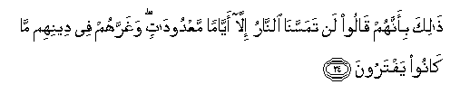

#ذَٰلِكَ بِأَنَّهُمْ قَالُوا لَنْ تَمَسَّنَا النَّارُ إِلَّا أَيَّامًا مَعْدُودَاتٍ ۖ وَغَرَّهُمْ فِي دِينِهِمْ مَا كَانُوا يَفْتَرُونَ 

##Thalika bi-annahum qaloo lan tamassana alnnaru illa ayyaman maAAdoodatin wagharrahum fee deenihim ma kanoo yaftaroona 

## 翻译(Translation)：

| Translator | 译文(Translation)                                            |
| :--------: | ------------------------------------------------------------ |
|    马坚    | 这是因为他们说：火绝不接触我们，除非若干有数的日子。他们所捏造的，在他们的宗教方面，已欺骗了他们。 |
|  YUSUFALI  | This because they say: "The Fire shall not touch us but for a few numbered days": For their forgeries deceive them as to their own religion. |
|  PICKTHAL  | That is because they say: The Fire will not touch us save for a certain number of days. That which they used to invent hath deceived them regarding their religion. |
|   SHAKIR   | This is because they say: The fire shall not touch us but for a few days; and what they have forged deceives them in the matter of their religion. |

---

## 对位释义(Words Interpretation)：

| No   | العربية | 中文    | English | 曾用词 |
| ---- | ------: | ------- | ------- | ------ |
| 序号 |    阿文 | Chinese | 英文    | Used   |
| 3:24.1  | ذَٰلِكَ     | 那，那个，那些，该 | that                    | 见2:2.1   |
| 3:24.2  | بِأَنَّهُمْ   | 因为那个他们       | That they are           | 见2:61.47 |
| 3:24.3  | قَالُوا   | 他们说，           | They said               | 见2:11.8  |
| 3:24.4  | لَنْ      | 绝不               | will not                | 见2:55.5  |
| 3:24.5  | تَمَسَّنَا   | 接触我们           | touch us                | 见2:80.3  |
| 3:24.6  | النَّارُ   | 火                 | fire                    | 见2:24.7  |
| 3:24.7  | إِلَّا     | 除了               | Except                  | 见2:9.7   |
| 3:24.8  | أَيَّامًا   | 日子               | Days                    | 见2:80.6  |
| 3:24.9  | مَعْدُودَاتٍ | 有数的             | For a certain number of | 见2:184.2 |
| 3:24.10 | وَغَرَّهُمْ   | 和它欺骗他们       | and deceive them        |           |
| 3:24.11 | فِي      | 在                 | in                      | 见2:10.1  |
| 3:24.12 | دِينِهِمْ   | 他们的宗教         | their religion          |           |
| 3:24.13 | مَا      | 什么               | what/ that which        | 见2:17.8  |
| 3:24.14 | كَانُوا   | 他们是             | they were               | 见2:10:11 |
| 3:24.15 | يَفْتَرُونَ  | 他们虚构           | they have forged        |           |

---
