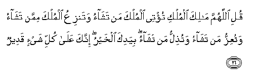

#قُلِ اللَّهُمَّ مَالِكَ الْمُلْكِ تُؤْتِي الْمُلْكَ مَنْ تَشَاءُ وَتَنْزِعُ الْمُلْكَ مِمَّنْ تَشَاءُ وَتُعِزُّ مَنْ تَشَاءُ وَتُذِلُّ مَنْ تَشَاءُ ۖ بِيَدِكَ الْخَيْرُ ۖ إِنَّكَ عَلَىٰ كُلِّ شَيْءٍ قَدِيرٌ 

##Quli allahumma malika almulki tu/tee almulka man tashao watanziAAu almulka mimman tashao watuAAizzu man tashao watuthillu man tashao biyadika alkhayru innaka AAala kulli shay-in qadeerun 

## 翻译(Translation)：

| Translator | 译文(Translation)                                            |
| :--------: | ------------------------------------------------------------ |
|    马坚    | 你说：真主啊！国权的主啊！你要把国权赏赐谁，就赏赐谁；你要把国权从谁手中夺去，就从谁手中夺去；你要使谁尊贵，就使谁尊贵；你要使谁裨贱，就使谁裨贱；福利只由你掌握；你对于万事，确是全能的。 |
|  YUSUFALI  | Say: "O Allah! Lord of Power (And Rule), Thou givest power to whom Thou pleasest, and Thou strippest off power from whom Thou pleasest: Thou enduest with honour whom Thou pleasest, and Thou bringest low whom Thou pleasest: In Thy hand is all good. Verily, over all things Thou hast power. |
| PICKTHALL  | Say: O Allah! Owner of Sovereignty! Thou givest sovereignty unto whom Thou wilt, and Thou withdrawest sovereignty from whom Thou wilt. Thou exaltest whom Thou wilt, and Thou abasest whom Thou wilt. In Thy hand is the good. Lo! Thou art Able to do all things. |
|   SHAKIR   | Say: O Allah, Master of the Kingdom! Thou givest the kingdom to whomsoever Thou pleasest and takest away the kingdom from whomsoever Thou pleasest, and Thou exaltest whom Thou pleasest and abasest whom Thou pleasest in Thine hand is the good; surety, Thou hast power over all things. |

---

## 对位释义(Words Interpretation)：

| No   | العربية | 中文    | English | 曾用词 |
| ---- | ------: | ------- | ------- | ------ |
| 序号 |    阿文 | Chinese | 英文    | Used   |
| 3:26.1  | قُلِ    | 你说           | Say               | 见2:219.30 |
| 3:26.2  | اللَّهُمَّ | 真主啊         | O Allah           |           |
| 3:26.3  | مَالِكَ  | 主，执掌，掌管 | owner, master     | 见1:4.1   |
| 3:26.4  | الْمُلْكِ | 国权           | the Kingdom       |           |
| 3:26.5  | تُؤْتِي  | 你给           | Thou givest       |           |
| 3:26.6  | الْمُلْكَ | 国权           | the Kingdom       | 见3:26.4  |
| 3:26.7  | مَنْ    | 谁             | who               | 见2:97.2  |
| 3:26.8  | تَشَاءُ  | 你意欲         | Thou pleasest     |           |
| 3:26.9  | وَتَنْزِعُ | 和你取出       | and takest away   |           |
| 3:26.10 | الْمُلْكَ | 国权           | the Kingdom       | 见3:26.4  |
| 3:26.11 | مِمَّنْ   | 比谁           | than who          | 见2:114.3 |
| 3:26.12 | تَشَاءُ  | 你意欲         | Thou pleasest     | 见3:26.8  |
| 3:26.13 | وَتُعِزُّ  | 和你使尊贵     | and Thou exaltest |           |
| 3:26.14 | مَنْ    | 谁             | who               | 见2:97.2  |
| 3:26.15 | تَشَاءُ  | 你意欲         | Thou pleasest     | 见3:26.8  |
| 3:26.16 | وَتُذِلُّ  | 和你使卑贱     | and Thou abasest  |           |
| 3:26.17 | مَنْ    | 谁             | who               | 见2:97.2  |
| 3:26.18 | تَشَاءُ  | 你意欲         | Thou pleasest     | 见3:26.8  |
| 3:26.19 | بِيَدِكَ  | 在你的手       | In Thy hand       |           |
| 3:26.20 | الْخَيْرُ | 好的           | the good          |           |
| 3:26.21 | إِنَّكَ   | 确实您         | surely you        | 见2:32.9  |
| 3:26.22 | عَلَىٰ   | 至             | On                | 见2:5.2   |
| 3:26.23 | كُلِّ    | 所有           | All               | 见2:20.23 |
| 3:26.24 | شَيْءٍ   | 事物           | Thing             | 见2:20.24 |
| 3:26.25 | قَدِيرٌ  | 全能，大能的   | Mighty            | 见2:20.25 |

---
