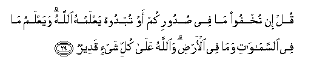

#قُلْ إِنْ تُخْفُوا مَا فِي صُدُورِكُمْ أَوْ تُبْدُوهُ يَعْلَمْهُ اللَّهُ ۗ وَيَعْلَمُ مَا فِي السَّمَاوَاتِ وَمَا فِي الْأَرْضِ ۗ وَاللَّهُ عَلَىٰ كُلِّ شَيْءٍ قَدِيرٌ 

##Qul in tukhfoo ma fee sudoorikum aw tubdoohu yaAAlamhu Allahu wayaAAlamu ma fee alssamawati wama fee al-ardi waAllahu AAala kulli shay-in qadeerun 

## 翻译(Translation)：

| Translator | 译文(Translation)                                            |
| :--------: | ------------------------------------------------------------ |
|    马坚    | 你说：你们的心事，无论加以隐讳，或加以表白，真主都是知道的。他知道天地万物。真主对于万事是全能的。 |
|  YUSUFALI  | Say: "Whether ye hide what is in your hearts or reveal it, Allah knows it all: He knows what is in the heavens, and what is on earth. And Allah has power over all things. |
|  PICKTHAL  | Say, (O Muhammad): Whether ye hide that which is in your breasts or reveal it, Allah knoweth it. He knoweth that which is in the heavens and that which is in the earth, and Allah is Able to do all things. |
|   SHAKIR   | Say: Whether you hide what is in your hearts or manifest it, Allah knows it, and He knows whatever is in the heavens and whatever is in the earth, and Allah has power over all things. |

---

## 对位释义(Words Interpretation)：

| No   | العربية | 中文    | English | 曾用词 |
| ---- | ------: | ------- | ------- | ------ |
| 序号 |    阿文 | Chinese | 英文    | Used   |
| 3:29.1  | قُلْ       | 你说         | Say              | 见2:80.8   |
| 3:29.2  | إِنْ       | 如果         | if               | 见2:23.18  |
| 3:29.3  | تُخْفُوا    | 你们隐讳     | you hide         |            |
| 3:29.4  | مَا       | 什么         | what/ that which | 见2:17.8   |
| 3:29.5  | فِي       | 在           | in               | 见2:10.1   |
| 3:29.6  | صُدُورِكُمْ   | 你们的胸中   | your breasts     |            |
| 3:29.7  | أَوْ       | 或           | or               | 见2:19.1   |
| 3:29.8  | تُبْدُوهُ    | 表白它       | reveal it        |            |
| 3:29.9  | يَعْلَمْهُ    | 知道它       | knows it         | 见2:197.20 |
| 3:29.10 | اللَّهُ     | 安拉，真主   | Allah            | 见1:1.2    |
| 3:29.11 | وَيَعْلَمُ    | 和他知道     | and He knows     |            |
| 3:29.12 | مَا       | 什么         | what/ that which | 见2:17.8   |
| 3:29.13 | فِي       | 在           | in               | 见2:10.1   |
| 3:29.14 | السَّمَاوَاتِ | 天           | Heavens          | 见2:33.16  |
| 3:29.15 | وَمَا      | 和什么       | and that         | 见2:4.6    |
| 3:29.16 | فِي       | 在           | in               | 见2:10.1   |
| 3:29.17 | الْأَرْضِ    | 大地         | Earth            | 见2:22.4   |
| 3:29.18 | وَاللَّهُ    | 和安拉，真主 | and Allah        | 见2:19.17  |
| 3:29.19 | عَلَىٰ      | 至           | On               | 见2:5.2    |
| 3:29.20 | كُلِّ       | 所有         | All              | 见2:20.23  |
| 3:29.21 | شَيْءٍ      | 事物         | Thing            | 见2:20.24  |
| 3:29.22 | قَدِيرٌ     | 全能，大能的 | Mighty           | 见2:20.25  |

---
