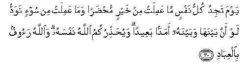

#يَوْمَ تَجِدُ كُلُّ نَفْسٍ مَا عَمِلَتْ مِنْ خَيْرٍ مُحْضَرًا وَمَا عَمِلَتْ مِنْ سُوءٍ تَوَدُّ لَوْ أَنَّ بَيْنَهَا وَبَيْنَهُ أَمَدًا بَعِيدًا ۗ وَيُحَذِّرُكُمُ اللَّهُ نَفْسَهُ ۗ وَاللَّهُ رَءُوفٌ بِالْعِبَادِ 

##Yawma tajidu kullu nafsin ma AAamilat min khayrin muhdaran wama AAamilat min soo-in tawaddu law anna baynaha wabaynahu amadan baAAeedan wayuhaththirukumu Allahu nafsahu waAllahu raoofun bialAAibadi 

## 翻译(Translation)：

| Translator | 译文(Translation)                                            |
| :--------: | ------------------------------------------------------------ |
|    马坚    | 在那日，人人都要发现自己所作善恶的记录陈列在自己面前。人人都要希望在自己和那日之间，有很远的距离。真主使你们防备他自己，真主是仁爱众仆的。 |
|  YUSUFALI  | "On the Day when every soul will be confronted with all the good it has done, and all the evil it has done, it will wish there were a great distance between it and its evil. But Allah cautions you (To remember) Himself. And Allah is full of kindness to those that serve Him." |
| PICKTHALL  | On the Day when every soul will find itself confronted with all that it hath done of good and all that it hath done of evil (every soul) will long that there might be a mighty space of distance between it and that (evil). Allah biddeth you beware of Him. And Allah is Full of Pity for (His) bondmen. |
|   SHAKIR   | On the day that every soul shall find present what it has done of good and what it has done of evil, it shall wish that between it and that (evil) there were a long duration of time; and Allah makes you to be cautious of (retribution from) Himself; and Allah is Compassionate to the servants. |

---

## 对位释义(Words Interpretation)：

| No   | العربية | 中文    | English | 曾用词 |
| ---- | ------: | ------- | ------- | ------ |
| 序号 |    阿文 | Chinese | 英文    | Used   |
| 3:30.1  | يَوْمَ     | 日，日子，时候的 | day                 | 见1:4.2    |
| 3:30.2  | تَجِدُ     | 发现             | find                |            |
| 3:30.3  | كُلُّ      | 所有             | All                 | 见2:20.23  |
| 3:30.4  | نَفْسٍ     | 一个人           | one soul         | 见2:48.5   |
| 3:30.5  | مَا      | 什么             | what/ that which    | 见2:17.8   |
| 3:30.6  | عَمِلَتْ    | 她做             | it has done         |            |
| 3:30.7  | مِنْ      | 从               | from                | 见2:4.8    |
| 3:30.8  | خَيْرٍ     | 较好的           | be better           | 见2:54.18  |
| 3:30.9  | مُحْضَرًا   | 面对             | confronted          |            |
| 3:30.10 | وَمَا     | 和什么           | and that            | 见2:4.6    |
| 3:30.11 | عَمِلَتْ    | 她做             | it has done         | 见3:30.6   |
| 3:30.12 | مِنْ      | 从               | from                | 见2:4.8    |
| 3:30.13 | سُوءٍ     | 恶               | evil                |            |
| 3:30.14 | تَوَدُّ     | 她希望           | it will wish        |            |
| 3:30.15 | لَوْ      | 如果             | If                  | 见2:102.72 |
| 3:30.16 | أَنَّ      | 该               | that                | 见2:26.5   |
| 3:30.17 | بَيْنَهَا   | 她之间           | between it          |            |
| 3:30.18 | وَبَيْنَهُ   | 和它之间         | and between it      |            |
| 3:30.19 | أَمَدًا    | 距离             | distance            |            |
| 3:30.20 | بَعِيدًا   | 很远的           | a long              |            |
| 3:30.21 | وَيُحَذِّرُكُمُ | 和他警告你们     | and he cautions you | 见3:28.22  |
| 3:30.22 | اللَّهُ    | 安拉，真主       | Allah               | 见2:7.2 |
| 3:30.23 | نَفْسَهُ    | 他自己           | Himself             | 见2:9.8    |
| 3:30.24 | وَاللَّهُ   | 和安拉，真主     | and Allah           | 见2:19.17  |
| 3:30.25 | رَءُوفٌ    | 仁爱             | Affectionate        | 见2:207.10 |
| 3:30.26 | بِالْعِبَادِ | 在众仆           | to the servants     | 见2:207.11 |

---
