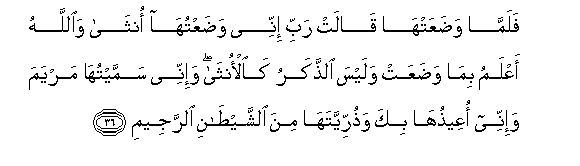

#فَلَمَّا وَضَعَتْهَا قَالَتْ رَبِّ إِنِّي وَضَعْتُهَا أُنْثَىٰ وَاللَّهُ أَعْلَمُ بِمَا وَضَعَتْ وَلَيْسَ الذَّكَرُ كَالْأُنْثَىٰ ۖ وَإِنِّي سَمَّيْتُهَا مَرْيَمَ وَإِنِّي أُعِيذُهَا بِكَ وَذُرِّيَّتَهَا مِنَ الشَّيْطَانِ الرَّجِيمِ 

##Falamma wadaAAat-ha qalat rabbi innee wadaAAtuha ontha waAllahu aAAlamu bima wadaAAat walaysa alththakaru kaalontha wa-innee sammaytuha maryama wa-innee oAAeethuha bika wathurriyyataha mina alshshaytani alrrajeemi 

## 翻译(Translation)：

| Translator | 译文(Translation)                                            |
| :--------: | ------------------------------------------------------------ |
|    马坚    | 当她生了一个女孩的时候，她说：我确已生了一个女孩。真主是知道她所生的孩子的。男孩不象女孩一样。我确已把她叫做麦尔彦，求你保佑她和她的后裔，免受被弃绝的恶魔的搔扰。 |
|  YUSUFALI  | When she was delivered, she said: "O my Lord! Behold! I am delivered of a female child!"- and Allah knew best what she brought forth- "And no wise is the male Like the female. I have named her Mary, and I commend her and her offspring to Thy protection from the Evil One, the Rejected." |
| PICKTHALL  | And when she was delivered she said: My Lord! Lo! I am delivered of a female - Allah knew best of what she was delivered - the male is not as the female; and lo! I have named her Mary, and lo! I crave Thy protection for her and for her offspring from Satan the outcast. |
|   SHAKIR   | So when she brought forth, she said: My Lord! Surely I have brought it forth a female-- and Allah knew best what she brought forth-- and the male is not like the female, and I have named it Marium, and I commend her and her offspring into Thy protection from the accursed Shaitan. |

---

## 对位释义(Words Interpretation)：

| No   | العربية | 中文    | English | 曾用词 |
| ---- | ------: | ------- | ------- | ------ |
| 序号 |    阿文 | Chinese | 英文    | Used   |
| 3:36.1  | فَلَمَّا    | 但是当         | but when          | 见2:17.6   |
| 3:36.2  | وَضَعَتْهَا  | 她生她         | she was delivered |            |
| 3:36.3  | قَالَتْ    | 她说           | she said          |            |
| 3:36.4  | رَبِّ      | 主，养育，调养 | Lord              | 见1:2.3    |
| 3:36.5  | إِنِّي     | 确实我         | surely I          | 见2:30.5   |
| 3:36.6  | وَضَعْتُهَا  | 我生她         | I am delivered    |            |
| 3:36.7  | أُنْثَىٰ    | 一个女的       | a female          |            |
| 3:36.8  | وَاللَّهُ   | 和安拉，真主   | and Allah         | 见2:19.17  |
| 3:36.9  | أَعْلَمُ    | 至知           | know best         | 见2:30.25  |
| 3:36.10 | بِمَا     | 在什么         | in what           | 见2:4.3    |
| 3:36.11 | وَضَعَتْ    | 她生           | she was delivered |            |
| 3:36.12 | وَلَيْسَ    | 和它不         | and it is not     |            |
| 3:36.13 | الذَّكَرُ   | 男性           | the male          |            |
| 3:36.14 | كَالْأُنْثَىٰ | 像女性         | like the female   |            |
| 3:36.15 | وَإِنِّي    | 和确实我       | and surely I      | 参2:30.5   |
| 3:36.16 | سَمَّيْتُهَا  | 我命名她       | I have named her  |            |
| 3:36.17 | مَرْيَمَ    | 麦尔彦         | Marium            | 见2:87.12  |
| 3:36.18 | وَإِنِّي    | 和确实我       | and surely I      | 见3:36.15  |
| 3:36.19 | أُعِيذُهَا  | 我求保佑她     | I commend her     |            |
| 3:36.20 | بِكَ      | 以你           | into Thy          |            |
| 3:36.21 | وَذُرِّيَّتَهَا | 和她的后裔     | and her offspring |            |
| 3:36.22 | مِنَ      | 从             | from              | 见2:4.8    |
| 3:36.23 | الشَّيْطَانِ | 恶魔的         | of the Shaitan    | 见2:168.13 |
| 3:36.24 | الرَّجِيمِ  | 被弃绝的       | the Rejected      |            |

---
