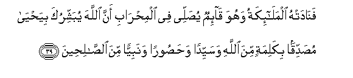

#فَنَادَتْهُ الْمَلَائِكَةُ وَهُوَ قَائِمٌ يُصَلِّي فِي الْمِحْرَابِ أَنَّ اللَّهَ يُبَشِّرُكَ بِيَحْيَىٰ مُصَدِّقًا بِكَلِمَةٍ مِنَ اللَّهِ وَسَيِّدًا وَحَصُورًا وَنَبِيًّا مِنَ الصَّالِحِينَ 

##Fanadat-hu almala-ikatu wahuwa qa-imun yusallee fee almihrabi anna Allaha yubashshiruka biyahya musaddiqan bikalimatin mina Allahi wasayyidan wahasooran wanabiyyan mina alssaliheena 

## 翻译(Translation)：

| Translator | 译文(Translation)                                            |
| :--------: | ------------------------------------------------------------ |
|    马坚    | 正当宰凯里雅站在内殿祈祷的时候，天神喊叫他说：真主以叶哈雅向你报喜，他要证实从真主发出的一句话，要长成尊贵的、克己的人，要变成一个善良的先知。 |
|  YUSUFALI  | While he was standing in prayer in the chamber, the angels called unto him: "Allah doth give thee glad tidings of Yahya, witnessing the truth of a Word from Allah, and (be besides) noble, chaste, and a prophet,- of the (goodly) company of the righteous." |
| PICKTHALL  | And the angels called to him as he stood praying in the sanctuary: Allah giveth thee glad tidings of (a son whose name is) John, (who cometh) to confirm a word from Allah lordly, chaste, a prophet of the righteous. |
|   SHAKIR   | Then the angels called to him as he stood praying in the sanctuary: That Allah gives you the good news of Yahya verifying a Word from Allah, and honorable and chaste and a prophet from among the good ones. |

---

## 对位释义(Words Interpretation)：

| No   | العربية | 中文    | English | 曾用词 |
| ---- | ------: | ------- | ------- | ------ |
| 序号 |    阿文 | Chinese | 英文    | Used   |
| 3:39.1  | فَنَادَتْهُ   | 然后她喊叫他 | Then she called to him     |            |
| 3:39.2  | الْمَلَائِكَةُ | 天使         | the angels                 | 见2:248.22 |
| 3:39.3  | وَهُوَ      | 和他         | and he                     | 见2:29.16  |
| 3:39.4  | قَائِمٌ     | 站立         | stood                      |            |
| 3:39.5  | يُصَلِّي     | 他祈祷       | he praying                 |            |
| 3:39.6  | فِي       | 在           | in                         | 见2:10.1   |
| 3:39.7  | الْمِحْرَابِ  | 内殿         | the sanctuary              | 见3:37.14  |
| 3:39.8  | أَنَّ       | 该           | that                       | 见2:26.5   |
| 3:39.9  | اللَّهَ     | 安拉，真主   | Allah                      | 见2:9.2 |
| 3:39.10 | يُبَشِّرُكَ    | 他报喜你     | he gives you the good news |            |
| 3:39.11 | بِيَحْيَىٰ    | 以叶哈雅     | of Yahya                   |            |
| 3:39.12 | مُصَدِّقًا    | 证实         | confirming                 | 见2:41.4   |
| 3:39.13 | بِكَلِمَةٍ    | 在一句话     | of a Word                  |            |
| 3:39.14 | مِنَ       | 从           | from                       | 见2:4.8    |
| 3:39.15 |     اللَّهِ | 真主的       | of Allah                   | 见2:23.17  |
| 3:39.16 | وَسَيِّدًا    | 和尊贵的     | and honorable              |            |
| 3:39.17 | وَحَصُورًا   | 和克己的     | and chaste                 |            |
| 3:39.18 | وَنَبِيًّا    | 和一个先知   | and a prophet              |            |
| 3:39.19 | مِنَ       | 从           | from                       | 见2:4.8    |
| 3:39.20 | الصَّالِحِينَ | 善人们       | the Righteous              | 见2:130.18 |

---
