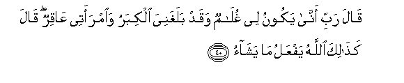

#قَالَ رَبِّ أَنَّىٰ يَكُونُ لِي غُلَامٌ وَقَدْ بَلَغَنِيَ الْكِبَرُ وَامْرَأَتِي عَاقِرٌ ۖ قَالَ كَذَٰلِكَ اللَّهُ يَفْعَلُ مَا يَشَاءُ 

##Qala rabbi anna yakoonu lee ghulamun waqad balaghaniya alkibaru waimraatee AAaqirun qala kathalika Allahu yafAAalu ma yasha/o 

## 翻译(Translation)：

| Translator | 译文(Translation)                                            |
| :--------: | ------------------------------------------------------------ |
|    马坚    | 他说：我的主啊！我确已老迈了，我的妻子是不会生育的，我怎么会有儿子呢? 天神说：真主如此为所欲为。 |
|  YUSUFALI  | He said: "O my Lord! How shall I have son, seeing I am very old, and my wife is barren?" "Thus," was the answer, "Doth Allah accomplish what He willeth." |
|  PICKTHAL  | He said: My Lord! How can I have a son when age hath overtaken me already and my wife is barren? (The angel) answered: So (it will be). Allah doeth what He will. |
|   SHAKIR   | He said: My Lord! when shall there be a son (born) to me, and old age has already come upon me, and my wife is barren? He said: even thus does Allah what He pleases. |

---

## 对位释义(Words Interpretation)：

| No   | العربية | 中文    | English | 曾用词 |
| ---- | ------: | ------- | ------- | ------ |
| 序号 |    阿文 | Chinese | 英文    | Used   |
| 3:40.1  | قَالَ     | 他说，         | He said           | 见2:30.2   |
| 3:40.2  | رَبِّ      | 主，养育，调养 | Lord              | 见1:2.3    |
| 3:40.3  | أَنَّىٰ     | 如何           | how               | 见2:223.6  |
| 3:40.4  | يَكُونُ    | 他是           | he is             | 见2:247.13 |
| 3:40.5  | لِي      | 至我           | to me             | 见2:152.4  |
| 3:40.6  | غُلَامٌ    | 一个儿子       | a son             |            |
| 3:40.7  | وَقَدْ     | 和当然         | and may           | 见2:75.5   |
| 3:40.8  | بَلَغَنِيَ   | 它达到我       | hath overtaken me |            |
| 3:40.9  | الْكِبَرُ   | 年老           | old age           | 见2:266.20 |
| 3:40.10 | وَامْرَأَتِي | 和我的妻子     | and my wife       |            |
| 3:40.11 | عَاقِرٌ    | 不能生育       | barren            |            |
| 3:40.12 | قَالَ     | 他说，         | He said           | 见2:30.2   |
| 3:40.13 | كَذَٰلِكَ    | 像如此         | Thus              | 见2:73.4   |
| 3:40.14 | اللَّهُ    | 安拉，真主     | Allah             | 见1:1.2    |
| 3:40.15 | يَفْعَلُ    | 做             | do                | 见2:85.31  |
| 3:40.16 | مَا      | 什么           | what/ that which  | 见2:17.8   |
| 3:40.17 | يَشَاءُ    | 他意欲         | He pleases        | 见2:90.18  |

---
