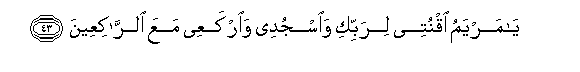

#يَا مَرْيَمُ اقْنُتِي لِرَبِّكِ وَاسْجُدِي وَارْكَعِي مَعَ الرَّاكِعِينَ 

##Ya maryamu oqnutee lirabbiki waosjudee wairkaAAee maAAa alrrakiAAeena 

## 翻译(Translation)：

| Translator | 译文(Translation)                                            |
| :--------: | ------------------------------------------------------------ |
|    马坚    | 麦尔彦啊！你当顺服你的主，你当叩头，你当与鞠躬的人一同鞠躬。 |
|  YUSUFALI  | "O Mary! worship Thy Lord devoutly: Prostrate thyself, and bow down (in prayer) with those who bow down." |
|  PICKTHAL  | O Mary! Be obedient to thy Lord, prostrate thyself and bow with those who bow (in worship). |
|   SHAKIR   | O Marium! keep to obedience to your Lord and humble yourself, and bow down with those who bow. |

---

## 对位释义(Words Interpretation)：

| No   | العربية | 中文    | English | 曾用词 |
| ---- | ------: | ------- | ------- | ------ |
| 序号 |    阿文 | Chinese | 英文    | Used   |
| 3:43.1 | يَا       | 啊         | Oh                     | 见2:21.1  |
| 3:43.2 | مَرْيَمُ     | 麦尔彦     | Marium                 | 见2:87.12 |
| 3:43.3 | اقْنُتِي    | 你应顺服   | Be obedient            |           |
| 3:43.4 | لِرَبِّكِ     | 至你的主   | to your Lord           |           |
| 3:43.5 | وَاسْجُدِي   | 和你应叩头 | and prostrate yourself |           |
| 3:43.6 | وَارْكَعِي   | 和你应鞠躬 | and bow down           |           |
| 3:43.7 | مَعَ       | 共同       | With                   | 见2:43.6  |
| 3:43.8 | الرَّاكِعِينَ | 鞠躬者     | Those who bow down     | 见2:43.7  |

---
