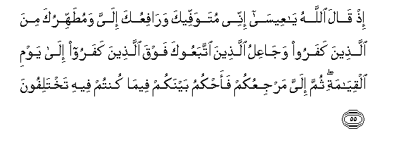

#إِذْ قَالَ اللَّهُ يَا عِيسَىٰ إِنِّي مُتَوَفِّيكَ وَرَافِعُكَ إِلَيَّ وَمُطَهِّرُكَ مِنَ الَّذِينَ كَفَرُوا وَجَاعِلُ الَّذِينَ اتَّبَعُوكَ فَوْقَ الَّذِينَ كَفَرُوا إِلَىٰ يَوْمِ الْقِيَامَةِ ۖ ثُمَّ إِلَيَّ مَرْجِعُكُمْ فَأَحْكُمُ بَيْنَكُمْ فِيمَا كُنْتُمْ فِيهِ تَخْتَلِفُونَ 

##Ith qala Allahu ya AAeesa innee mutawaffeeka warafiAAuka ilayya wamutahhiruka mina allatheena kafaroo wajaAAilu allatheena ittabaAAooka fawqa allatheena kafaroo ila yawmi alqiyamati thumma ilayya marjiAAukum faahkumu baynakum feema kuntum feehi takhtalifoona 

## 翻译(Translation)：

| Translator | 译文(Translation)                                            |
| :--------: | ------------------------------------------------------------ |
|    马坚    | 当时，真主对尔撒说：我必定要使你寿终，要把你擢升到我那里，要为你涤清不信道者的诬蔑，要使信仰你的人，在不信仰你的人之上，直到复活日。然后你们只归于我，我要为你们判决你们所争论的是非。 |
|  YUSUFALI  | Behold! Allah said: "O Jesus! I will take thee and raise thee to Myself and clear thee (of the falsehoods) of those who blaspheme; I will make those who follow thee superior to those who reject faith, to the Day of Resurrection: Then shall ye all return unto me, and I will judge between you of the matters wherein ye dispute. |
| PICKTHALL  | (And remember) when Allah said: O Jesus! Lo! I am gathering thee and causing thee to ascend unto Me, and am cleansing thee of those who disbelieve and am setting those who follow thee above those who disbelieve until the Day of Resurrection. Then unto Me ye will (all) return, and I shall judge between you as to that wherein ye used to differ. |
|   SHAKIR   | And when Allah said: O Isa, I am going to terminate the period of your stay (on earth) and cause you to ascend unto Me and purify you of those who disbelieve and make those who follow you above those who disbelieve to the day of resurrection; then to Me shall be your return, so l will decide between you concerning that in which you differed. |

---

## 对位释义(Words Interpretation)：

| No   | العربية | 中文    | English | 曾用词 |
| ---- | ------: | ------- | ------- | ------ |
| 序号 |    阿文 | Chinese | 英文    | Used   |
| 3:55.1  | إِذْ      | 当时             | when             | 见2:131.1  |
| 3:55.2  | قَالَ     | 他说，           | He said          | 见2:30.2   |
| 3:55.3  | اللَّهُ    | 安拉，真主       | Allah            | 见1:1.2    |
| 3:55.4  | يَا      | 啊               | Oh               | 见2:21.1   |
| 3:55.5  | عِيسَىٰ    | 尔撒             | Isa              | 见2:87.10  |
| 3:55.6  | إِنِّي     | 确实我           | surely I         | 见2:30.5   |
| 3:55.7  | مُتَوَفِّيكَ  | 你的寿终         | gathering you    |            |
| 3:55.8  | وَرَافِعُكَ  | 和提升你         | and raise you    |            |
| 3:55.9  | إِلَيَّ     | 至我             | to me            |            |
| 3:55.10 | وَمُطَهِّرُكَ  | 和洁净你         | and purify you   |            |
| 3:55.11 | مِنَ      | 从               | from             | 见2:4.8    |
| 3:55.12 | الَّذِينَ   | 谁，那些         | those who        | 见2:6.2    |
| 3:55.13 | كَفَرُوا   | 不信             | disbelieve       | 见2:6.3    |
| 3:55.14 | وَجَاعِلُ   | 和使             | and make         |            |
| 3:55.15 | الَّذِينَ   | 谁，那些         | those who        | 见2:6.2    |
| 3:55.16 | اتَّبَعُوكَ  | 追随你           | follow you       |            |
| 3:55.17 | فَوْقَ     | 之上             | above            |            |
| 3:55.18 | الَّذِينَ   | 谁，那些         | those who        | 见2:6.2    |
| 3:55.19 | كَفَرُوا   | 不信             | disbelieve       | 见2:6.3    |
| 3:55.20 | إِلَىٰ     | 至               | to               | 见2:14.9   |
| 3:55.21 | يَوْمِ     | 日，日子，时候的 | day              | 见1:4.2    |
| 3:55.22 | الْقِيَامَةِ | 复活的           | Resurrection     | 见2:85.40  |
| 3:55.23 | ثُمَّ      | 然后             | Then             | 见2:28.7   |
| 3:55.24 | إِلَيَّ     | 至我             | to me            | 见3:55.9   |
| 3:55.25 | مَرْجِعُكُمْ  | 你们被返回       | your return      |            |
| 3:55.26 | فَأَحْكُمُ   | 然后我将审判     | so I will judge  |            |
| 3:55.27 | بَيْنَكُمْ   | 你们之中         | among yourselves | 见2:188.4  |
| 3:55.28 | فِيمَا    | 在什么           | in that          | 见2:113.28 |
| 3:55.29 | كُنْتُمْ    | 你们             | You              | 见2:23.2   |
| 3:55.30 | فِيهِ     | 它，其中         | in it            | 见2:2.5    |
| 3:55.31 | تَخْتَلِفُونَ | 你们争论         | you differ       |            |

---
