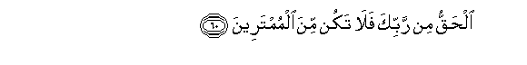

#الْحَقُّ مِنْ رَبِّكَ فَلَا تَكُنْ مِنَ الْمُمْتَرِينَ 

##Alhaqqu min rabbika fala takun mina almumtareena 

## 翻译(Translation)：

| Translator | 译文(Translation)                                            |
| :--------: | ------------------------------------------------------------ |
|    马坚    | （这是）从你的主降示的真理，故你不要怀疑。                   |
|  YUSUFALI  | The Truth (comes) from Allah alone; so be not of those who doubt. |
| PICKTHALL  | (This is) the truth from thy Lord (O Muhammad), so be not thou of those who waver. |
|   SHAKIR   | (This is) the truth from your Lord, so be not of the disputers. |

---

## 对位释义(Words Interpretation)：

| No   | العربية | 中文    | English | 曾用词 |
| ---- | ------: | ------- | ------- | ------ |
| 序号 |    阿文 | Chinese | 英文    | Used   |
| 3:60.1 | الْحَقُّ     | 正确的，真理 | Right, truth | 见2:26.17 |
| 3:60.2 | مِنْ       | 从           | from         | 见2:4.8   |
| 3:60.3 | رَبِّكَ      | 您的主       | Your Lord    | 见2:30.3  |
| 3:60.4 | فَلَا      | 因此不       | shall not    | 见2:22.18 |
| 3:60.5 | تَكُنْ      | 你是         | be           |           |
| 3:60.6 | مِنَ       | 从           | from         | 见2:4.8   |
| 3:60.7 | الْمُمْتَرِينَ | 怀疑         | doubt        | 见2:147.7 |

---
