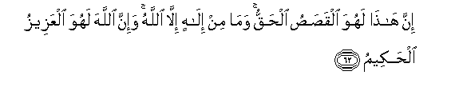

#إِنَّ هَٰذَا لَهُوَ الْقَصَصُ الْحَقُّ ۚ وَمَا مِنْ إِلَٰهٍ إِلَّا اللَّهُ ۚ وَإِنَّ اللَّهَ لَهُوَ الْعَزِيزُ الْحَكِيمُ 

##Inna hatha lahuwa alqasasu alhaqqu wama min ilahin illa Allahu wa-inna Allaha lahuwa alAAazeezu alhakeemu 

## 翻译(Translation)：

| Translator | 译文(Translation)                                            |
| :--------: | ------------------------------------------------------------ |
|    马坚    | 这确是真实的故事。除真主外，绝无应受崇拜的。真主确是万能的，确是至睿的。 |
|  YUSUFALI  | This is the true account: There is no god except Allah; and Allah-He is indeed the Exalted in Power, the Wise. |
| PICKTHALL  | Lo! This verily is the true narrative. There is no Allah save Allah, and lo! Allah, He verily is, is the Mighty, the Wise. |
|   SHAKIR   | Most surely this is the true explanation, and there is no god but Allah; and most surely Allah-- He is the Mighty, the Wise. |

---

## 对位释义(Words Interpretation)：

| No   | العربية | 中文    | English | 曾用词 |
| ---- | ------: | ------- | ------- | ------ |
| 序号 |    阿文 | Chinese | 英文    | Used   |
| 3:62.1  | إِنَّ     | 的确         | surely        | 见2:6.1    |
| 3:62.2  | هَٰذَا    | 这个，此     | This          | 见2:25.20  |
| 3:62.3  | لَهُوَ    | 必定它       | surely he     |            |
| 3:62.4  | الْقَصَصُ  | 故事         | the narrative |            |
| 3:62.5  | الْحَقُّ   | 正确的，真理 | Right, truth  | 见2:26.17  |
| 3:62.6  | وَمَا    | 和不         | And not       | 见2:9.9    |
| 3:62.7  | مِنْ     | 从           | from          | 见2:4.8    |
| 3:62.8  | إِلَٰهٍ    | 神           | god           |            |
| 3:62.9  | إِلَّا    | 除了         | Except        | 见2:9.7    |
| 3:62.10 | اللَّهُ   | 安拉，真主   | Allah         | 见1:1.2    |
| 3:62.11 | وَإِنَّ    | 和确实       | and is        | 见2:143.28 |
| 3:62.12 | اللَّهَ   | 安拉，真主   | Allah         | 见1:1.2    |
| 3:62.13 | لَهُوَ    | 必定它       | surely he     | 见3:62.13  |
| 3:62.14 | الْعَزِيزُ | 万能的       | the Mighty    | 见2:129.15 |
| 3:62.15 | الْحَكِيمُ | 至睿的       | the wise      | 见2:32.12  |

---
