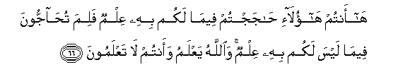

#هَا أَنْتُمْ هَٰؤُلَاءِ حَاجَجْتُمْ فِيمَا لَكُمْ بِهِ عِلْمٌ فَلِمَ تُحَاجُّونَ فِيمَا لَيْسَ لَكُمْ بِهِ عِلْمٌ ۚ وَاللَّهُ يَعْلَمُ وَأَنْتُمْ لَا تَعْلَمُونَ 

##Ha antum haola-i hajajtum feema lakum bihi AAilmun falima tuhajjoona feema laysa lakum bihi AAilmun waAllahu yaAAlamu waantum la taAAlamoona 

## 翻译(Translation)：

| Translator | 译文(Translation)                                            |
| :--------: | ------------------------------------------------------------ |
|    马坚    | 你们这等人，自己知道的事，固然可以辩论；怎么连自己所不知道的事，也要加以辩论呢？真主知道，你们确不知道。 |
|  YUSUFALI  | Ah! Ye are those who fell to disputing (Even) in matters of which ye had some knowledge! but why dispute ye in matters of which ye have no knowledge? It is Allah Who knows, and ye who know not! |
| PICKTHALL  | Lo! ye are those who argue about that whereof ye have some knowledge: Why then argue ye concerning that whereof ye have no knowledge? Allah knoweth. Ye know not. |
|   SHAKIR   | Behold! you are they who disputed about that of which you had knowledge; why then do you dispute about that of which you have no knowledge? And Allah knows while you do not know. |

---

## 对位释义(Words Interpretation)：

| No   | العربية | 中文    | English | 曾用词 |
| ---- | ------: | ------- | ------- | ------ |
| 序号 |    阿文 | Chinese | 英文    | Used   |
| 3:66.1  | هَا     | 啊            | Ah          |            |
| 3:66.2  | أَنْتُمْ   | 你们           | you         | 见2:85.2   |
| 3:66.3  | هَٰؤُلَاءِ  | 这些           | Those       | 见2:31.12  |
| 3:66.4  | حَاجَجْتُمْ | 你们争论       | dispute     |            |
| 3:66.5  | فِيمَا   | 在什么         | in that     | 见2:113.28 |
| 3:66.6  | لَكُمْ    | 为你们         | For you     | 见2:22.3   |
| 3:66.7  | بِهِ     | 以它           | with it     | 见2:22.13  |
| 3:66.8  | عِلْمٌ    | 知识           | knowledge   |            |
| 3:66.9  | فَلِمَ    | 为什么然后     | Why then    | 见2:91.22  |
| 3:66.10 | تُحَاجُّونَ | 你们争论       | you dispute | 见3:65.5   |
| 3:66.11 | فِيمَا   | 在什么         | in that     | 见2:113.28 |
| 3:66.12 | لَيْسَ    | 它不是         | It is not   | 见2:177.1  |
| 3:66.13 | لَكُمْ    | 为你们         | For you     | 见2:22.3   |
| 3:66.14 | بِهِ     | 以它           | with it     | 见2:22.13  |
| 3:66.15 | عِلْمٌ    | 知识           | knowledge   | 见3:66.8   |
| 3:66.16 | وَاللَّهُ  | 和安拉，真主   | and Allah   | 见2:19.17  |
| 3:66.17 | يَعْلَمُ   | 知道           | knows       | 见2:77.5   |
| 3:66.18 | وَأَنْتُمْ  | 和你们         | and you     | 见2:22.22  |
| 3:66.19 | لَا     | 不，不是，没有 | no          | 见2:2.3    |
| 3:66.20 | تَعْلَمُونَ | 你知道         | You know    | 见2:22.23  |

---
