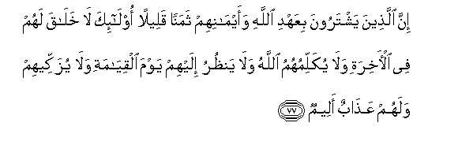

#إِنَّ الَّذِينَ يَشْتَرُونَ بِعَهْدِ اللَّهِ وَأَيْمَانِهِمْ ثَمَنًا قَلِيلًا أُولَٰئِكَ لَا خَلَاقَ لَهُمْ فِي الْآخِرَةِ وَلَا يُكَلِّمُهُمُ اللَّهُ وَلَا يَنْظُرُ إِلَيْهِمْ يَوْمَ الْقِيَامَةِ وَلَا يُزَكِّيهِمْ وَلَهُمْ عَذَابٌ أَلِيمٌ 

##Inna allatheena yashtaroona biAAahdi Allahi waaymanihim thamanan qaleelan ola-ika la khalaqa lahum fee al-akhirati wala yukallimuhumu Allahu wala yanthuru ilayhim yawma alqiyamati wala yuzakkeehim walahum AAathabun aleemun 

## 翻译(Translation)：

| Translator | 译文(Translation)                                            |
| :--------: | ------------------------------------------------------------ |
|    马坚    | 以真主的盟约和自已的盟誓换取些微代价的人，在后世不获恩典，复活日，真主不和他们说话，不睬他们，不涤清他们的罪恶，他们将受痛苦的刑罚。 |
|  YUSUFALI  | As for those who sell the faith they owe to Allah and their own plighted word for a small price, they shall have no portion in the Hereafter: Nor will Allah (Deign to) speak to them or look at them on the Day of Judgment, nor will He cleans them (of sin): They shall have a grievous penalty. |
| PICKTHALL  | Lo! those who purchase a small gain at the cost of Allah's covenant and their oaths, they have no portion in the Hereafter. Allah will neither speak to them nor look upon them on the Day of Resurrection, nor will He make them grow. Theirs will be a painful doom. |
|   SHAKIR   | (As for) those who take a small price for the covenant of Allah and their own oaths-- surely they shall have no portion in the hereafter, and Allah will not speak to them, nor will He look upon them on the day of resurrection nor will He purify them, and they shall have a painful chastisement. |

---

## 对位释义(Words Interpretation)：

| No   | العربية | 中文    | English | 曾用词 |
| ---- | ------: | ------- | ------- | ------ |
| 序号 |    阿文 | Chinese | 英文    | Used   |
| 3:77.1  | إِنَّ       | 的确             | surely              | 见2:6.1    |
| 3:77.2  | الَّذِينَ    | 谁，那些         | those who           | 见2:6.2    |
| 3:77.3  | يَشْتَرُونَ   | 他们出卖         | they sell           |            |
| 3:77.4  | بِعَهْدِ     | 以盟约           | for the covenant    |            |
| 3:77.5  |     اللَّهِ | 真主的           | of Allah            | 见2:23.17  |
| 3:77.6  | وَأَيْمَانِهِمْ | 和他们的誓言     | and their oaths     |            |
| 3:77.7  | ثَمَنًا     | 价钱             | Price               | 见2:41.15  |
| 3:77.8  | قَلِيلًا    | 微小的           | A little            | 见2:41.16  |
| 3:77.9  | أُولَٰئِكَ    | 这等人           | These are           | 见2:5.1    |
| 3:77.10 | لَا       | 不，不是，没有   | no                  | 见2:2.3    |
| 3:77.11 | خَلَاقَ     | 享受             | portion             |            |
| 3:77.12 | لَهُمْ      | 对他们           | for them            | 见2:11.3   |
| 3:77.13 | فِي       | 在               | in                  | 见2:10.1   |
| 3:77.14 | الْآخِرَةِ   | 后世             | the Hereafter       | 见2:102.64 |
| 3:77.15 | وَلَا      | 也不             | and not             | 见1:7.8    |
| 3:77.16 | يُكَلِّمُهُمُ   | 和他们说话       | speak to them       | 见2:174.21 |
| 3:77.17 | اللَّهُ     | 安拉，真主       | Allah               | 见2:7.2 |
| 3:77.18 | وَلَا      | 也不             | and not             | 见1:7.8    |
| 3:77.19 | يَنْظُرُ     | 他看             | He look             |            |
| 3:77.20 | إِلَيْهِمْ    | 至他们           | at them             |            |
| 3:77.21 | يَوْمَ      | 日，日子，时候的 | day                 | 见1:4.2    |
| 3:77.22 | الْقِيَامَةِ  | 复活的           | Resurrection        | 见2:85.40  |
| 3:77.23 | وَلَا      | 也不             | and not             | 见1:7.8    |
| 3:77.24 | يُزَكِّيهِمْ   | 洁净他们         | purify them         | 见2:174.26 |
| 3:77.25 | وَلَهُمْ     | 和对他们         | and for them        | 见2:7.10   |
| 3:77.26 | عَذَابٌ     | 煎熬，刑罚       | torment, punishment | 见2:7.11   |
| 3:77.27 | أَلِيمٌ     | 痛苦，疼痛       | A painful           | 见2:10.9   |

---
