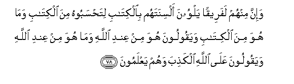

#وَإِنَّ مِنْهُمْ لَفَرِيقًا يَلْوُونَ أَلْسِنَتَهُمْ بِالْكِتَابِ لِتَحْسَبُوهُ مِنَ الْكِتَابِ وَمَا هُوَ مِنَ الْكِتَابِ وَيَقُولُونَ هُوَ مِنْ عِنْدِ اللَّهِ وَمَا هُوَ مِنْ عِنْدِ اللَّهِ وَيَقُولُونَ عَلَى اللَّهِ الْكَذِبَ وَهُمْ يَعْلَمُونَ 

##Wa-inna minhum lafareeqan yalwoona alsinatahum bialkitabi litahsaboohu mina alkitabi wama huwa mina alkitabi wayaqooloona huwa min AAindi Allahi wama huwa min AAindi Allahi wayaqooloona AAala Allahi alkathiba wahum yaAAlamoona 

## 翻译(Translation)：

| Translator | 译文(Translation)                                            |
| :--------: | ------------------------------------------------------------ |
|    马坚    | 他们中确有一部分人，篡改天经，以便你们把曾经篡改的当做天经，其实，那不是天经。他们说：这是从真主那里降示的。其实那不是从真主那里降示的，他们明知故犯地假借真主的名义而造遥。 |
|  YUSUFALI  | There is among them a section who distort the Book with their tongues: (As they read) you would think it is a part of the Book, but it is no part of the Book; and they say, "That is from Allah," but it is not from Allah: It is they who tell a lie against Allah, and (well) they know it! |
| PICKTHALL  | And lo! there is a party of them who distort the Scripture with their tongues, that ye may think that what they say is from the Scripture, when it is not from the Scripture. And they say: It is from Allah, when it is not from Allah; and they speak a lie concerning Allah knowingly. |
|   SHAKIR   | Most surely there is a party amongst those who distort the Book with their tongue that you may consider it to be (a part) of the Book, and they say, It is from Allah, while it is not from Allah, and they tell a lie against Allah whilst they know. |

---

## 对位释义(Words Interpretation)：

| No   | العربية | 中文    | English | 曾用词 |
| ---- | ------: | ------- | ------- | ------ |
| 序号 |    阿文 | Chinese | 英文    | Used   |
| 3:78.1  | وَإِنَّ     | 和确实       | and is                | 见2:143.28 |
| 3:78.2  | مِنْهُمْ    | 从他们       | from them             | 见2:75.8   |
| 3:78.3  | لَفَرِيقًا  | 一部分       | a party               |            |
| 3:78.4  | يَلْوُونَ   | 他们扭曲     | they distort          |            |
| 3:78.5  | أَلْسِنَتَهُمْ | 他们的舌头   | their tongues         |            |
| 3:78.6  | بِالْكِتَابِ | 在天经       | in the Book           | 见2:85.25  |
| 3:78.7  | لِتَحْسَبُوهُ | 以便你们认为 | that you may consider |            |
| 3:78.8  | مِنَ      | 从           | from                  | 见2:4.8    |
| 3:78.9  | الْكِتَابِ  | 这部经的     | of the Book           | 见2:85.25  |
| 3:78.10 | وَمَا     | 和不         | And not               | 见2:9.9    |
| 3:78.11 | هُوَ      | 他是         | He is                 | 见2:29.1   |
| 3:78.12 | مِنَ      | 从           | from                  | 见2:4.8    |
| 3:78.13 | الْكِتَابِ  | 这部经的     | of the Book           | 见2:85.25  |
| 3:78.14 | وَيَقُولُونَ | 和他们说     | and they tell         | 见3:75.31  |
| 3:78.15 | هُوَ      | 他是         | He is                 | 见2:29.1   |
| 3:78.16 | مِنْ      | 从           | from                  | 见2:4.8    |
| 3:78.17 | عِنْدِ     | 以           | with                  | 见2:54.20  |
| 3:78.18 |    اللَّهِ | 真主的       | of Allah              | 见2:23.17  |
| 3:78.19 | وَمَا     | 和不         | And not               | 见2:9.9    |
| 3:78.20 | هُوَ      | 他是         | He is                 | 见2:29.1   |
| 3:78.21 | مِنْ      | 从           | from                  | 见2:4.8    |
| 3:78.22 | عِنْدِ     | 以           | with                  | 见2:54.20  |
| 3:78.23 |    اللَّهِ | 真主的       | of Allah              | 见2:23.17  |
| 3:78.24 | وَيَقُولُونَ | 和他们说     | and they tell         | 见3:75.31  |
| 3:78.25 | عَلَى     | 至           | On                    | 见2:5.2    |
| 3:78.26 |    اللَّهِ | 真主的       | of Allah              | 见2:23.17  |
| 3:78.27 | الْكَذِبَ   | 一个谎言     | a lie                 | 见3:75.34  |
| 3:78.28 | وَهُمْ     | 和他们       | and in them           | 见2:25.32  |
| 3:78.29 | يَعْلَمُونَ  | 知道         | Know                  | 见2:13.19  |

---
