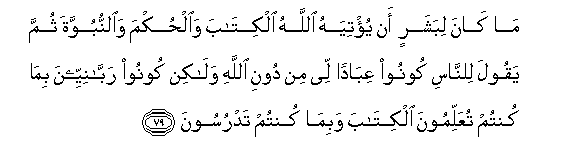

#مَا كَانَ لِبَشَرٍ أَنْ يُؤْتِيَهُ اللَّهُ الْكِتَابَ وَالْحُكْمَ وَالنُّبُوَّةَ ثُمَّ يَقُولَ لِلنَّاسِ كُونُوا عِبَادًا لِي مِنْ دُونِ اللَّهِ وَلَٰكِنْ كُونُوا رَبَّانِيِّينَ بِمَا كُنْتُمْ تُعَلِّمُونَ الْكِتَابَ وَبِمَا كُنْتُمْ تَدْرُسُونَ 

##Ma kana libasharin an yu/tiyahu Allahu alkitaba waalhukma waalnnubuwwata thumma yaqoola lilnnasi koonoo AAibadan lee min dooni Allahi walakin koonoo rabbaniyyeena bima kuntum tuAAallimoona alkitaba wabima kuntum tadrusoona 

## 翻译(Translation)：

| Translator | 译文(Translation)                                            |
| :--------: | ------------------------------------------------------------ |
|    马坚    | 一个人既蒙真主赏赐经典，智慧和预言，他不至对世人说：你们做我的奴仆，不要做真主的奴仆。但（他必说）：你们当做崇拜造物主的人，因为你们教授天经，诵习天经。 |
|  YUSUFALI  | It is not (possible) that a man, to whom is given the Book, and Wisdom, and the prophetic office, should say to people: "Be ye my worshippers rather than Allah's": on the contrary (He would say) "Be ye worshippers of Him Who is truly the Cherisher of all: For ye have taught the Book and ye have studied it earnestly." |
| PICKTHALL  | It is not (possible) for any human being unto whom Allah had given the Scripture and wisdom and the prophethood that he should afterwards have said unto mankind: Be slaves of me instead of Allah; but (what he said was): Be ye faithful servants of the Lord by virtue of your constant teaching of the Scripture and of your constant study thereof. |
|   SHAKIR   | It is not meet for a mortal that Allah should give him the Book and the wisdom and prophethood, then he should say to men: Be my servants rather than Allah's; but rather (he would say): Be worshippers of the Lord because of your teaching the Book and your reading (it yourselves). |

---

## 对位释义(Words Interpretation)：

| No   | العربية | 中文    | English | 曾用词 |
| ---- | ------: | ------- | ------- | ------ |
| 序号 |    阿文 | Chinese | 英文    | Used   |
| 3:79.1  | مَا      | 不             | not                     | 见2:120.24 |
| 3:79.2  | كَانَ     | 他是           | It was                  | 见2:75.6   |
| 3:79.3  | لِبَشَرٍ    | 为一个人       | for a man               |            |
| 3:79.4  | أَنْ      | 该             | that                    | 见2:26.5   |
| 3:79.5  | يُؤْتِيَهُ   | 他给他         | He give him             |            |
| 3:79.6  | اللَّهُ    | 安拉，真主     | Allah                   | 见2:7.2 |
| 3:79.7  | الْكِتَابَ  | 这部经，这本书 | the book                | 见2:2.2    |
| 3:79.8  | وَالْحُكْمَ  | 和智慧         | and the wisdom          |            |
| 3:79.9  | وَالنُّبُوَّةَ | 和预言         | and the prophethood     |            |
| 3:79.10 | ثُمَّ      | 然后           | Then                    | 见2:28.7   |
| 3:79.11 | يَقُولَ    | 他说           | he said                 | 见2:214.18 |
| 3:79.12 | لِلنَّاسِ   | 对世人         | For people              | 见2:83.17  |
| 3:79.13 | كُونُوا   | 你们是         | Be you                  | 见2:65.10  |
| 3:79.14 | عِبَادًا   | 奴仆           | servants                |            |
| 3:79.15 | لِي      | 至我           | to me                   | 见2:152.4  |
| 3:79.16 | مِنْ      | 从             | from                    | 见2:4.8    |
| 3:79.17 | دُونِ     | 之外           | Without                 | 见2:23.16  |
| 3:79.18 |    اللَّهِ | 真主的         | of Allah                | 见2:23.17  |
| 3:79.19 | وَلَٰكِنْ    | 并且但是       | and but                 | 见2:12.5   |
| 3:79.20 | كُونُوا   | 你们是         | Be you                  | 见2:65.10  |
| 3:79.21 | رَبَّانِيِّينَ | 崇拜造物主的人 | worshippers of the Lord |            |
| 3:79.22 | بِمَا     | 在什么         | in what                 | 见2:4.3    |
| 3:79.23 | كُنْتُمْ    | 你们是         | You are                 | 见2:23.2   |
| 3:79.24 | تُعَلِّمُونَ  | 你们教授       | your teaching           |            |
| 3:79.25 | الْكِتَابَ  | 这部经，这本书 | the book                | 见2:2.2    |
| 3:79.26 | وَبِمَا    | 和在什么       | and in what             | 参2:4.3    |
| 3:79.27 | كُنْتُمْ    | 你们是         | You are                 | 见2:23.2   |
| 3:79.28 | تَدْرُسُونَ  | 你们诵习       | your reading            |            |

---
