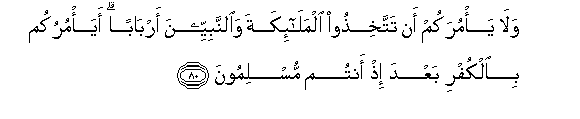

#وَلَا يَأْمُرَكُمْ أَنْ تَتَّخِذُوا الْمَلَائِكَةَ وَالنَّبِيِّينَ أَرْبَابًا ۗ أَيَأْمُرُكُمْ بِالْكُفْرِ بَعْدَ إِذْ أَنْتُمْ مُسْلِمُونَ 

##Wala ya/murakum an tattakhithoo almala-ikata waalnnabiyyeena arbaban aya/murukum bialkufri baAAda ith antum muslimoona 

## 翻译(Translation)：

| Translator | 译文(Translation)                                            |
| :--------: | ------------------------------------------------------------ |
|    马坚    | 他也不致教你们以众天神和众先知为主宰。你们既归顺之后，他怎能教你们不信道呢？ |
|  YUSUFALI  | Nor would he instruct you to take angels and prophets for Lords and patrons. What! would he bid you to unbelief after ye have bowed your will (To Allah in Islam)? |
|  PICKTHAL  | And he commanded you not that ye should take the angels and the prophets for lords. Would he command you to disbelieve after ye had surrendered (to Allah)? |
|   SHAKIR   | And neither would he enjoin you that you should take the angels and the prophets for lords; what! would he enjoin you with unbelief after you are Muslims? |

---

## 对位释义(Words Interpretation)：

| No   | العربية | 中文    | English | 曾用词 |
| ---- | ------: | ------- | ------- | ------ |
| 序号 |    阿文 | Chinese | 英文    | Used   |
| 3:80.1  | وَلَا      | 也不         | and not              | 见1:7.8    |
| 3:80.2  | يَأْمُرَكُمْ   | 他命令你们   | he commanded you     |            |
| 3:80.3  | أَنْ       | 该           | that                 | 见2:26.5   |
| 3:80.4  | تَتَّخِذُوا   | 你们取       | you take             | 见2:231.22 |
| 3:80.5  | الْمَلَائِكَةَ | 和天神       | and Angels           | 见2:161.11 |
| 3:80.6  | وَالنَّبِيِّينَ | 和众先知     | and the Prophets     | 见2:177.18 |
| 3:80.7  | أَرْبَابًا   | 众主         | lords                | 见3:64.23  |
| 3:80.8  | أَيَأْمُرُكُمْ  | 他命令你们吗 | Would he command you |            |
| 3:80.9  | بِالْكُفْرِ   | 在不信       | with unbelief        |            |
| 3:80.10 | بَعْدَ      | 之后         | after                | 见2:27.6   |
| 3:80.11 | إِذْ       | 当时         | when                 | 见2:131.1  |
| 3:80.12 | أَنْتُمْ     | 你们         | you                  | 见2:85.2   |
| 3:80.13 | مُسْلِمُونَ   | 穆斯林，顺民 | Muslims, submissive  | 见2:132.17 |

---
