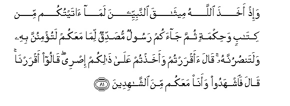

# وَإِذْ أَخَذَ اللَّهُ مِيثَاقَ النَّبِيِّينَ لَمَا آتَيْتُكُمْ مِنْ كِتَابٍ وَحِكْمَةٍ ثُمَّ جَاءَكُمْ رَسُولٌ مُصَدِّقٌ لِمَا مَعَكُمْ لَتُؤْمِنُنَّ بِهِ وَلَتَنْصُرُنَّهُ ۚ قَالَ أَأَقْرَرْتُمْ وَأَخَذْتُمْ عَلَىٰ ذَٰلِكُمْ إِصْرِي ۖ قَالُوا أَقْرَرْنَا ۚ قَالَ فَاشْهَدُوا وَأَنَا مَعَكُمْ مِنَ الشَّاهِدِينَ 

##Wa-ith akhatha Allahu meethaqa alnnabiyyeena lama ataytukum min kitabin wahikmatin thumma jaakum rasoolun musaddiqun lima maAAakum latu/minunna bihi walatansurunnahu qala aaqrartum waakhathtum AAala thalikum isree qaloo aqrarna qala faishhadoo waana maAAakum mina alshshahideena 

## 翻译(Translation)：

| Translator | 译文(Translation)                                            |
| :--------: | ------------------------------------------------------------ |
|    马坚    | 当时，真主与众先知缔约说：我已赏赐你们经典和智慧，以后有一个使者来证实你们所有的经典，你们必须确信他，必须辅助他。他说：你们承认吗？你们愿意为此事而与我缔约吗? 他们说：我们承认了。他说：那末，你们作证吧；我也和你们一同作证。 |
|  YUSUFALI  | Behold! Allah took the covenant of the prophets, saying: "I give you a Book and Wisdom; then comes to you a messenger, confirming what is with you; do ye believe in him and render him help." Allah said: "Do ye agree, and take this my Covenant as binding on you?" They said: "We agree." He said: "Then bear witness, and I am with you among the witnesses." |
| PICKTHALL  | When Allah made (His) covenant with the prophets, (He said): Behold that which I have given you of the Scripture and knowledge. And afterward there will come unto you a messenger, confirming that which ye possess. Ye shall believe in him and ye shall help him. He said: Do ye agree, and will ye take up My burden (which I lay upon you) in this (matter)? They answered: We agree. He said: Then bear ye witness. I will be a witness with you. |
|   SHAKIR   | And when Allah made a covenant through the prophets: Certainly what I have given you of Book and wisdom-- then an messenger comes to you verifying that which is with you, you must believe in him, and you must aid him. He said: Do you affirm and accept My compact in this (matter)? They said: We do affirm. He said: Then bear witness, and I (too) am of the bearers of witness with you. |

---

## 对位释义(Words Interpretation)：

| No   | العربية | 中文    | English | 曾用词 |
| ---- | ------: | ------- | ------- | ------ |
| 序号 |    阿文 | Chinese | 英文    | Used   |
| 3:81.1  | وَإِذْ      | 和当时          | and when              | 见2:30.1  |
| 3:81.2  | أَخَذَ      | 他取             | he take               |           |
| 3:81.3  | اللَّهُ     | 安拉，真主       | Allah                 | 见2:7.2 |
| 3:81.4  | مِيثَاقَ    | 约               | a covenant            | 见2:83.3  |
| 3:81.5  | النَّبِيِّينَ  | 众先知           | The Prophets          | 见2:61.53 |
| 3:81.6  | لَمَا      | 必定什么         | Certainly what        | 见2:74.15 |
| 3:81.7  | آتَيْتُكُمْ   | 我给你们         | I give you            |           |
| 3:81.8  | مِنْ       | 从               | from                  | 见2:4.8   |
| 3:81.9  | كِتَابٍ     | 经典             | Book                  | 参2:2.2   |
| 3:81.10 | وَحِكْمَةٍ    | 和智慧           | and wisdom            |           |
| 3:81.11 | ثُمَّ       | 然后             | Then                  | 见2:28.7  |
| 3:81.12 | جَاءَكُمْ    | 他来到你们       | He came to you        | 见2:87.18 |
| 3:81.13 | رَسُولٌ     | 一个使者         | a messenger           | 见2:87.19 |
| 3:81.14 | مُصَدِّقٌ     | 证实             | confirming            | 见2:89.7  |
| 3:81.15 | لِمَا      | 至什么           | for what              | 见2:41.5  |
| 3:81.16 | مَعَكُمْ     | 随着你           | With you              | 见2:14.13 |
| 3:81.17 | لَتُؤْمِنُنَّ   | 你们必定诚信     | you must believe      |           |
| 3:81.18 | بِهِ       | 以它             | with it               | 见2:22.13 |
| 3:81.19 | وَلَتَنْصُرُنَّهُ | 和你们必定协助他 | and you must aid him  |           |
| 3:81.20 | قَالَ      | 他说，           | He said               | 见2:30.2  |
| 3:81.21 | أَأَقْرَرْتُمْ  | 你们同意吗？     | Do you agree          |           |
| 3:81.22 | وَأَخَذْتُمْ   | 和你们采取       | and you take          |           |
| 3:81.23 | عَلَىٰ      | 至               | On                    | 见2:5.2   |
| 3:81.24 | ذَٰلِكُمْ     | 那个是           | That's it             | 见2:49.14 |
| 3:81.25 | إِصْرِي     | 我的约           | my Covenant           |           |
| 3:81.26 | قَالُوا    | 他们说，         | They said             | 见2:11.8  |
| 3:81.27 | أَقْرَرْنَا   | 我们同意         | We agree              |           |
| 3:81.28 | قَالَ      | 他说，           | He said               | 见2:30.2  |
| 3:81.29 | فَاشْهَدُوا  | 然后你们证实     | Then bear you witness |           |
| 3:81.30 | وَأَنَا     | 和我是           | and I am              | 见2:160.9 |
| 3:81.31 | مَعَكُمْ     | 随着你           | With you              | 见2:14.13 |
| 3:81.32 | مِنَ       | 从               | from                  | 见2:4.8   |
| 3:81.33 | الشَّاهِدِينَ | 众作证者         | those who witness     | 见3:53.9  |

---
