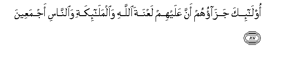

#أُولَٰئِكَ جَزَاؤُهُمْ أَنَّ عَلَيْهِمْ لَعْنَةَ اللَّهِ وَالْمَلَائِكَةِ وَالنَّاسِ أَجْمَعِينَ 

##Ola-ika jazaohum anna AAalayhim laAAnata Allahi waalmala-ikati waalnnasi ajmaAAeena 

## 翻译(Translation)：

| Translator | 译文(Translation)                                            |
| :--------: | ------------------------------------------------------------ |
|    马坚    | 这等人的报应，是遭受真主的弃绝与天神和人类的共同的咒诅；     |
|  YUSUFALI  | Of such the reward is that on them (rests) the curse of Allah, of His angels, and of all mankind;- |
|  PICKTHAL  | As for such, their guerdon is that on them rests the curse of Allah and of angels and of men combined. |
|   SHAKIR   | (As for) these, their reward is that upon them is the curse of Allah and the angels and of men, all together. |

---

## 对位释义(Words Interpretation)：

| No   | العربية | 中文    | English | 曾用词 |
| ---- | ------: | ------- | ------- | ------ |
| 序号 |    阿文 | Chinese | 英文    | Used   |
| 3:87.1 | أُولَٰئِكَ     | 这等人     | These are    | 见2:5.1    |
| 3:87.2 | جَزَاؤُهُمْ    | 他们的报应 | their reward |            |
| 3:87.3 | أَنَّ        | 该         | that         | 见2:26.5   |
| 3:87.4 | عَلَيْهِمْ     | 在他们     | on they      | 见1:7.4    |
| 3:87.5 | لَعْنَةَ      | 诅咒       | the curse    |            |
| 3:87.6 | اللَّهِ      | 安拉，真主 | Allah        | 见1:1.2    |
| 3:87.7 | وَالْمَلَائِكَةِ | 和天神     | and Angels   | 见2:161.11 |
| 3:87.8 | وَالنَّاسِ    | 和人       | and People   | 见2:161.12 |
| 3:87.9 | أَجْمَعِينَ    | 全体       | all          | 见2:161.13 |

---
