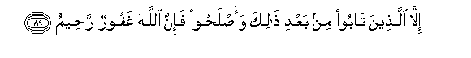

#إِلَّا الَّذِينَ تَابُوا مِنْ بَعْدِ ذَٰلِكَ وَأَصْلَحُوا فَإِنَّ اللَّهَ غَفُورٌ رَحِيمٌ 

##Illa allatheena taboo min baAAdi thalika waaslahoo fa-inna Allaha ghafoorun raheemun 

## 翻译(Translation)：

| Translator | 译文(Translation)                                            |
| :--------: | ------------------------------------------------------------ |
|    马坚    | 惟后来悔过自新的人，（将蒙赦宥），因为真主确是至赦的，确是至慈的。 |
|  YUSUFALI  | Except for those that repent (Even) after that, and make amends; for verily Allah is Oft-Forgiving, Most Merciful. |
|  PICKTHAL  | Save those who afterward repent and do right. Lo! Allah is Forgiving, Merciful. |
|   SHAKIR   | Except those who repent after that and amend, then surely Allah is Forgiving, Merciful. |

---

## 对位释义(Words Interpretation)：

| No   | العربية | 中文    | English | 曾用词 |
| ---- | ------: | ------- | ------- | ------ |
| 序号 |    阿文 | Chinese | 英文    | Used   |
| 3:89.1  | إِلَّا     | 除了       | Except    | 见2:9.7    |
| 3:89.2  | الَّذِينَ   | 谁，那些   | those who | 见2:6.2    |
| 3:89.3  | تَابُوا   | 悔过       | repent    | 见2:160.3  |
| 3:89.4  | مِنْ      | 从         | from      | 见2:4.8    |
| 3:89.5  | بَعْدِ     | 之后       | after     | 见2:27.6   |
| 3:89.6  | ذَٰلِكَ     | 这个       | this      | 见2:2.1    |
| 3:89.7  | وَأَصْلَحُوا | 和改正     | and amend | 见2:160.4  |
| 3:89.8  | فَإِنَّ     | 和确实     | so surely | 见2:98.9   |
| 3:89.9  | اللَّهَ    | 安拉，真主 | Allah     | 见1:1.2    |
| 3:89.10 | غَفُورٌ    | 至赦的     | Forgiving | 见2:173.24 |
| 3:89.11 | رَحِيمٌ    | 至慈的     | Merciful  | 见2:143.45 |

---
