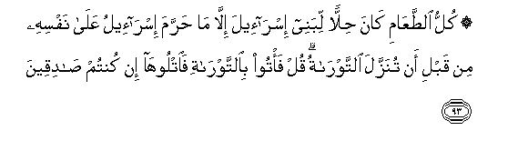

#۞ كُلُّ الطَّعَامِ كَانَ حِلًّا لِبَنِي إِسْرَائِيلَ إِلَّا مَا حَرَّمَ إِسْرَائِيلُ عَلَىٰ نَفْسِهِ مِنْ قَبْلِ أَنْ تُنَزَّلَ التَّوْرَاةُ ۗ قُلْ فَأْتُوا بِالتَّوْرَاةِ فَاتْلُوهَا إِنْ كُنْتُمْ صَادِقِينَ

##Kullu alttaAAami kana hillan libanee isra-eela illa ma harrama isra-eelu AAala nafsihi min qabli an tunazzala alttawratu qul fa/too bialttawrati faotlooha in kuntum sadiqeena 

## 翻译(Translation)：

| Translator | 译文(Translation)                                            |
| :--------: | ------------------------------------------------------------ |
|    马坚    | 一切食物对于以色列的后裔，原是合法的。除非在降示《讨拉特》之前易司拉仪（的后裔）自己所戒除的食物。你说：你们拿《讨拉特》来当面诵读吧，如果你们是诚实的。 |
|  YUSUFALI  | All food was lawful to the Children of Israel, except what Israel Made unlawful for itself, before the Law (of Moses) was revealed. Say: "Bring ye the Law and study it, if ye be men of truth." |
| PICKTHALL  | All food was lawful unto the Children of Israel, save that which Israel forbade himself, (in days) before the Torah was revealed. Say: Produce the Torah and read it (unto us) if ye are truthful. |
|   SHAKIR   | All food was lawful to the children of Israel except that which Israel had forbidden to himself, before the Taurat was revealed. Say: Bring then the Taurat and read it, if you are truthful. |

---

## 对位释义(Words Interpretation)：

| No   | العربية | 中文    | English | 曾用词 |
| ---- | ------: | ------- | ------- | ------ |
| 序号 |    阿文 | Chinese | 英文    | Used   |
| 3:93.1  | كُلُّ       | 所有           | All              | 见2:20.23 |
| 3:93.2  | الطَّعَامِ   | 食物           | food             |           |
| 3:93.3  | كَانَ      | 他是           | It was           | 见2:75.6  |
| 3:93.4  | حِلًّا      | 合法           | lawful           |           |
| 3:93.5  | لِبَنِي     | 对后裔         | to the Children  | 参2:40.2  |
| 3:93.6  | إِسْرَائِيلَ  | 以色列         | Israel           | 见2:40.3  |
| 3:93.7  | إِلَّا      | 除了           | Except           | 见2:9.7   |
| 3:93.8  | مَا       | 什么           | what/ that which | 见2:17.8  |
| 3:93.9  | حَرَّمَ      | 禁止           | forbidden        | 见2:173.2 |
| 3:93.10 | إِسْرَائِيلُ  | 易司拉仪       | Israel           |           |
| 3:93.11 | عَلَىٰ      | 至             | On               | 见2:5.2   |
| 3:93.12 | نَفْسِهِ     | 他自己         | himself          |           |
| 3:93.13 | مِنْ       | 从             | from             | 见2:4.8   |
| 3:93.14 | قَبْلِ      | 以前           | Before           | 见2:25.24 |
| 3:93.15 | أَنْ       | 该             | that             | 见2:26.5  |
| 3:93.16 | تُنَزَّلَ     | 它被颁降       | was revealed     |           |
| 3:93.17 | التَّوْرَاةُ  | 讨拉特         | the Torah        | 见3:65.10 |
| 3:93.18 | قُلْ       | 你说           | Say              | 见2:80.8  |
| 3:93.19 | فَأْتُوا    | 因此带来       | then produce     | 见2:23.9  |
| 3:93.20 | بِالتَّوْرَاةِ | 在讨拉特       | by the Torah     | 参3:65.10 |
| 3:93.21 | فَاتْلُوهَا  | 然后你们诵读它 | and read it      |           |
| 3:93.22 | إِنْ       | 如果           | if               | 见2:23.18 |
| 3:93.23 | كُنْتُمْ     | 你们           | You              | 见2:23.2  |
| 3:93.24 | صَادِقِينَ   | 诚实的         | Honest           | 见2:23.20 |

---
