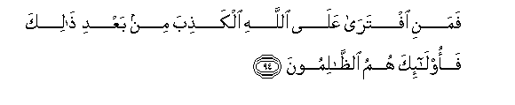

#فَمَنِ افْتَرَىٰ عَلَى اللَّهِ الْكَذِبَ مِنْ بَعْدِ ذَٰلِكَ فَأُولَٰئِكَ هُمُ الظَّالِمُونَ 

##Famani iftara AAala Allahi alkathiba min baAAdi thalika faola-ika humu althalimoona 

## 翻译(Translation)：

| Translator | 译文(Translation)                                            |
| :--------: | ------------------------------------------------------------ |
|    马坚    | 此后，凡是假借真主的名义而造谣的人，都是不义的。             |
|  YUSUFALI  | If any, after this, invent a lie and attribute it to Allah, they are indeed unjust wrong-doers. |
| PICKTHALL  | And whoever shall invent a falsehood after that concerning Allah, such will be wrong-doers. |
|   SHAKIR   | Then whoever fabricates a lie against Allah after this, these it is that are the unjust. |

---

## 对位释义(Words Interpretation)：

| No   | العربية | 中文    | English | 曾用词 |
| ---- | ------: | ------- | ------- | ------ |
| 序号 |    阿文 | Chinese | 英文    | Used   |
| 3:94.1  | فَمَنِ      | 然后谁     | then who   | 见2:173.13 |
| 3:94.2  | افْتَرَىٰ    | 他假借     | he invents |            |
| 3:94.3  | عَلَى      | 至         | On         | 见2:5.2    |
| 3:94.4  |     اللَّهِ | 真主的     | of Allah   | 见2:23.17  |
| 3:94.5  | الْكَذِبَ    | 一个谎言   | a lie      | 见3:75.34  |
| 3:94.6  | مِنْ       | 从         | from       | 见2:4.8    |
| 3:94.7  | بَعْدِ      | 之后       | after      | 见2:27.6   |
| 3:94.8  | ذَٰلِكَ      | 这个       | this       | 见2:2.1    |
| 3:94.9  | فَأُولَٰئِكَ   | 然后那些人 | then those | 见2:81.8   |
| 3:94.10 | هُمُ       | 他们       | they       | 见2:4.11   |
| 3:94.11 | الظَّالِمُونَ | 不义者     | the unjust | 见2:229.46 |

---
